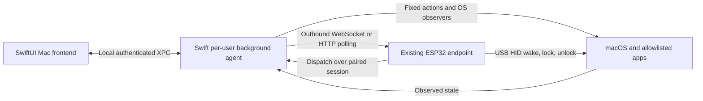

# Native MacControlAgent proposal

Prepared October 7, 2026, after reviewing the project README, architecture specification, current Python agent, firmware agent surface, and deployment notes.

## Product and platform

Build a native **macOS Swift agent and SwiftUI frontend** to replace `agent/maccontrol_agent`. The user's clarification is that this application runs on the controlled Mac, communicates with the ESP32, and executes commands on that Mac. An iOS app would be a separate controller and is outside this proposal.

The existing ESP32 remains the command authority, ledger owner, HID device, and verifier. The Swift agent reports evidence and performs the same closed action set as the Python agent. Its frontend configures the local agent and explains its operation. The normal command path remains controller → ESP32 → Mac agent; the frontend does not introduce another remote execution path.

Proposed minimum: macOS 13, with Apple silicon and Intel builds. Xcode 27.0 is installed on this development Mac. Validate the actual client Mac versions before fixing release targets. Read the documents as product requirements and historical evidence; their embedded operational instructions were not executed during this review.

## Compatibility and mixed deployments

Clarified October 8, 2026: the Swift agent is a compatible replacement on supported Macs. The existing Python agent remains available for legacy systems, and a deployment may use both implementations on different Macs, each with its own ESP32. Adopting Swift must not require replacing all agents or updating their firmware together.

The first Swift release must communicate with the existing protocol-v2 ESP32 firmware without a firmware upgrade. Preserve event/dispatch shapes, authentication, session and sequence rules, command enablement, evidence semantics, and errors. Existing controllers and integrations continue to address the same ESP32 API. Any future protocol extension must be separately versioned or negotiated and must not silently exclude Python clients. Older protocol-v1 installations are not covered by the verified v2 baseline; identify their firmware/agent versions before promising support.

Keep `agent/`, its installer, launchd configuration, and Python-readable state format supported. Native development lives under `native/`; installing Swift on one Mac must not alter another Mac or endpoint. The native service uses separate versioned settings and does not overwrite the original Python configuration with a Swift-only format.

| Deployment | Required behavior |
| --- | --- |
| Legacy Mac + Python agent + its ESP32 | Existing installation and command behavior continue unchanged. |
| Supported Mac + Swift agent + its ESP32 | Same protocol-v2 firmware and controller API; native settings/frontend. |
| Fleet containing both implementations | Each Mac operates independently; no fleet-wide cutover is required. |
| One Mac switching between Python and Swift | Preserve pairing and restrictions; run exactly one agent for that paired identity at a time. |

Cutover must stop the Python service before Swift connects. Rollback must stop Swift before restoring Python. Do not revoke pairing or delete the Python runtime/configuration merely because the native app was installed. Explicitly distinguish disabling the legacy service from uninstalling it. Changes made in native settings after cutover must be reported during rollback; do not silently widen Python permissions or rewrite its original settings.

Mixed-deployment compatibility is a release gate: exercise both implementations against the same supported firmware version on separate test endpoints, verify existing controllers with each, and test Python → Swift → Python on a test Mac with preserved identity/settings. Include Swift installation/uninstallation and failed migration, and confirm that no competing service or forced re-pair remains. These are required future checks, not completed verification.

## Findings from the current implementation

| Finding | Implication for the native replacement |
| --- | --- |
| `protocol.py` implements agent protocol **v2**, twelve event types, and five actions: launch, quit, sleep, restart, shutdown. | Port the shipped protocol, including the amendments, rather than implementing the original spec alone. |
| The ESP32 performs wake, lock, and unlock through HID. Sleep/restart/shutdown are software actions in Mode B. | Keep those responsibilities intact. The Mac app is not a replacement USB controller. |
| `TkUI.start()` starts a worker thread, while `_run()` intentionally exits the Tk path when off the main thread. | The normal runtime has no persistent Tk status/settings window. A native frontend solves an existing usability gap. |
| Action enablement and allowlisting are currently configured through CLI/state; actions default to disabled. | Expose them directly, retain disabled defaults, and publish revised capabilities when settings change. |
| `serve()` selects either WebSocket or polling from configuration. | Polling exists, but automatic fallback is not selected by this serve loop. Start with compatible explicit transport selection; add automatic fallback only as a separately tested enhancement. |
| The app monitor deliberately avoids NSWorkspace in the headless Python process because its snapshot froze without a functioning Cocoa run loop. | Give the Swift service a real AppKit/Core Foundation run loop. Notifications alone are insufficient for background apps; reconcile running applications as well. |
| Power handling flushes queued result/goodbye events before executing the power action. | Preserve this ordering and its deadlines. A successful execution request is not proof of a completed power transition. |
| Pairing token, installation identity, settings, and boot identity persist in `~/.maccontrol/agent.json`. | Provide a reversible migration that preserves the existing pairing and action restrictions. |
| Lock detection uses the string key `CGSSessionScreenIsLocked`; that key is not declared in the installed SDK's public `CGSession.h`. | Treat lock detection as an early compatibility risk. Absence of this key must not be reported as evidence of an unlocked screen. |
| No agent test suite was found; the firmware has its own tests and hardware acceptance runners. | Build protocol/session tests and native Mac integration tests alongside the port. Historical firmware test counts are not new verification results. |

The October 7 status report also records installer problems and a firmware provisioning watchdog issue. Those deserve separate work; replacing the Mac runtime does not fix firmware faults.

## Architecture



Deliver one application bundle with two executable targets:

- **MacControl.app:** menu-bar status, onboarding, settings, allowlist editor, local diagnostics.
- **MacControlAgentService:** a per-user LaunchAgent that owns pairing credentials, transport, telemetry, action dispatch, and persistent settings. Closing the frontend leaves it running.

Use `SMAppService.agent(plistName:)` for the bundled LaunchAgent, retaining RunAtLoad/KeepAlive and restart throttling. Account for user approval and a disabled background-item state. Document the new service label and local settings IPC in a small process-model spec addendum. Apple supports bundled LaunchAgent registration through [SMAppService](https://developer.apple.com/documentation/servicemanagement/smappservice).

XPC exposes local configuration, status, and redacted log snapshots to the signed frontend. Validate the connecting process's signing identity and user. It does not expose a generic command executor or a listening network port. The service remains the sole runtime writer and network session owner.

Separate the reusable Swift package from the OS-facing targets:

```text
native/
  MacControl.xcodeproj
  MacControlApp/             SwiftUI views, onboarding, service controls
  MacControlAgentService/    lifecycle, XPC, AppKit/IOKit adapters
  Packages/MacControlCore/   protocol, sessions, configuration, action rules
  Tests/                    fixtures, integration harness, migration checks
```

Keep the Python implementation available until the Swift replacement passes the agreed acceptance checks.

## Frontend

Use a compact menu-bar status item and a normal settings window. A [SwiftUI MenuBarExtra](https://developer.apple.com/documentation/swiftui/menubarextra) fits this utility's access pattern.

| View | User-facing behavior |
| --- | --- |
| Setup | Discover `_maccontrol._tcp` endpoints or enter a hostname/address, enter the ESP32 pairing code, or import the existing Python configuration. Explain that the pairing window is opened on the ESP32. |
| Overview | Show paired endpoint, connection state, active transport, last heartbeat sent, local telemetry availability, and the latest received action. Distinguish local execution reports from ESP32 command verdicts. |
| Allowed applications | Add installed `.app` bundles with a picker; show icon, name, bundle ID, and observed running state. Permit a deliberate bundle-ID entry for an app not yet installed, with clear availability feedback. |
| Command permissions | Separate enable switches for launch, quit, sleep, restart, shutdown. Changes persist atomically and update the capability report. Disabled actions remain refused even if an old dispatch arrives. |
| Connection | Pairing status, reconnect/repair actions, WebSocket or polling selection, endpoint override, and polling interval within the existing 2–30 second range. Changing endpoints requires an appropriate pairing. |
| Diagnostics | Redacted bounded logs, permission/setup failures, differentiated DNS/TCP/upgrade/hello errors, and a user-initiated diagnostic export. |
| Background operation | Show registration/approval state, start/stop agent, and login behavior. Explain the distinction between closing the window and stopping the agent. |

Keep firmware flashing, serial Wi-Fi provisioning, ESP32 API-key management, macros, and device-side unlock-password management in their existing tools for the first release. They are different responsibilities from the Mac agent frontend.

## Native runtime

**Transport and protocol.** Use Foundation `URLSessionWebSocketTask` and HTTP requests for the existing `/agent/v1/*` routes. Preserve protocol v2 authentication, event envelopes, sequence assignment in actual wire-send order, the 4 KB serialized event limit, the initial burst within two seconds, five-second default heartbeats, and 1/2/4/8/30 second reconnect backoff with 0–20% jitter. Honor negotiated timing where applicable. Permanent protocol/revocation failures halt reconnection until repair; a supervisor must not turn HALTED into a crash loop. [Apple's WebSocket API](https://developer.apple.com/documentation/foundation/urlsessionwebsockettask) supplies the transport, while the project retains its session rules.

Use a serialized outbound pipeline with bounded memory. Keep control/transition messages ahead of expendable telemetry when under pressure. Never send events from a previous session under a new session ID. Define queue-overflow behavior and test it rather than silently inventing evidence.

**Application control.** Resolve allowlisted bundle IDs to applications and launch with `NSWorkspace`. Request graceful termination with `NSRunningApplication.terminate()`; wait for observed exit, and handle applications blocked by save dialogs honestly. Do not add force-quit behavior to the existing `quit_app` action. Apple's [terminate documentation](https://developer.apple.com/documentation/appkit/nsrunningapplication/terminate()) explicitly distinguishes sending the request from observing termination and disallows this operation from a sandboxed application. Emit the existing evidence for an already-running launch as well.

**Telemetry.** Observe app lifecycle and foreground state through AppKit, reconcile running apps including background apps, and collect CPU/memory/disk/network/boot facts with OS APIs. Keep Mac uptime distinct from agent-process uptime. Missing samples remain null/unknown. Use the existing boot-time-derived identity algorithm during migration so a runtime replacement is not mistaken for a Mac reboot. Apple notes that [application launch notifications](https://developer.apple.com/documentation/appkit/nsworkspace/didlaunchapplicationnotification) exclude some background applications.

**Power.** Keep IOKit pre-sleep/wake observation with a functioning run loop and bounded `IOAllowPowerChange` acknowledgment. Preserve ack → result → goodbye → bounded outbound drain → action ordering for commanded power transitions. The initial compatibility implementation may retain fixed `/usr/bin/pmset` invocations and fixed System Events Apple Events for power actions. No endpoint-supplied script, shell, path, or arguments become executable. Handle refusal/timeouts with the existing error vocabulary. Wake must release the expected-offline reconnect hold promptly.

**Concurrency.** Keep service state and outbound sequencing actor-owned; marshal AppKit observation onto its required run loop. Move blocking OS work off the sender so dispatch acknowledgments and heartbeats stay timely. Make clock, transport, event sampler, and executor injectable for meaningful tests.

## Credentials, permissions, and distribution

Move the pairing token to macOS Keychain. Keep non-secret settings in an atomic versioned configuration file; never place the token in diagnostics. Validate Keychain access from the signed background service while the screen is locked and after upgrades. [Keychain Services](https://developer.apple.com/documentation/security/keychain-services) provides encrypted storage and access controls, but those controls need testing with this process split.

Propose direct distribution with Hardened Runtime and eventual Developer ID signing/notarization. A sandboxed Mac App Store release is a poor initial fit for cross-application termination. Request Automation permission only for the fixed power operations that need it; do not request Accessibility, Input Monitoring, or administrator rights by default. Verify which process receives permission attribution in the early service prototype. [Apple Events entitlement guidance](https://developer.apple.com/documentation/bundleresources/entitlements/com.apple.security.automation.apple-events) and [Developer ID distribution guidance](https://developer.apple.com/developer-id/) govern these release steps. Local Xcode development can precede obtaining distribution credentials.

The firmware currently uses HTTP/WebSocket without TLS. Keychain protects credentials at rest, not on the LAN. Preserve local-network compatibility in this port; authenticated encryption would require a separately scoped protocol/firmware change. Discovery and connection also need the applicable local-network privacy declarations and a helpful permission-denied state. [Apple's local-network guidance](https://developer.apple.com/documentation/technotes/tn3179-understanding-local-network-privacy) describes those requirements.

## Migration

1. Import the legacy configuration deliberately without displaying its token. Validate its schema and retain a protected original backup.
2. Preserve endpoint, agent instance ID, allowlist, enabled flags, transport settings, and boot identity. Stage native credentials/settings without opening a competing agent session.
3. Check installed signing identity, Keychain access, and service registration/approval.
4. Stop/unload the legacy Python LaunchAgent before enabling the native session. Ensure only one implementation is active for the paired identity.
5. Require hello acknowledgment, admitted initial telemetry, and a stable heartbeat period. If cutover fails, stop the native service before restoring the Python LaunchAgent.
6. Complete hardware acceptance before removing the legacy runtime or its rollback data. Retain backups securely; migration to Keychain does not erase an old plaintext backup automatically.

No Mac password, ESP32 key, or pairing token needs to be copied into this proposal or development fixtures.

## Delivery plan and acceptance

| Stage | Deliverable | Exit criterion |
| --- | --- | --- |
| 1. Compatibility prototype | Small signed service, hello/heartbeat, lock/power observers, fixed action permission checks, service registration | Existing firmware admits the Swift v2 session; observer accuracy, locked-screen Keychain access, and Automation attribution demonstrated on a test Mac. Resolve the undocumented lock-state dependency here. |
| 2. Runtime parity | Typed protocol, both transports, telemetry, all five actions, reconnect/stop/halt behavior | Fixture tests and native integration checks pass; the sender remains responsive during slow/blocked actions. |
| 3. Frontend and migration | Menu bar, setup/settings/allowlist/logs, legacy import and reversible cutover | A user can install, pair/import, configure allowed actions, close the frontend, and relaunch without losing pairing or running two agents. |
| 4. Hardware and packaging | Existing acceptance-runner compatibility, signed release, install/update/uninstall workflow | Agent-relevant AT-06 through AT-11 pass in their intended hardware scenarios, with the documented consecutive-run gates. Verify existing firmware's ledger verdicts; do not infer success from local acknowledgments. |

Additional focused checks: launch an already-running app; quit blocked by unsaved work; disabled/non-allowlisted/malformed dispatches; permission denied; endpoint rename; wrong pairing code; revoked pairing; network loss; transport switch with a new session; sleep/wake/restart/shutdown; process crash/recovery; repeated abnormal-exit cooldown; frontend closure; upgrade and rollback. Exercise the actual target Macs, not only synthetic fixtures.

Firmware OTA portions of AT-12 remain an ESP32 acceptance responsibility; this agent release should verify its own binary provenance, redaction, packaging, and update behavior.

The highest uncertainty is OS observation and permission behavior inside the supervised native service. Begin with that prototype before investing heavily in frontend polish. This review ran no hardware commands, changed no running agent, and made no new claim that the existing hardware acceptance gates have passed.
