# MacControl Deterministic Architecture and MVP Specification

## 1. Scope, Conventions, and System Components

### 1.1 Purpose and normative language

#### 1.1.1 Define the document as build-ready engineering guidance using MUST/SHOULD/MAY and deterministic acceptance criteria

This document is the build-ready engineering specification for MacControl, a deterministic control system in which an ESP32-S3 endpoint controls a target Mac over USB Human Interface Device (HID) and an optional MacControlAgent (MCA) supplies verification evidence. An implementer can produce conforming firmware and software without further design decisions: every behavior is a requirement, schema, state rule, or failure behavior, and every feature carries at least one deterministic acceptance criterion testable by automated request/response checks rather than by judgment.

The key words **MUST**, **MUST NOT**, **SHOULD**, **SHOULD NOT**, and **MAY** are normative. **MUST** denotes a behavior required for conformance; violating it is a defect. **SHOULD** denotes a recommended behavior that may be omitted only with a documented reason. **MAY** denotes an optional behavior whose presence or absence does not affect conformance. Recommended defaults are always labeled as defaults and are configurable. Acceptance criteria are phrased as observable outcomes — an HTTP status code, a ledger record, a state transition, or a timeout — so that conformance testing is itself deterministic.

#### 1.1.2 State that MacControl contains no LLM, natural-language parser, planner, or inference-driven behavior anywhere in the product

MacControl contains **no large language model (LLM), no natural-language parser, no planner, and no inference-driven behavior** in any component. Every command path, macro step, verification predicate, and terminal verdict is produced by fixed, deterministic logic. External AI clients, if deployed, are ordinary HTTP API consumers with no privileged subsystem: they authenticate through the same role-based access control (RBAC) roles (READ, CONTROL, ADMIN) and receive the same responses. The machine-readable surfaces `GET /api/v1/capabilities` and `GET /api/v1/openapi.json` serve such clients, but they describe the system; they never cause it to reason.

### 1.2 Component inventory

#### 1.2.1 Identify the four components: controller, ESP32-S3 endpoint, target Mac, and optional MacControlAgent

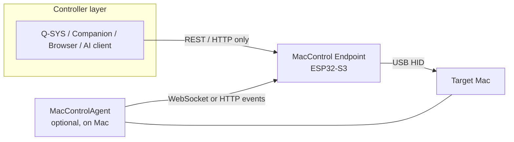

| Component | Required | Role | Owns |
|---|---|---|---|
| Controller | Yes | Any REST/HTTP client (Q-SYS, Companion, browser, automation, AI client) | Nothing; issues requests only |
| MacControl Endpoint (ESP32-S3) | Yes | Authoritative control and status hub | Command ledger, status cache, identity, macros, terminal verdicts |
| Target Mac | Yes | Machine under control, reached via USB HID | Receives HID input; no protocol role |
| MacControlAgent (MCA) | No | On-Mac evidence provider | Pairing state, allowlist, event reports to ESP32 |

The inventory is closed: no central manager, broker, or cloud service exists in this specification. The ESP32 endpoint MUST remain fully functional in Mode A even when the MCA is never installed, because the ESP32 alone owns command initiation, the persistent command ledger, the controller-facing status cache, and all terminal command outcomes. The MCA closes the verification loop with evidence; it never independently marks a command complete and is never a dependency of basic HID control.

#### 1.2.2 Require all controllers to communicate only with the ESP32 REST/API surface and never directly with the MCA

Controllers MUST address only the ESP32 REST/API surface (`/api/v1/...`) and MUST NOT communicate directly with the MCA. The MCA accepts inbound traffic solely from its paired ESP32 endpoint and exposes no controller-facing API. This single-ingress rule keeps authentication, RBAC enforcement, rate limiting, and the command ledger in exactly one place, so the ESP32 is the sole testable system boundary.

### 1.3 Operating modes and capability levels

#### 1.3.1 Define Mode A as agentless HID control with hid_only/unconfirmed terminal states

Mode A is the zero-install mode: no software runs on the Mac. The ESP32 issues keyboard shortcuts, macros, and power commands over USB HID. Because no evidence channel exists, Mode A commands MUST terminate as `unconfirmed` (with `result = hid_only`) or `failed` on local dispatch errors, and MUST NEVER terminate as `completed`.

#### 1.3.2 Define Mode B as agent-enhanced operation where MCA evidence completes the verification loop

Mode B adds the MCA, which reports system state, user state, application state, and command acknowledgements. Mode B is the only mode that MAY mark a command `completed`, and only when MCA evidence satisfies the command's verification predicate within its deadline (Section 5.3).

#### 1.3.3 Define capability levels L1 HID, L2 agent visibility, and L3 verified automation with one testable criterion each

| Level | Name | Scope | Testable criterion |
|---|---|---|---|
| L1 | HID control | Mode A | Dispatching `POST /api/v1/system/lock` produces a ledger record terminating in `unconfirmed` with `result = hid_only` |
| L2 | Agent visibility | Mode B | `GET /api/v1/status` reports `agent_reported` Mac state no older than the 15 s stale threshold |
| L3 | Verified automation | Mode B | A `restart` command reaches terminal state `completed` only after agent hello with a changed `boot_id` within the restart deadline |

The levels are cumulative: L3 implies L1 and L2. An implementation claiming L3 MUST pass the L1 and L2 criteria with the agent disabled and enabled respectively, which proves the ESP32's independence from the MCA.

## 2. Authority Model and Responsibility Split

MacControl is a deterministic system, and determinism requires an unambiguous answer to the question: *who is allowed to assert what?* This chapter fixes that answer. The ESP32-S3 MacControl Endpoint is the single authority for command state and published status; the MacControlAgent (MCA) is an evidence supplier whose output can advance a command through its lifecycle but can never independently settle it. Controllers (Q-SYS, Companion, browsers, automation scripts, external AI clients) communicate only with the ESP32 REST/API surface and MUST NOT communicate directly with the MCA. No inference, planning, or natural-language interpretation occurs anywhere in this authority chain; every transition is produced by explicit, testable rules.

### 2.1 ESP32 as final source of truth

#### 2.1.1 Exclusive ESP32 responsibilities

Four functions are assigned exclusively to the ESP32 and MUST NOT be delegated to any other component, including the MCA:

| Function | Owner | Exclusive rule |
|---|---|---|
| Command initiation and dispatch | ESP32 | Every command-producing request (power commands, macro execution, application launch/quit) creates a ledger record and receives a `command_id` before any HID dispatch or agent action; non-command mutations (macro CRUD, key management, OTA) return 200/201 synchronously and create no ledger record. |
| Command ledger ownership | ESP32 | The ledger is the sole record of command state; it survives reboot and is reconciled at boot. |
| Status cache publication | ESP32 | `GET /api/v1/status` is served only from the ESP32 cache, with per-field provenance and freshness metadata. |
| Terminal verdicts | ESP32 | Only the ESP32 may set a command to `completed`, `failed`, `timed_out`, or `unconfirmed`. |

This concentration of authority is deliberate. Because controllers never talk to the MCA, a controller can reconstruct the full truth of the system from one document (the status cache) and one record set (the ledger). If authority were split — for example, if the MCA could mark a command complete — a controller would have to trust a component it cannot address and whose liveness it cannot independently observe. Centralizing verdicts on the ESP32 also makes the failure model simple: if the ESP32 is reachable, its answers are authoritative; if it is unreachable, nothing downstream may substitute its own claim of success.

#### 2.1.2 MCA output classified as evidence

MCA output is classified as *evidence*: typed, sequenced, authenticated messages that the ESP32 evaluates against per-command verification predicates. Evidence can advance a command from `dispatched` to `confirming` to `completed`, but evidence alone never produces a terminal state. The verdict is always computed by ESP32-side rules (see Chapter 5), which also incorporate timeouts and expected-offline windows. In Mode A (agentless), no evidence exists, so commands MUST terminate as `unconfirmed` with `result=hid_only`; Mode A MUST never report `completed`. Mode B (agent-enhanced) is the only mode in which `completed` is reachable, and only when MCA evidence satisfies the declared predicate for that command within its deadline.

### 2.2 MCA as loop-closing evidence provider

#### 2.2.1 Evidence supplied by the MCA

The MCA closes the verification loop that USB HID cannot close. It MUST supply the following evidence classes: `agent_hello`/`agent_goodbye` (session boundaries), `heartbeat` (every 5 seconds by default), system state reports (awake, sleeping, waking, shutting down, restarting, booting), user state reports (logged in/out, screen locked/unlocked), application state reports (started/exited for allowlisted applications), and command acknowledgements/results correlated by `command_id`. Each class exists to make a specific predicate testable: without `agent_goodbye` plus expected offline, sleep and shutdown cannot be verified; without a post-restart `agent_hello` bearing a changed `boot_id`, restart cannot be verified.

#### 2.2.2 Evidence admission rules

The ESP32 MUST reject MCA evidence that is unauthenticated (missing or invalid paired credential), out-of-sequence (session sequence number not monotonically increasing within the active session), stale (arriving only after its associated session has been declared OFFLINE at 30 seconds of silence or has been closed; a session merely marked STALE at 15 seconds still accepts evidence, because STALE is recoverable — any valid frame in the same session returns the session to ACTIVE per Chapter 4.2.1), or unpaired (device identity not matching the single active pairing). Rejected evidence is logged with the rejection reason and MUST NOT advance any command or update any status field. These admission rules make replay, spoofing, and cross-device confusion detectable and harmless rather than silently corrupting the ledger.

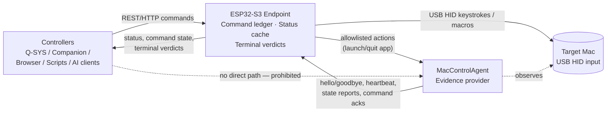

The data-flow diagram makes the authority structure visible: all controller traffic terminates at the ESP32, all physical effect flows through USB HID, and all verification flows back from the MCA as evidence. There is exactly one path by which the outside world learns outcomes, and exactly one component that decides them.

### 2.3 UI ownership split

Because authority is split between the endpoint and the agent, configuration authority is split the same way. Each UI configures only the component it runs on; neither UI may write configuration owned by the other.

#### 2.3.1 ESP32 Web UI responsibilities

The ESP32 Web UI MUST own shortcut trigger setup and macro definitions, device identity, controller credentials and RBAC keys, and dashboard/log/OTA functions, and MUST NOT expose any control that writes MCA-owned configuration.

#### 2.3.2 MCA UI responsibilities

The MCA UI MUST own command enablement, response endpoint configuration, and the application allowlist, and MUST NOT expose any control that writes ESP32-owned configuration.

| Configuration area | ESP32 Web UI | MCA UI |
|---|---|---|
| Shortcut trigger setup and macros | Owns | — |
| Device identity (name, hostname, location, description) | Owns | — |
| Controller credentials and RBAC keys (READ/CONTROL/ADMIN) | Owns | — |
| Dashboard publication, logs, OTA | Owns | — |
| Pairing initiation/completion | Opens pairing window | Completes pairing ceremony |
| Command enablement and response endpoints | — | Owns |
| Application allowlist | — | Owns |

This split follows the principle that the party enforcing a rule must own its configuration. The ESP32 enforces controller authentication and executes macros, so it owns credentials and macro definitions; the MCA enforces the application allowlist and decides which commands it will act on, so it owns allowlist and enablement state. Pairing is the single deliberate exception requiring cooperation: the ESP32 opens a time-boxed pairing window from its Web UI, and the MCA completes the ceremony in its own UI, after which exactly one active pairing is recognized (see Chapter 3). A consequence for implementers is that a factory-reset ESP32 never invalidates MCA-side allowlist data, and a reinstalled MCA never inherits controller credentials — each side's configuration is independently persisted, independently revocable, and meaningless to the other component except through the paired protocol.

## 3. Device Identity, Pairing, and Discovery

### 3.1 Endpoint identity

#### 3.1.1 Define device name, hostname, location, description, generated device ID, and mDNS naming rules

Every MacControl Endpoint MUST carry a persistent identity record stored in ESP32 flash, editable through the ESP32 Web UI, and readable at `GET /api/v1/status` and in mDNS TXT records. The identity record is the anchor that controllers, the MCA, and the command ledger use to correlate traffic with a physical machine.

| Field | Type | Mutable | Rules |
|---|---|---|---|
| `device_name` | string, 1–32 chars | Yes (Web UI) | Operator label, e.g. `ProPresenter Mac`; display only, never used for routing |
| `hostname` | DNS label, 1–57 chars | Yes (Web UI) | Lowercase `[a-z0-9-]`, must start/end alphanumeric; default `mac-` + last 6 hex of factory MAC. The 57-char cap reserves room for the collision suffixes of Chapter 3.3 (`-2` through `-99`) within the 63-char DNS label limit |
| `location` | string, 0–64 chars | Yes (Web UI) | Free text, e.g. `Main Sanctuary` |
| `description` | string, 0–128 chars | Yes (Web UI) | Free text, e.g. `Main ProPresenter computer` |
| `device_id` | 12 hex chars | No | Generated once at first boot from the factory eFuse MAC; never regenerated, survives OTA and config reset |

The mDNS advertised instance name MUST be the collision-resolved hostname label (Chapter 3.3) plus `.local`, and the Web UI MUST reject a `hostname` edit that does not satisfy the DNS-label rule above. `device_id` is the only identity element other subsystems may trust for correlation: `device_name` and `hostname` are operator-editable and therefore decorative for security and ledger purposes. Implementers should note that identity edits apply without reboot, but the mDNS responder MUST re-announce within 2 seconds of a hostname change so controllers do not retain stale resolutions.

### 3.2 ESP32-MCA pairing

#### 3.2.1 Define a time-boxed pairing ceremony initiated from the ESP32 Web UI and completed in the MCA UI

Pairing is the sole trust anchor between an ESP32 endpoint and an MCA instance. The ceremony is explicitly two-sided and time-boxed:

1. An ADMIN-scoped operator opens the pairing window from the ESP32 Web UI. The ESP32 generates a one-time 8-character alphanumeric pairing code (excluding ambiguous glyphs `0/O/1/I`), displays it locally, and opens a pairing window with a default lifetime of 120 seconds (configurable 60–600 s).
2. The operator enters that code in the MCA UI on the target Mac. The MCA resolves the endpoint via mDNS, submits the code to `POST /agent/v1/pair` over the LAN, and receives a pairing credential in return.
3. The ESP32 validates the code, atomically stores the pairing record, and closes the window. Exactly one code validation attempt per second is accepted; after 5 failed attempts the window closes.

#### 3.2.2 Define stored credentials, revocation, re-pairing, and exactly-one-pairing-per-activation rules

The pairing record stored on the ESP32 MUST conform to:

```json
{
  "pairing_id": "pr-3fa9c2",
  "device_id": "a1b2c3d4e5f6",
  "agent_instance_id": "ag-7e21",
  "agent_token_sha256": "9f2c…e4",
  "created_at": "2025-01-14T09:31:02Z",
  "last_used_at": "2025-01-14T10:12:03Z",
  "state": "active"
}
```

The raw `agent_token` (32 bytes, base64url) is returned to the MCA exactly once during the ceremony; the ESP32 persists only its SHA-256 digest. The MCA MUST present the token on every WebSocket `agent_hello` and every polling request; the ESP32 MUST reject evidence bearing an unknown, revoked, or mismatched token. The following state machine governs the record's lifecycle:

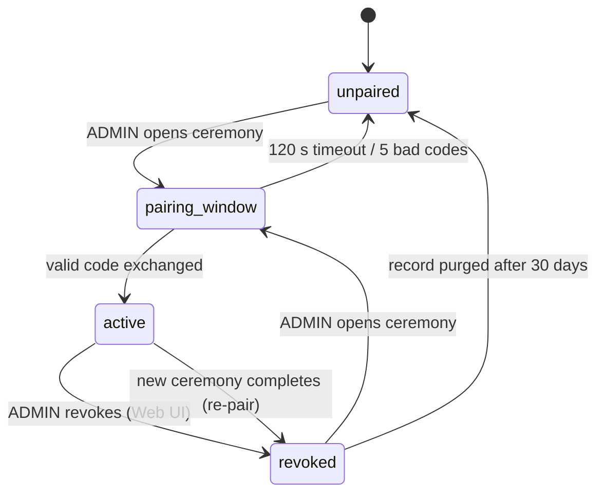

The exactly-one rule is normative: an ESP32 holds at most one record in `active` state at any time, and completing a new ceremony implicitly revokes the incumbent credential before the new one is stored. Revocation takes effect immediately — in-flight MCA connections are closed with a dedicated close code and the status cache marks all `agent_reported` fields stale. Re-pairing after credential loss therefore requires physical or ADMIN access to the ESP32 Web UI, which is the intended recovery path. Acceptance implication: a revoked token presented within the same second as revocation MUST be rejected, and the ledger MUST log the revocation event with a correlation ID.

### 3.3 Discovery

#### 3.3.1 Define mDNS advertisement and deterministic controller discovery without any central manager dependency

Each endpoint MUST advertise service type `_maccontrol._tcp.local.` with TXT records `id=<device_id>`, `api=1`, `mode=A|B`, and `pair=unpaired|active|revoked`. Controllers discover endpoints by browsing this service type and resolving `<hostname>.local`; no central manager, cloud broker, or directory service is required or consulted. On joining a network, the ESP32 MUST issue an unsolicited announcement; on detecting a hostname conflict it MUST log the conflict, retain its configured `hostname` in the identity record, and advertise with the first available suffixed label formed by appending `-2`, then `-3`, and so on through `-99` (the 57-char base-label cap of Chapter 3.1 guarantees every suffixed label fits the 63-char DNS limit), while surfacing a persistent warning in the Web UI. If every suffix from `-2` through `-99` also collides, provisioning of the advertisement MUST fail with the deterministic error `hostname_collision_exhausted`, logged and surfaced in the Web UI; the endpoint retains its configured `hostname` and does not advertise a mDNS instance name until the conflict is resolved. Deterministic renaming beyond this rule remains the operator's responsibility, since silent renaming would break stored controller configurations. A future manager may aggregate these advertisements, but endpoints MUST remain fully functional in its absence; discovery, pairing, and command execution degrade only with the LAN itself, never with any off-device dependency.

## 4. Connectivity and Agent Transport

This chapter defines the two transport surfaces of the MacControl Endpoint (ESP32): the controller-facing REST/HTTP API and the agent-facing channel used by MacControlAgent (MCA). Both surfaces are deterministic: every request produces a versioned path, a closed set of status codes, and a fixed timing behavior. The ESP32 remains the final source of truth for connection state; the MCA only initiates and maintains a session. Nothing in this chapter depends on natural-language or inference-driven behavior of any kind.

### 4.1 Controller transport

#### 4.1.1 REST/HTTP access with versioned paths and deterministic errors

Controllers (Q-SYS, Bitfocus Companion, browsers, scripts, or external AI clients acting as ordinary HTTP consumers) MUST communicate only with the ESP32 over HTTP. All controller paths MUST be prefixed with a major version segment, `/api/v1/`, and all agent-facing paths with `/agent/v1/`; unversioned requests MUST be rejected with HTTP 404. A version bump (for example `/api/v2/`) MUST leave `/api/v1/` behavior unchanged for at least one full firmware release cycle.

Every error response MUST use the deterministic error envelope below, and the mapping between HTTP status and `code` MUST be exact and total: the ESP32 MUST NOT emit a status code outside this table. The transport is Ethernet-capable: the same controller and agent surfaces, paths, status codes, and mDNS discovery apply unchanged when the endpoint is deployed with an Ethernet interface (Chapter 17, Phase 6) instead of or alongside Wi-Fi.

```json
{
  "error": {
    "code": "unauthorized",
    "message": "API key missing or invalid",
    "request_id": "req_01HF3K9X2A"
  }
}
```

| HTTP status | code | Trigger condition |
|---|---|---|
| 400 | `bad_request` | Malformed JSON, unknown field, schema violation on a controller (`/api/v1/`) request |
| 400 | `validation_failed` | Agent (`/agent/v1/`) event envelope schema violation or unknown event type; counted per Chapter 6.1.1 |
| 400 | `macro_invalid_step` | Any invalid macro definition: a step `type`, `key`, or modifier outside the closed enums, or an invalid `expected_event` such as a forbidden verification event type (Chapter 10.1.1) |
| 401 | `unauthorized` | Missing/invalid API key or pairing credential |
| 403 | `forbidden` | Valid credential, insufficient READ/CONTROL/ADMIN role |
| 403 | `forbidden` | Known but revoked/disabled credential (controller API key or agent pairing token) |
| 404 | `not_found` | Unknown path, command_id, macro_id, or version |
| 409 | `conflict` | Idempotency key replay with divergent body |
| 409 | `agent_not_paired` | Agent-dependent command or endpoint requested with no active pairing (Mode A) |
| 409 | `agent_offline` | Agent-dependent command requested while the paired agent's session is not ACTIVE |
| 409 | `command_disabled` | Action absent from the MCA `capability_report.enabled_commands` |
| 409 | `app_not_allowlisted` | Target `bundle_id` absent from the MCA `allowlisted_apps` |
| 409 | `app_not_registered` | Target `bundle_id` absent from the ESP32 monitored registry |
| 409 | `app_control_disabled` | Registry entry has `control_enabled: false` |
| 409 | `macro_queue_full` | Macro execution queue at capacity; rejected pre-ledger, no record created (Chapter 10.3.1) |
| 409 | `ota_in_progress` | OTA upload/apply requested while another OTA operation is in progress, or `ota/apply` requested without `force` while commands are in flight (Chapter 15.3) |
| 409 | `store_corrupt` | Persistent macro store failed CRC validation; execution refused (Chapter 15.1). Unrecoverable corruption of other stores surfaces as 500 `internal_error` |
| 429 | `rate_limited` | Per-role rate limit exceeded (Chapter 13) |
| 500 | `internal_error` | Any otherwise unclassified failure |
| 503 | `ledger_unavailable` | Ledger write failed; nothing dispatched (Chapter 5.1.2) |
| 503 | `network_unavailable` | Requests arriving during association loss (Chapter 15.1) |

This closed mapping lets controllers implement exact retry logic: 429, 500, and 503 are retryable with the backoff defined in Section 4.3.2, while 400, 401, 403, 404, and the 409 family are permanent and MUST NOT be retried unchanged. The mapping is total for the HTTP surfaces: every HTTP error the ESP32 emits uses exactly one row above. WebSocket close codes 4001, 4002, and 4003 (Section 4.2.1) are **not** HTTP status codes and are excluded from this mapping. There is no one-to-one mapping from WebSocket close codes to HTTP statuses; on the polling fallback transport, agent-facing rejections follow the deterministic HTTP rules of Section 4.3.1 and never reuse close-code numbers as `code` values or HTTP statuses. Only command-producing requests — power commands (`wake`, `sleep`, `restart`, `shutdown`, `lock`), macro execution, and application launch/quit — return HTTP 202 with a `command_id` whose lifecycle is defined in Chapter 5; transport acceptance never implies execution success. Non-command-producing mutations (macro CRUD, key management, OTA upload/apply) return HTTP 200 or 201 synchronously and create no ledger record. `request_id` is an ESP32-generated correlation identifier echoed into the event log (Chapter 15).

### 4.2 MCA-to-ESP32 WebSocket

#### 4.2.1 Handshake, session assignment, and sequence numbers

The MCA MUST initiate the connection; the ESP32 never dials the agent. The MCA opens a WebSocket to `ws://<hostname>.local/agent/v1/ws` and presents its pairing credential (Chapter 3) in the HTTP `Authorization: Bearer` header of the upgrade request. Immediately after upgrade, the MCA MUST send an `agent_hello` frame, enveloped like every MCA message (Chapter 6.1):

```json
{
  "event_id": "evt_1",
  "agent_instance_id": "ag-7e21",
  "seq": 1,
  "timestamp": "2025-01-14T09:31:10Z",
  "type": "agent_hello",
  "payload": {
    "protocol_version": 1,
    "agent_version": "1.0.0",
    "boot_id": "b_3F8A11",
    "hostname": "mac-propresenter"
  }
}
```

`agent_hello` carries no `state` or `ready` field: readiness is established by the mandatory initial status burst (Chapter 6.3) that follows `hello_ack`. The opening `agent_hello` is the only frame without a `session_id`, which is assigned by the `hello_ack` reply.
The ESP32 validates the credential and `agent_instance_id` against the stored pairing record's `agent_instance_id` (Chapter 3), then replies with `hello_ack` containing a server-assigned `session_id`, the negotiated `protocol_version`, and the heartbeat parameters of Section 4.2.2. From `hello_ack` onward the session is ACTIVE. Each MCA frame carries `seq`, a per-session monotonically increasing integer starting at 1; `seq` resets on every new session and MUST NOT be reused across sessions. The ESP32 MUST reject evidence that is unpaired or out of sequence (a gap greater than the configured `max_seq_gap`, default 10), per the evidence rules of Chapter 2. The MCA-supplied `timestamp` is advisory only and is never a rejection or ordering criterion: ordering is governed by `seq`, and all timing arithmetic uses the ESP32-recorded `received_at` (Chapter 6.1.1). Rejection is expressed by closing the socket with the close codes below.

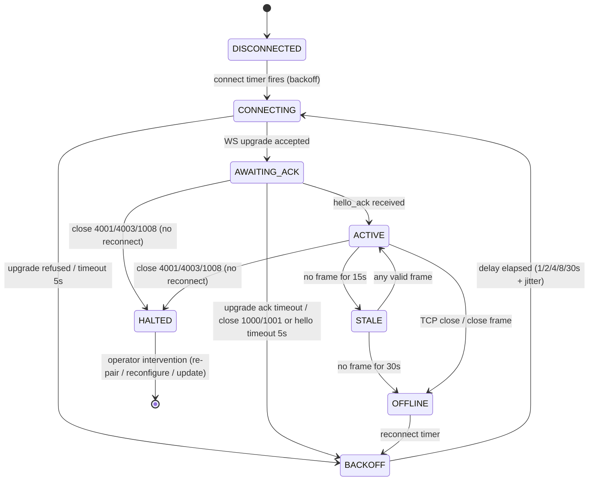

The STALE and OFFLINE states are ESP32-side observations of the session, not MCA states; they drive status-cache freshness marking (Chapter 7) and never terminate commands by themselves. HALTED is the terminal no-reconnect state: closes 4001 (unpaired/revoked), 4003 (protocol mismatch), and 1008 (policy/auth failure) land there, and the MCA MUST NOT enter BACKOFF for them; only close 1000, close 1001, and unannounced network loss (including close 4002, which forces a new session) enter the BACKOFF loop.

| Close code | Name | Meaning | MCA MUST reconnect? |
|---|---|---|---|
| 1000 | Normal | Clean shutdown after `agent_goodbye` | Yes, after backoff |
| 1001 | Going away | Expected-offline window (sleep/restart/shutdown) | Yes, inside declared window |
| 1008 | Policy violation | Generic authentication/policy failure | No, until reconfigured |
| 4001 | Unpaired or revoked | Credential unknown or revoked pairing | No, until re-paired |
| 4002 | Sequence violation | `seq` regression or gap > `max_seq_gap` | Yes, new session, `seq` resets |
| 4003 | Protocol mismatch | Unsupported `protocol_version` | No, until agent updated |

For implementers, the reconnect column encodes the authority split: codes 1008, 4001, and 4003 represent configuration or trust faults that retrying cannot fix, so the MCA MUST surface them in its UI connection-status page and stop reconnecting; codes 1000, 1001, and 4002 are transient and enter the backoff loop. During an expected-offline window (1001), the ESP32 MUST classify the silence as `expected_offline` evidence rather than a fault.

Close handling is ordered and total. On any connection termination the ESP32 and the MCA MUST evaluate the close code first: close 4001, 4003, or 1008 transitions the session directly to HALTED (terminal, no reconnect); close 1000, close 1001, or no-code network loss transitions to OFFLINE and thence into BACKOFF as applicable. A 1001 close permits transport-level reconnect in general — the backoff loop is legal during an expected-offline window — but the command layer evaluates reconnects independently of transport permission: an MCA reconnect arriving before an in-flight sleep command's `close_after_s` is refutation evidence that MUST fail that command with `unexpected_wake` (Chapters 5.3.2, 8.1.1). For a clean sleep the MCA SHOULD NOT reconnect before `close_after_s` elapses.

#### 4.2.2 Heartbeat and liveness timing

| Parameter | Default | Configurable range | Semantics |
|---|---|---|---|
| `heartbeat_interval` | 5 s | 2–30 s | MCA sends `heartbeat` frame this often |
| `stale_threshold` | 15 s | fixed at 3 × interval | Agent-derived status fields marked stale |
| `offline_threshold` | 30 s | fixed at 6 × interval | Session declared OFFLINE; agent evidence closed |
| `hello_timeout` | 5 s | 2–10 s | Max wait for `hello_ack` after upgrade |

The 3× and 6× ratios MUST be preserved if `heartbeat_interval` is changed, so exactly three missed heartbeats imply STALE and six imply OFFLINE. Any valid frame—not only `heartbeat`—resets the liveness clock, which prevents idle-but-chatty sessions from flapping. OFFLINE does not mark commands failed; it only closes the evidence channel, leaving terminal verdicts to the lifecycle rules of Chapter 5.

### 4.3 Polling fallback

#### 4.3.1 Semantically identical HTTP transport

Where WebSocket is unavailable (proxy restrictions, constrained networks), the MCA MUST fall back to two endpoints that are semantically identical to the WebSocket channel: `POST /agent/v1/events` carries the exact same event envelope as a WebSocket frame (`agent_hello`, `heartbeat`, `command_ack`, and all Chapter 6 events), and `GET /agent/v1/commands/pending` replaces server-pushed command dispatch. The first `agent_hello` POST establishes the session and returns `session_id` in the response body, which the MCA MUST then supply as the `X-Session-Id` header on every subsequent request; sequence numbering and rejection rules are unchanged. Because HTTP has no close frames, there is no one-to-one WebSocket-close-to-HTTP mapping; instead, rejections on the polling transport use these deterministic rules: a missing or invalid credential is HTTP 401 `unauthorized`; a known but revoked or disabled credential is HTTP 403 `forbidden`; an unpaired `agent_instance_id` is HTTP 409 `agent_not_paired`; a request against an inactive or unknown session is HTTP 409 `agent_offline`; and an event-envelope schema violation or unknown event type is HTTP 400 `validation_failed`, counted toward the schema-violation threshold of Chapter 6.1.1. The default poll interval for `GET /agent/v1/commands/pending` is 5 s (configurable 2–30 s), matching `heartbeat_interval` so liveness semantics are identical across transports. The ESP32 MUST NOT treat transport choice as evidence: Mode B verification rules apply equally, and switching transports mid-session is prohibited—a transport change requires a new session.

#### 4.3.2 Deterministic reconnect backoff

| Consecutive failed attempts | Base delay | Applied jitter (0–20%) | Effective range |
|---|---|---|---|
| 1 | 1 s | 0–0.2 s | 1.0–1.2 s |
| 2 | 2 s | 0–0.4 s | 2.0–2.4 s |
| 3 | 4 s | 0–0.8 s | 4.0–4.8 s |
| 4 | 8 s | 0–1.6 s | 8.0–9.6 s |
| 5+ | 30 s (cap) | 0–6.0 s | 30.0–36.0 s |

The attempt counter increments on every failed connect, upgrade, or `hello_ack` wait, and on every failed poll cycle in fallback mode; it resets to zero only on a successful `hello_ack`. Jitter MUST be drawn uniformly from $[0,\ 0.2 \times \text{base}]$ using a non-cryptographic PRNG seeded at boot, which decorrelates fleets of agents rebooting together after a power event without introducing unbounded delay. There is no maximum attempt count: a paired agent retries forever at the 30 s cap, because long-lived silence is normal inside expected-offline windows and the ESP32, not the transport, decides when evidence is too old to matter.

## 5. Command Ledger and Deterministic Command Lifecycle

This chapter defines how the MacControl Endpoint (ESP32-S3) records, advances, and terminates commands. The design follows directly from the authority model in Chapter 2: the ESP32 owns the command ledger, MacControlAgent (MCA) supplies evidence only, and the absence of evidence MUST produce a non-committal terminal state rather than an inferred success. Every state transition in this chapter is deterministic: given the same ledger record and the same evidence inputs, any conforming implementation MUST reach the same terminal verdict.

### 5.1 Command ledger

#### 5.1.1 Flash-backed append-only ledger with bounded capacity, FIFO eviction, idempotency keys, and boot reconciliation

The ESP32 MUST maintain a persistent command ledger in flash storage. The ledger is append-only: records are never mutated in place; instead, each state transition appends a new record revision sharing the same `command_id`, and the latest revision defines the observable state. This preserves an auditable transition history within the same bounded store. The ledger MUST be bounded at a default capacity of 256 commands (configurable 64–1024); when capacity is exhausted, the oldest command — including all of its revisions — MUST be evicted in strict FIFO order. Eviction MUST NOT remove a command in a non-terminal state unless the store is full of non-terminal commands, in which case the oldest non-terminal command MUST be terminated as `failed` with `error_code = "evicted_pending"` before eviction.

Idempotency is deduplicated on an explicit client-supplied key (`Idempotency-Key` header or `idempotency_key` field). If a new request arrives whose explicit idempotency key matches an existing non-evicted ledger record, the ESP32 MUST NOT create a new record or re-dispatch; it MUST return the existing `command_id` and current state with HTTP 200, and the same key with a divergent body MUST be rejected with 409 `conflict` (Chapter 12.2.1). A request with no explicit key executes as a new command, with exactly one exception: the ESP32 derives a hash of `(command_type, target, normalized_parameters)`, and if that hash matches a ledger record still in a non-terminal in-flight state (`accepted`, `dispatched`, or `confirming`) that was accepted within the last 60 seconds, the duplicate MUST be coalesced to the existing in-flight `command_id` — the ESP32 returns HTTP 202 carrying the existing `command_id` and its current state, creates no new record, and MUST NOT dispatch a duplicate. Coalescing never applies to terminal records and never beyond the 60-second in-flight window: once the earlier command terminates or the window elapses, an identical no-key request executes as a new command with a new ledger record. Only explicit-key deduplication spans full ledger retention.

```json
{
  "command_id": "8F31A2C4",
  "idempotency_key": "qsys-show-preset-042",
  "revision": 3,
  "type": "restart",
  "parameters": {},
  "requested_by": "apikey:control-01",
  "requested_at": "2025-01-14T09:31:02Z",
  "mode_at_accept": "B",
  "state": "confirming",
  "dispatched_at": "2025-01-14T09:31:03Z",
  "deadline_at": "2025-01-14T09:34:03Z",
  "expected_offline_window": { "open_after_s": 3, "close_after_s": 60 },
  "evidence": ["evt_1042", "evt_1047"],
  "result": null,
  "error_code": null
}
```

The schema fixes the vocabulary used across this specification: `command_id` is an ESP32-generated unique identifier formatted as a bare 8-character Crockford Base32 string — uppercase digits `0–9` and letters `A–Z` excluding `I`, `L`, `O`, and `U` (e.g., `8F31A2C4`, `7AC41E9B`); `state` and `result` follow Section 5.2; `expected_offline_window` follows Section 5.3.2; `evidence` lists MCA event identifiers (Chapter 6) that advanced the command. `result` and `error_code` are null in every non-terminal revision. Implementers should note that `mode_at_accept` is pinned at acceptance time: pairing or unpairing the MCA mid-command MUST NOT retroactively change which terminal states are reachable for that command.

On every boot, the ESP32 MUST reconcile the ledger before accepting new commands. Any command found in a non-terminal state MUST be re-evaluated against current evidence (MCA connection state, network probes): if its deadline has passed it transitions to `timed_out`; if its deadline is still open and the command is resumable (e.g., `wake`, which is pure observation after dispatch), it resumes in `confirming`; otherwise it transitions to `failed` with `error_code = "esp32_restarted"`. Boot reconciliation MUST complete within 2 seconds and MUST be recorded as a log entry (Chapter 15) so that a controller can explain any verdict that changed while the endpoint was down.

#### 5.1.2 Require every command-producing request to create a ledger record before dispatch and return 202 with command_id

Every command-producing controller request — system power commands, macro execution, and application launch/quit — MUST be persisted to the ledger in state `accepted` **before** any HID report is emitted or any MCA-bound action is queued. The only exceptions are requests resolved before acceptance: deterministic pre-ledger rejections (the 409 family of Chapter 12.3.1, including `macro_queue_full` and `agent_not_paired`) and the coalesced in-flight duplicate of Chapter 5.1.1, which returns HTTP 202 with the existing `command_id` and creates no new record. The response to an accepted controller request is HTTP 202 with a body containing at minimum `command_id`, `state: "accepted"`, and `deadline_at`. This ordering is the core durability guarantee: if the endpoint loses power after the flash write but before dispatch, boot reconciliation finds the record and terminates it deterministically instead of losing the command silently. If the ledger write fails (flash error, store full of unevictable records), the endpoint MUST return HTTP 503 whose error envelope carries `code: "ledger_unavailable"` and MUST NOT dispatch. Non-command-producing mutations — macro CRUD, API key management, and OTA upload/apply — return HTTP 200 or 201 synchronously and MUST NOT create ledger records. Read-only requests (status, capabilities, macro listing) MUST NOT create ledger records. Acceptance testing should verify the 202 contract by power-cycling the endpoint between acceptance and dispatch and confirming the command resolves to `failed`/`esp32_restarted` rather than disappearing.

### 5.2 Lifecycle states

#### 5.2.1 Define accepted, dispatched, confirming, completed, failed, timed_out, and unconfirmed with terminal-state rules

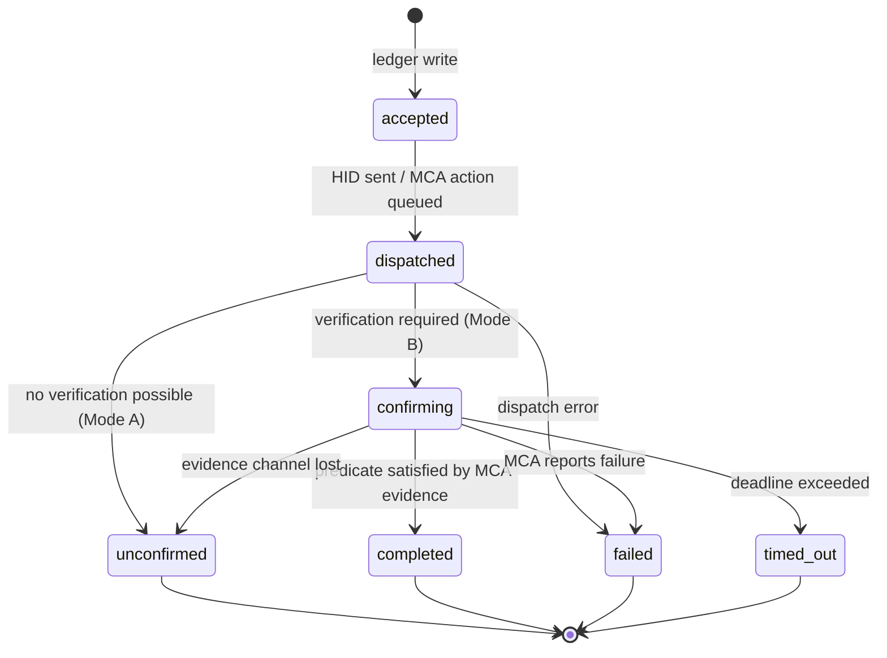

The four terminal states are `completed`, `failed`, `timed_out`, and `unconfirmed`; terminal records are immutable except for FIFO eviction. The transition table below is normative.

| From | Trigger | To | Guard / side effect |
|---|---|---|---|
| — | mutating request accepted | `accepted` | record persisted before dispatch |
| `accepted` | HID report sent or MCA action queued | `dispatched` | set `dispatched_at`, `deadline_at` |
| `accepted`/`dispatched` | USB/queue error | `failed` | `error_code = "dispatch_error"` |
| `dispatched` | Mode B, verification pending | `confirming` | evidence correlation opens |
| `dispatched` | Mode A, or no predicate available | `unconfirmed` | `result = "hid_only"` |
| `confirming` | MCA evidence satisfies predicate (5.3) | `completed` | result code per predicate table |
| `confirming` | MCA `command_result` reports failure | `failed` | `error_code` from MCA payload |
| `confirming` | `deadline_at` exceeded | `timed_out` | `error_code = "deadline_exceeded"` |
| `confirming` | MCA channel lost > 30 s with no window open | `unconfirmed` | `result = "evidence_lost"` |

The table encodes two rules implementers must not soften. First, `completed` has exactly one incoming edge, and that edge requires MCA evidence; no timer, probe, or HID success signal may substitute. Second, `unconfirmed` is terminal, not a retry state: a command that lost its evidence path ends there, and controllers that need certainty must issue a new command (idempotency keys make this safe). `timed_out` and `unconfirmed` differ in meaning — the deadline expired while the evidence channel was healthy, versus the channel itself failed — and UIs (Chapter 14) MUST render them distinctly.

#### 5.2.2 Define Mode A terminal behavior as unconfirmed with result=hid_only and prohibit completed without MCA evidence

In Mode A (agentless), every command MUST terminate as `unconfirmed` with `result = "hid_only"` once dispatch succeeds. This is the deterministic restatement of the PRD's distinction between "command sent" and "command confirmed": HID dispatch is proof of transmission, never of effect. The ESP32 MUST NOT mark any command `completed` without correlated MCA evidence, and this prohibition holds even if optional network probes (e.g., ping loss after a shutdown request) suggest success — such probes MAY annotate `result` (e.g., `"hid_only_net_unreachable"`) but MUST NOT change the terminal state. Symmetrically, in Mode B the MCA's `command_result` events are inputs to the ESP32's verdict logic; the MCA MUST NOT be treated as having authority to close a command, and the ESP32 MUST ignore completion claims that fail the evidence validation rules of Chapter 2.2.2 (unauthenticated, out-of-sequence, stale, or unpaired).

### 5.3 Verification predicates

#### 5.3.1 Define per-command predicates and default deadlines for wake, sleep, restart, shutdown, lock, macro execution, app launch, and app quit

Each command type has exactly one verification predicate — a boolean expression over MCA evidence events — and a default deadline. All deadlines are defaults and MUST be configurable per command type within the stated bounds.

| Command | Verification predicate (MCA evidence) | Default deadline (bounds) | `result` on completion |
|---|---|---|---|
| wake | Post-dispatch **new** MCA session `agent_hello` whose mandatory initial status burst reports `system_state=awake` (heartbeat alone insufficient) | 120 s (30–600) | `wake_confirmed` |
| sleep | `agent_goodbye(reason=sleep)` or offline onset inside the expected-offline window (5.3.2), **and** no reconnect through `close_after_s` | 90 s (15–300; MUST be > `close_after_s`) | `sleep_confirmed` |
| restart | Offline/goodbye inside window, then new-session `agent_hello` with changed `boot_id` and initial burst reporting `system_state=awake` | 180 s (60–900) | `restart_confirmed` |
| shutdown | `agent_goodbye(reason=shutdown)` or offline onset inside window, plus ICMP unreachability probes (Chapter 8.2.2) and no reconnect by deadline | 120 s (30–600) | `shutdown_confirmed` |
| lock | `screen_lock_changed(locked)` | 15 s (5–60) | `lock_confirmed` |
| macro execution | HID-only: the macro definition's explicit `expected_event` (e.g., `application_started` with matching `bundle_id`) arrives within the deadline; `expected_event.type` is restricted to the five ambient evidence types of Chapter 10.1.1 (`application_started`, `application_exited`, `system_state_changed`, `user_session_changed`, `screen_lock_changed`) — `command_ack`, `command_result`, `heartbeat`, `agent_hello`, `agent_goodbye`, and `capability_report` are forbidden as macro verification events; macro execution never uses MCA `command_ack`/`command_result` correlation, and if the macro declares no `expected_event`, the command is unverifiable and MUST terminate `unconfirmed` (Chapter 10.3.1) | macro timeout + 5 s | `macro_confirmed` |
| app launch | MCA-executed (Chapter 9.3.1): correlated `command_ack(action=launch_app)` **plus** `application_started(bundle_id)` matching the allowlisted target; `command_result(ok)` may report local execution outcome but MUST NOT by itself complete the predicate | 30 s (10–120) | `app_launch_confirmed` |
| app quit | MCA-executed (Chapter 9.3.1): correlated `command_ack(action=quit_app)` **plus** `application_exited(bundle_id)` with `reason` ∈ {`quit`, `requested_by_agent`} matching the allowlisted target; `command_result(ok)` may report local execution outcome but MUST NOT by itself complete the predicate | 30 s (10–120) | `app_quit_confirmed` |

Two consequences follow for implementers. First, evidence MUST be correlated by `command_id` where the event schema supports it (Chapter 6); uncorrelated events MAY satisfy a predicate only if they arrive within the command's open confirmation window and unambiguously match the command's target — a `wake` command accepts any qualifying new-session `agent_hello` plus awake burst inside its window, whereas an app launch requires an exact `bundle_id` match. Second, deadlines start at dispatch (`dispatched_at`), not at acceptance, so queue backpressure in the macro engine (Chapter 10) consumes no verification budget; a command that cannot dispatch before its acceptance plus 30 seconds MUST instead fail with `error_code = "dispatch_delayed"`.

#### 5.3.2 Define expected-offline windows as positive evidence for sleep, restart, and shutdown when they occur inside declared windows

For sleep, restart, and shutdown, the expected evidence is the *absence* of the agent — which is indistinguishable from failure without a declared window. Each such command therefore carries an `expected_offline_window` defined by two offsets from dispatch: `open_after_s` (default 3 s) and `close_after_s` (default 60 s). An MCA disconnect, a graceful `agent_goodbye`, or heartbeat expiry (offline after 30 s per Chapter 4) counts as **positive evidence** if and only if the offline condition begins at or after `open_after_s` and no later than `close_after_s`. No power command completes immediately on dispatch or on the first sign of silence: **sleep** completes only when the window has closed at `close_after_s` with no MCA reconnect (a `agent_goodbye(reason=sleep)` or in-window offline onset plus silence through `close_after_s`); sleep's refutation horizon is `close_after_s` — a reconnect before the window closes at `close_after_s` fails the command with `error_code = "unexpected_wake"`, while a reconnect after the command has completed at `close_after_s` is logged as `unexpected_wake` evidence (Chapter 15) and MUST NOT alter the terminal record. Sleep's timing carries a hard invariant: `close_after_s` MUST be strictly less than the sleep deadline (defaults 60 s < 90 s), and configuration MUST reject any sleep deadline less than or equal to `close_after_s`. Sleep completion and refutation are both evaluated at `close_after_s`; the deadline is only an outer bound for missing evidence — it terminates the command `timed_out` / `deadline_exceeded` when the evidence needed for evaluation (for example, any qualifying offline onset) never arrives, and it plays no role in a window whose evidence is complete. **Shutdown** completes only when the in-window offline evidence is corroborated by MUST-level ICMP unreachability probes (Chapter 8.2.2) and no MCA reconnect has occurred by the deadline; any reconnect fails it with `"unexpected_reconnect"`. For **restart**, the window satisfies only the first half of the predicate; `completed` additionally requires a new-session `agent_hello` bearing a `boot_id` different from the pre-command value and an initial status burst reporting `system_state=awake`, which deterministically excludes mere agent-process restarts. An offline event earlier than `open_after_s` is treated as a pre-existing channel fault and MUST terminate the command as `unconfirmed` with `result = "evidence_lost"`, because the endpoint cannot attribute the disconnection to its own dispatch. Once any command reaches a terminal state the record is never reopened: later contradictory events (for example, an MCA reconnect after a `completed` sleep or shutdown) are logged as `unexpected_wake`/`unexpected_reconnect` evidence and MUST NOT alter the terminal record.

## 6. MCA Protocol, Events, and Status Schemas

This chapter defines the complete message vocabulary that MacControlAgent (MCA) may send to the MacControl Endpoint (ESP32) over the transports of Chapter 4 (`/agent/v1/ws`, or `POST /agent/v1/events` in polling fallback). The vocabulary is a closed set: there are exactly eleven event types, one envelope, and one composite status report. Every message is evidence. The ESP32 ingests it, validates it against the pairing record and session state, and alone decides what it advances — the command ledger (Chapter 5) or the status cache (Chapter 7). The MCA never learns whether its evidence was sufficient, and no message in this chapter carries authority to close a command.

### 6.1 Event envelope

#### 6.1.1 Define event_id, agent_instance_id, session sequence, timestamp, type, payload, and optional command_id correlation

All MCA-to-ESP32 messages — WebSocket frames and HTTP POST bodies alike — MUST use the single envelope below. Maximum serialized size is 4 KB; larger frames MUST be rejected.

```json
{
  "event_id": "evt_1047",
  "agent_instance_id": "ag-7e21",
  "session_id": "s_9A21",
  "seq": 42,
  "timestamp": "2025-01-14T09:31:10Z",
  "type": "screen_lock_changed",
  "command_id": null,
  "payload": { "locked": true }
}
```

| Field | Set by | Normative rule |
|---|---|---|
| `event_id` | MCA | `evt_` prefix plus a per-boot monotonically increasing counter starting at 1; unique within (`agent_instance_id`, `boot_id`). Referenced by ledger `evidence` arrays. |
| `agent_instance_id` | MCA | MUST equal the stored pairing record's `agent_instance_id`; mismatch closes the socket with 4001, and on the polling fallback is rejected per the deterministic rules of Chapter 4.3.1 (unpaired `agent_instance_id` → HTTP 409 `agent_not_paired`). `device_id` refers to the ESP32 endpoint only and never identifies the agent. |
| `session_id` | ESP32 | Assigned in `hello_ack`; MCA echoes it on every frame. On the polling transport it is carried as the `X-Session-Id` header; if a body value is also present the two MUST be equal. Unknown session closes with 4002 (polling fallback: HTTP 409 `agent_offline`, Chapter 4.3.1; the MCA MUST open a new session; `seq` resets). |
| `seq` | MCA | Per-session integer starting at 1, incremented by exactly 1 per frame; a gap greater than `max_seq_gap` (default 10) closes with 4002 (Chapter 4.2.1). |
| `timestamp` | MCA | Agent-local clock, ISO 8601 UTC. Advisory only: the ESP32 records its own `received_at` and MUST use `received_at` for all deadline and expected-offline-window arithmetic. |
| `type` | MCA | Closed enum from Section 6.2. Unknown types are rejected (polling fallback: HTTP 400 `validation_failed`) and counted as schema violations; the WebSocket closes with 4003 only after the configured threshold of consecutive schema-violating frames (default 3, configurable 1–10). |
| `command_id` | MCA | Optional; meaningful only on `command_ack` and `command_result`. MUST reference a ledger record; correlation to a record not in `confirming` state is ignored, never an error. |
| `payload` | MCA | Per-type object from Section 6.2; unknown keys are schema violations. |

Three rules follow for implementers. First, because `timestamp` is advisory, the agent needs no clock synchronization: an MCA with a wildly wrong clock produces evidence that is still valid, since freshness is measured against ESP32-side receipt time. Second, a frame discarded for schema violation still consumes its `seq` value, so the next valid frame is not a sequence gap; three consecutive schema-violating frames (default, configurable 1–10) close the socket with 4003. Third, the soft handling of a stale `command_id` is deliberate: a `command_result` arriving after its command timed out is logged as an event but MUST NOT reopen a terminal ledger record, which keeps terminal states immutable (Chapter 5.2.1).

### 6.2 Event catalog

#### 6.2.1 Define agent_hello, agent_goodbye, heartbeat, system_state_changed, user_session_changed, screen_lock_changed, application_started, application_exited, command_ack, command_result, and capability_report

| Type | Required payload keys | Emitted when | Ledger effect |
|---|---|---|---|
| `agent_hello` | `protocol_version`, `agent_version`, `boot_id`, `hostname` | First frame of every session | Opens a new session; a post-dispatch **new-session** `agent_hello` whose mandatory initial status burst reports `system_state=awake` satisfies the wake predicate (Chapter 8.1.2); satisfies the restart predicate only if `boot_id` differs from the pre-command value (Chapter 5.3.2) |
| `agent_goodbye` | `reason` ∈ {`shutdown`, `restart`, `sleep`, `user_logout`, `agent_stop`} | Graceful process or OS exit | Positive evidence inside the expected-offline window (defaults `open_after_s` 3 s, `close_after_s` 60 s) |
| `heartbeat` | `boot_id`, `uptime_s` | Every `heartbeat_interval` (default 5 s) | Liveness only; MUST NOT advance any command |
| `system_state_changed` | `state` ∈ {`awake`, `sleeping`, `waking`, `shutting_down`, `restarting`, `booting`} | OS power-state transition | `awake` satisfies the wake predicate only as part of a new session's mandatory initial status burst following `agent_hello` (Chapter 5.3.1); all values update the status cache |
| `user_session_changed` | `user_logged_in` (bool), `user` (string or null) | Console login or logout | Status evidence only; never completes a command |
| `screen_lock_changed` | `locked` (bool) | Screen lock or unlock | `locked: true` satisfies the lock predicate |
| `application_started` | `bundle_id`, `pid` | An allowlisted application launches | Satisfies the app launch predicate on exact `bundle_id` match |
| `application_exited` | `bundle_id`, `pid`, `reason` ∈ {`quit`, `crashed`, `requested_by_agent`} | An allowlisted application exits | `quit`/`requested_by_agent` satisfy the app quit predicate; `crashed` MUST fail an in-flight quit command with `error_code = "app_crashed"` |
| `command_ack` | `command_id`, `action` | Within 2 s of receiving a dispatched agent action | First half of the app-action predicates (`launch_app`/`quit_app` only, Chapter 5.3.1); macros are HID-only and never use `command_ack`/`command_result` |
| `command_result` | `command_id`, `outcome` ∈ {`ok`, `failed`}, `error_code` | After the attempted agent action | `ok` reports the local execution outcome only and MUST NOT by itself complete a command: the app-action predicates complete solely on correlated `command_ack` plus the matching `application_started`/`application_exited` event (Chapter 5.3.1); `failed` terminates the command with the supplied `error_code` |
| `capability_report` | `agent_version`, `protocol_version`, `os_version`, `enabled_commands[]`, `allowlisted_apps[]` (entries `{bundle_id, state}`, `state` ∈ {`running`, `not_running`}) | Immediately after `agent_hello` and on any MCA-UI configuration change or allowlisted-app state change | Gates dispatch: the ESP32 MUST NOT queue an action absent from `enabled_commands` or an application absent from `allowlisted_apps`. The per-entry `state` is the protocol representation of an allowlisted application that is not running — no separate event type exists for it — and it seeds the status cache `applications` map (Chapter 11.1.1). `enabled_commands` lists only agent-executed actions (`launch_app`, `quit_app`) — never controller command types (`app_launch`, `app_quit`, `restart`, `lock`), and never `ack_command`, which is the internal acknowledgement action and is always permitted |

The catalog enforces the authority split structurally. Only `command_ack` and `command_result` may carry `command_id`, so exactly two event types can influence a specific ledger record; every other event is ambient evidence usable only by the window-matching rules of Chapter 5.3.1. The `command_result.error_code` enum is closed: `app_not_allowlisted`, `app_not_running`, `launch_failed`, `quit_failed`, `command_disabled`, `action_timeout`. The `capability_report` is what makes MCA-side enablement enforceable: the ESP32 compares each dispatch against the most recent report, so a command the operator disabled in the MCA UI fails deterministically with `command_disabled` rather than silently executing. Events that match no open confirmation window are not wasted — they populate the status cache (Chapter 7) — but they MUST NOT retroactively alter any terminal record.

### 6.3 MCA status report

#### 6.3.1 Define system state, user state, system information, and monitored application map as MCA evidence only

Within 2 s of receiving `hello_ack` — on either transport — the MCA MUST emit an initial burst: one `system_state_changed`, one `user_session_changed`, one `screen_lock_changed`, one `capability_report` whose `allowlisted_apps` carries every allowlisted application with its current state (`running` or `not_running`), and optionally one `application_started` per running allowlisted application. The `capability_report` state entries are what give `not_running` its protocol representation in the burst (Chapter 11.1.1); the `application_started` events remain the delta stream for later launches. The ESP32 assembles these, plus subsequent deltas, into the composite MCA status report:

```json
{
  "agent_instance_id": "ag-7e21",
  "boot_id": "b_3F8A11",
  "reported_at": "2025-01-14T09:31:10Z",
  "system": { "state": "awake" },
  "user": { "logged_in": true, "name": "production", "screen_locked": false },
  "system_info": {
    "hostname": "mac-propresenter",
    "macos_version": "14.3",
    "hardware_model": "Macmini9,1",
    "uptime_s": 37210,
    "cpu_utilization_pct": 12.5,
    "memory_utilization_pct": 61.0,
    "disk_free_bytes": 241591910400,
    "network": { "reachable": true, "ip": "192.168.1.42" }
  },
  "applications": {
    "com.renewedvision.propresenter": { "state": "running", "pid": 812, "since": "evt_1031" }
  }
}
```

The report is a view over retained events, not an independent message: every scalar MUST be traceable to a specific `event_id`, and the ESP32 MUST be able to reconstruct the identical report from the events it accepted. `user.name` is the macOS short login name; the MCA MUST NOT attempt directory lookups or display-name resolution. Keys of the `applications` map are `bundle_id` values drawn from the current `capability_report.allowlisted_apps`; non-allowlisted processes MUST NOT appear, regardless of whether they are running, and application display names are presentation-only (Chapter 11). `system_info.hostname` is the bare DNS label; the `.local` suffix appears only in mDNS advertisements and serialized FQDN contexts. Dynamic `system_info` fields (`cpu_utilization_pct`, `memory_utilization_pct`, `disk_free_bytes`, `network`) are point-in-time samples refreshed at most once per `heartbeat_interval` (default 5 s), which bounds report traffic on constrained links. Critically, the report is evidence only: the ESP32 copies its fields into the status cache with provenance `agent_reported`, marks them stale after 15 s of silence, and reclassifies them as expected-offline inside declared windows (Chapter 7). The report never marks a command `completed` — that verdict remains reachable solely through the predicates of Chapter 5.

## 7. Status Cache, Provenance, and Freshness

This chapter defines the status cache: the MacControl Endpoint's (ESP32) authoritative representation of the controlled Mac's most recent known state. The cache exists because the ESP32 is the final source of truth for controller-facing state: a controller MUST be able to learn everything the system knows — and how well it knows it — without the endpoint ever blocking on the Mac, the MacControlAgent (MCA), or the network. Two rules organize the chapter: every field carries explicit provenance and freshness metadata (Section 7.2.1), and staleness and expected-offline conditions are represented as data rather than inferred by the client (Section 7.2.2).

### 7.1 ESP32-owned status document

#### 7.1.1 Serve GET /api/v1/status only from the ESP32 cache with per-field provenance and freshness metadata

`GET /api/v1/status` (READ role) MUST be answered exclusively from an ESP32-resident cache document. The handler MUST NOT perform a synchronous MCA round-trip, network probe, or ledger scan at request time; cache updates arrive only from asynchronous inputs (MCA events per Chapter 6, probe results, ESP32 self-observation, and timer-driven freshness transitions), and the handler MUST respond within 50 ms. The cache SHOULD persist across reboots alongside the command ledger; on boot, every `agent_reported` field is restored with its original `observed_at` and its freshness recomputed, so a restarted endpoint never presents aged data as fresh.

Every leaf field is a five-member tuple. A field never yet observed MUST be present with `value: null`, `source: "unknown"`, `observed_at: null`, and `freshness: "unknown"` — omission is prohibited, because a missing key is indistinguishable from a schema error.

```json
{
  "generated_at": "2025-01-14T09:41:12Z",
  "cache_epoch": 42,
  "device": {
    "name":     { "value": "ProPresenter Mac", "source": "esp32_direct", "observed_at": "2025-01-10T08:00:00Z", "ttl_s": null, "freshness": "fresh" },
    "hostname": { "value": "maccontrol-01", "source": "esp32_direct", "observed_at": "2025-01-10T08:00:00Z", "ttl_s": null, "freshness": "fresh" }
  },
  "connection": {
    "usb":     { "value": true,  "source": "esp32_direct",   "observed_at": "2025-01-14T09:41:12Z", "ttl_s": null, "freshness": "fresh" },
    "network": { "value": true,  "source": "network_probe",  "observed_at": "2025-01-14T09:41:07Z", "ttl_s": 30,   "freshness": "fresh" },
    "agent":   { "value": true,  "source": "esp32_direct",   "observed_at": "2025-01-14T09:41:10Z", "ttl_s": null, "freshness": "fresh" }
  },
  "mac": {
    "state":           { "value": "awake", "source": "agent_reported", "observed_at": "2025-01-14T09:41:10Z", "ttl_s": 15, "freshness": "fresh" },
    "locked":          { "value": false,   "source": "agent_reported", "observed_at": "2025-01-14T09:41:10Z", "ttl_s": 15, "freshness": "fresh" },
    "user_logged_in":  { "value": true,    "source": "agent_reported", "observed_at": "2025-01-14T09:41:10Z", "ttl_s": 15, "freshness": "fresh" },
    "user":            { "value": "production", "source": "agent_reported", "observed_at": "2025-01-14T09:41:10Z", "ttl_s": 15, "freshness": "fresh" },
    "boot_id":         { "value": "b_3F8A11", "source": "agent_reported", "observed_at": "2025-01-14T09:41:10Z", "ttl_s": null, "freshness": "fresh" }
  },
  "applications": {
    "com.renewedvision.propresenter": {
      "state": { "value": "running", "source": "agent_reported", "observed_at": "2025-01-14T09:41:10Z", "ttl_s": 15, "freshness": "fresh" },
      "pid":   { "value": 812,       "source": "agent_reported", "observed_at": "2025-01-14T09:41:10Z", "ttl_s": 15, "freshness": "fresh" },
      "warning": { "value": null, "source": "unknown", "observed_at": null, "ttl_s": null, "freshness": "unknown" }
    }
  }
}
```

The schema preserves the PRD's four top-level groups (`device`, `connection`, `mac`, `applications`) and adds two cache-level fields: `generated_at`, the ESP32's clock at serialization, and `cache_epoch`, a monotonically increasing integer bumped on every mutation so controllers can cheaply detect change. Each `applications` entry is an object with `state` and `pid` provenance tuples plus a `warning` provenance tuple (Chapter 11.1.1) — no leaf in the cache escapes the tuple invariant: `warning.value` is null or one of the closed reconciliation warning strings, with `source: "unknown"`, `observed_at: null`, and `freshness: "unknown"` while null, and `source: "agent_reported"` with a real `observed_at` when registry reconciliation against the latest MCA `capability_report` has raised it; `warning.ttl_s` is always null because warnings clear on the next reconciliation, not by aging. `state` is the enum `not_running`/`running`/`launching`/`quitting`; a boolean `running` flag MUST NOT be used anywhere in the cache schema. Hostname values are stored and served as bare DNS labels; the `.local` suffix is applied only for mDNS advertisement and serialized FQDN contexts (Chapter 3.1). `mac.boot_id` carries the boot identity provenance used by the restart predicate (Chapter 8.2.1) and MUST persist across reboots so the comparison survives an endpoint restart during an open window. Updates MUST be atomic per source event: one MCA status report refreshes all fields it carries with a single shared `observed_at`, preventing torn reads in which `mac.state` and `mac.locked` describe different moments. All `observed_at` values derive from the ESP32's clock; MCA-supplied timestamps are evidence metadata (Chapter 6) and MUST NOT set `observed_at`, because the ESP32 only vouches for when it accepted the observation.

### 7.2 Provenance rules

#### 7.2.1 Define esp32_direct, network_probe, agent_reported, inferred, and unknown sources with precedence rules

| Source | Rank | Definition | Example fields |
|---|---|---|---|
| `esp32_direct` | 1 (highest) | Observed by the endpoint itself: configuration, USB link state, MCA session liveness | `device.*`, `connection.usb`, `connection.agent` |
| `network_probe` | 2 | Asynchronous reachability probes (ICMP/TCP) issued by the ESP32 | `connection.network` |
| `agent_reported` | 3 | MCA status reports and events accepted per the Chapter 2 evidence rules | `mac.*`, `applications.*` |
| `inferred` | 4 | Derived deterministically from higher-ranked observations (e.g., LAN-reachable agent session implies `connection.network`) | derived `connection.*` |
| `unknown` | 5 (lowest) | No observation has ever been accepted for the field | any field pre-first-report |

Replacement precedence is total and deterministic: a stored value MUST be replaced by an observation of equal or higher rank, and by a lower-ranked observation only when the stored value's freshness is `stale` or `unknown`. This prevents two common implementation errors: an `inferred` value must never overwrite a fresh `agent_reported` fact (a live session does not prove the screen is unlocked), and a probe result must never masquerade as agent evidence (rank 2 cannot produce `mac.state`). Ranks 1–2 describe only the transport surroundings of the Mac; every claim *about* the Mac itself is rank 3 or absent — the cache-level restatement of the rule that unverified is never completed.

#### 7.2.2 Mark agent-derived fields stale after heartbeat loss and expected_offline during declared power windows

Freshness is a pure function of field age, TTL, and window state, evaluated on every mutation and at least once per second by timer: if a declared expected-offline window is open for the field's group, freshness is `expected_offline`; else if `ttl_s` is non-null and `now − observed_at > ttl_s`, freshness is `stale`; else `fresh`. Values MUST NOT be erased on staleness — a stale value with provenance is more useful than none — but staleness MUST propagate: a controller reading `stale` agent-derived fields MUST treat them as history, and Mode B commands in `confirming` still terminate per Chapter 5 regardless of what the cache shows.

| Field group | Primary source | `ttl_s` | Stale trigger | Expected-offline trigger |
|---|---|---|---|---|
| `device.*` | `esp32_direct` (config) | — | never | never |
| `connection.usb`, `connection.agent` | `esp32_direct` (event-driven) | — | never; value flips on the event itself | `connection.agent` value set `false`, freshness `expected_offline` |
| `connection.network` | `network_probe` | 30 (probe interval, default) | probe age > 30 s | probe skipped inside window, last value kept, freshness `expected_offline` |
| `mac.*` (except `mac.boot_id`) | `agent_reported` | 15 (`stale_threshold`, Chapter 4) | no MCA frame for 15 s | open `expected_offline_window` (Chapter 5.3.2) |
| `mac.boot_id` | `agent_reported` | — | never; refreshed on every `agent_hello` and retained so the restart predicate survives reboots and windows | value retained through the window; freshness `expected_offline` |
| `applications.*` | `agent_reported` | 15 | as above | as above |

The table shows that only `agent_reported` and `network_probe` groups carry TTLs at all: `esp32_direct` fields are event-driven facts the endpoint observes directly, so their values change atomically with the event and never silently expire. The 15 s agent TTL is pinned to the Chapter 4 `stale_threshold`, not chosen independently, so transport liveness and cache freshness can never disagree. Implementers should also note the asymmetry in the expected-offline column: during a declared window, `connection.agent` is *set* false with `expected_offline` freshness, while `mac.*` and `applications.*` merely freeze — the endpoint knows the agent left, but makes no claim about the Mac's applications beyond the last report.

**Worked example 1 — healthy Mode B.** The MCA heartbeats every 5 s and reports status on change. At `t = 09:41:10Z` a report sets all `mac.*` and `applications.*` fields with one shared `observed_at`; a request at `09:41:12Z` returns them `fresh`. Because any frame resets the liveness clock (Chapter 4.2.2), the 15 s TTL is never reached while the session is ACTIVE, and the document changes only when the Mac actually changes.

**Worked example 2 — unannounced heartbeat loss.** The MCA process dies at `t = 0` with no `agent_goodbye` and no open window. At `t = 15 s` every `agent_reported` field is marked `stale` with values preserved; at `t = 30 s` the session reaches OFFLINE (Chapter 4) and `connection.agent.value` flips to `false` with freshness `fresh` — the endpoint directly observed the loss, so this negative fact is the freshest data in the document. Any `confirming` command with no open window terminates `unconfirmed` / `evidence_lost` (Chapter 5.2.1). A controller reading at `t = 45 s` can state exactly: the Mac was awake and unlocked as of 45 s ago, the agent is now down, and nothing further is known.

**Worked example 3 — declared sleep window.** A `sleep` command dispatches at `t = 0` with `expected_offline_window = {open_after_s: 3, close_after_s: 60}`. The MCA sends `agent_goodbye` at `t = 4 s`; the ESP32 opens the window and marks all `agent_reported` fields `expected_offline` rather than letting them age into `stale` at `t = 15 s`. The distinction is load-bearing: `expected_offline` is positive evidence advancing the command toward `completed`, whereas `stale` would be an ambiguous fault. If the window closes at `t = 60 s` without reconnect, the fields transition to `stale`; if the MCA reconnects, its first status report refreshes all groups atomically and freshness returns to `fresh` in a single `cache_epoch` increment.

## 8. Power Transitions and Expected-Offline Windows

Power commands invert the usual evidence polarity: success looks like the MacControlAgent (MCA) disappearing. Without a declared window, disappearance is indistinguishable from a channel fault. This chapter therefore binds each power transition to a deterministic sequence of observations over the vocabulary fixed in Chapters 4–6: `agent_goodbye`, session OFFLINE (30 s silence or close frame), close code 1001, `agent_hello` carrying `boot_id`, and `system_state_changed`. The MacControl Endpoint (ESP32) alone evaluates these observations against the ledger record's `expected_offline_window` and deadline; the MCA never marks a power command complete. The per-command parameters below are normative defaults and MUST be configurable per Chapter 5.3.1.

| Command | `open_after_s` | `close_after_s` | Deadline | Positive offline evidence | Disqualifying event | Terminal on success |
|---|---|---|---|---|---|---|
| sleep | 3 s | 60 s | 90 s (MUST be > `close_after_s`) | `agent_goodbye(reason=sleep)` or OFFLINE in window, held with no reconnect through `close_after_s` | MCA reconnect before the window closes at `close_after_s` → `failed` / `unexpected_wake`; a reconnect after completion is logged as `unexpected_wake` and MUST NOT alter the terminal record | `completed` / `sleep_confirmed` |
| wake | — (no offline window) | — | 120 s | post-dispatch new-session `agent_hello` + initial burst reporting `system_state=awake` | none; absence runs to `timed_out` | `completed` / `wake_confirmed` |
| restart | 3 s | 60 s | 180 s | `agent_goodbye` or OFFLINE in window | reconnect with unchanged `boot_id` (window evidence voided; keep `confirming`) | `completed` / `restart_confirmed` |
| shutdown | 3 s | 60 s | 120 s | `agent_goodbye` or OFFLINE in window + probe unreachability | any MCA reconnect → `failed` / `unexpected_reconnect` | `completed` / `shutdown_confirmed` |

The table encodes three consequences for implementers. First, only sleep, restart, and shutdown carry an offline window; wake is a pure-presence command and is the resumable case in boot reconciliation (Chapter 5.1.1). Second, an offline event earlier than `open_after_s` is never attributed to the dispatch: it terminates the command as `unconfirmed` / `evidence_lost` per Chapter 5.3.2. Third, the disqualifying events differ deliberately — sleep and shutdown treat any reconnect as refutation, while restart *expects* a reconnect and instead refutes identity-unchanged reconnects.

### 8.1 Sleep and wake

#### 8.1.1 Define sleep as HID dispatch followed by graceful agent_goodbye or expected offline within the sleep window

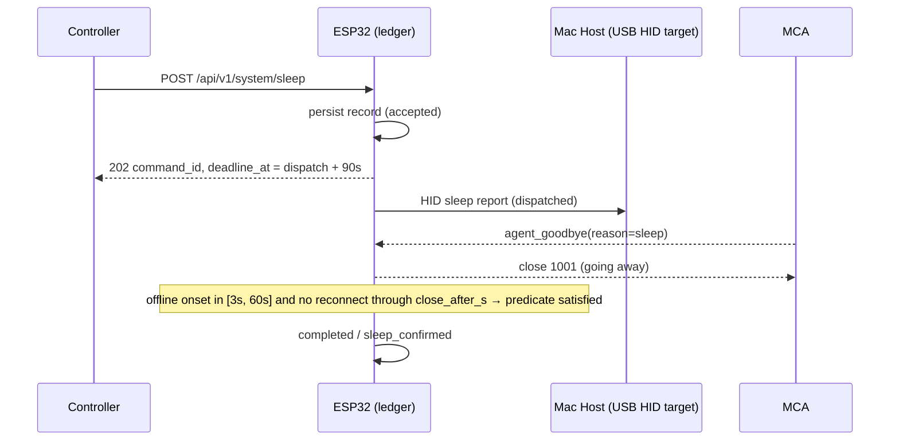

A `sleep` command is verified when the MCA's session goes offline — gracefully via `agent_goodbye(reason=sleep)` with close code 1001, or ungracefully via heartbeat expiry (no frame for 30 s, Chapter 4.2.2) — with the offline onset inside $[\text{dispatched\_at} + 3\text{ s},\ \text{dispatched\_at} + 60\text{ s}]$. Both paths are equivalent evidence, because a sleeping host may drop TCP before the goodbye frame flushes; the ESP32 MUST NOT prefer one over the other. There is no immediate completion: the command remains `confirming` until the window closes at `close_after_s` with no MCA reconnect, at which point it completes `completed` / `sleep_confirmed`. Sleep's refutation horizon is `close_after_s`, not the 90 s deadline: any MCA reconnect before the window closes at `close_after_s` refutes the transition and MUST terminate the command `failed` / `unexpected_wake`; once the command has completed at `close_after_s`, a later reconnect is recorded in the log (Chapter 15) as `unexpected_wake` evidence but MUST NOT alter the terminal record. Two timing invariants bind this evaluation: `close_after_s` MUST be strictly less than the sleep deadline (defaults 60 s < 90 s), and configuration MUST reject any sleep deadline less than or equal to `close_after_s`; completion and refutation are both evaluated at `close_after_s`, so the deadline is only an outer bound for missing evidence — it terminates the command `timed_out` / `deadline_exceeded` when the evidence needed for the `close_after_s` evaluation never arrives.

#### 8.1.2 Define verified wake only when the MCA reconnects and reports awake inside the wake deadline

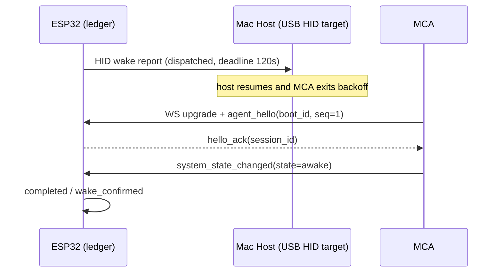

Wake is the mirror of sleep: the only acceptable evidence is *presence*. The command completes if and only if, within 120 s of dispatch, a **post-dispatch new MCA session** arrives (`agent_hello`, `seq` reset to 1, fresh `session_id`) whose mandatory initial status burst (Chapter 6.3) reports `system_state=awake`. A heartbeat alone is insufficient, because reconnect proves the agent process lives, not that the host woke on account of this command; requiring the new-session hello plus the explicit awake burst keeps the predicate deterministic. If the Mac was already awake, the predicate still works: the ESP32 closes the incumbent session with close code 1000 (normal) at dispatch, the MCA immediately reconnects with a new session and its initial burst reports `awake`, and the command completes. If the deadline passes with no qualifying evidence, the command ends `timed_out` / `deadline_exceeded` regardless of how plausible the wake appears. In Mode A there is no agent to return, so `wake` MUST terminate `unconfirmed` / `hid_only` immediately after dispatch.

### 8.2 Restart and shutdown

#### 8.2.1 Define restart confirmation as goodbye/offline followed by hello with changed boot_id and an initial awake burst

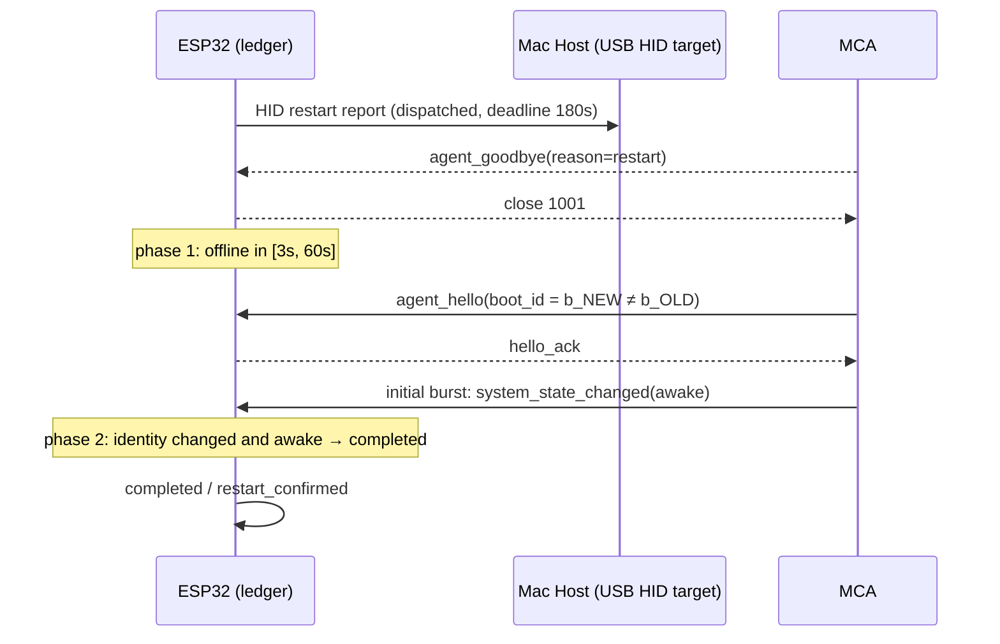

Restart verification is a two-phase predicate. Phase 1 is identical to sleep: a goodbye or OFFLINE onset inside the declared window. Phase 2 requires, before the 180 s deadline, a new-session `agent_hello` that (a) carries a `boot_id` strictly different from the value cached at acceptance and (b) is followed by the mandatory initial status burst (Chapter 6.3) reporting `system_state=awake` — `agent_hello` carries no readiness or state field, so readiness is established only by that burst. The `boot_id` comparison is what makes the verdict deterministic: an MCA process restart (crash, update, manual relaunch) reconnects with the **same** `boot_id`, which the ESP32 MUST treat as voiding the phase-1 evidence — the command stays in `confirming` and eventually ends `timed_out`, never `completed`. The ESP32 MUST cache `boot_id` in the status cache (Chapter 7 `mac.boot_id`) so the comparison survives an ESP32 reboot during the window.

#### 8.2.2 Define shutdown completion through expected agent offline plus network unreachability inside the shutdown window

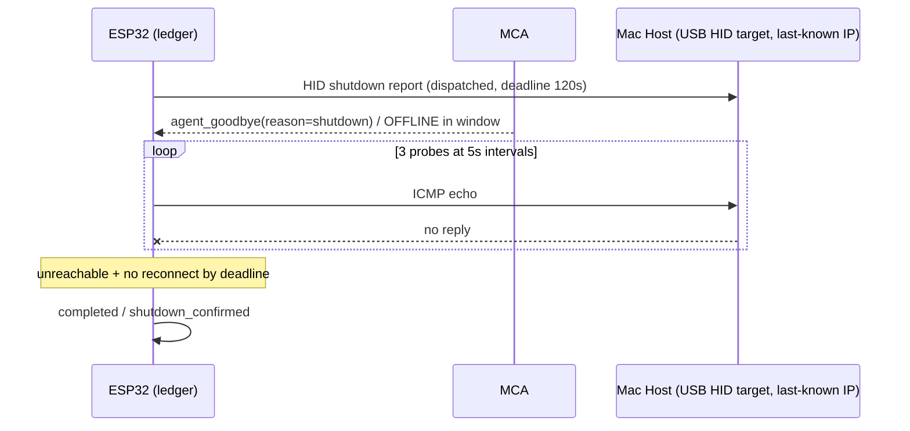

Shutdown adds one corroborating check because its refutation window is otherwise unbounded. After a qualifying offline onset (goodbye with close 1001, or heartbeat expiry, inside the window), the ESP32 MUST issue three ICMP echo probes to the MCA's last-known source IP at 5 s intervals; all three failing establishes unreachability. The command completes only when unreachability holds **and** no MCA reconnect has occurred by the 120 s deadline; any reconnect MUST terminate it `failed` / `unexpected_reconnect`, and any probe reply MUST terminate it `failed` / `host_still_reachable`. Probe results are corroboration, not substitutes: in Mode A, where no goodbye can arrive, probes MAY only annotate `result` (e.g., `hid_only_net_unreachable`) and the command MUST still terminate `unconfirmed`, preserving the Chapter 5 rule that `completed` requires MCA evidence.

## 9. MacControlAgent Specification

MacControlAgent (MCA) is the optional macOS component that elevates an endpoint from Mode A (agentless) to Mode B (agent-enhanced). Its charter is narrow by design: it supplies authenticated, sequenced evidence to the paired MacControl Endpoint and executes a closed set of allowlisted actions. It is never a general remote shell, never a verdict authority, and never a dependency for basic HID control — Mode A operation without the agent MUST remain fully functional, with commands terminating as `unconfirmed` rather than `completed`.

### 9.1 Process model and privileges

#### 9.1.1 Define launchd-based background operation, automatic restart, minimal privileges, and no inbound control except paired ESP32 traffic

The MCA MUST be installed as a `launchd` agent (user-domain `LaunchAgent` plist with label `com.maccontrol.agent`), configured with `KeepAlive=true` and `RunAtLoad=true` so the supervisor restarts it after crash or logout/login. Restart throttling uses `ThrottleInterval=10` seconds; three consecutive abnormal exits within 60 seconds MUST place the process in a supervisor-backed cool-down of 60 seconds before the next attempt, and each abnormal exit MUST be written to the local log. The agent runs as the logged-in console user with no elevated entitlements: it MUST NOT request root, `sudo`, or Accessibility/Input Monitoring permissions beyond what its closed action set requires, and it MUST NOT open any listening socket on the network. The only network traffic permitted is the outbound, MCA-initiated channel to the paired endpoint (`ws://<hostname>.local/agent/v1/ws` or the polling fallback of Chapter 4); the MCA MUST ignore and log any inbound connection attempt. There is exactly one inbound trust path — commands delivered over the already-authenticated session with the paired ESP32 — so a port scan or rogue LAN host cannot reach the agent's action surface.

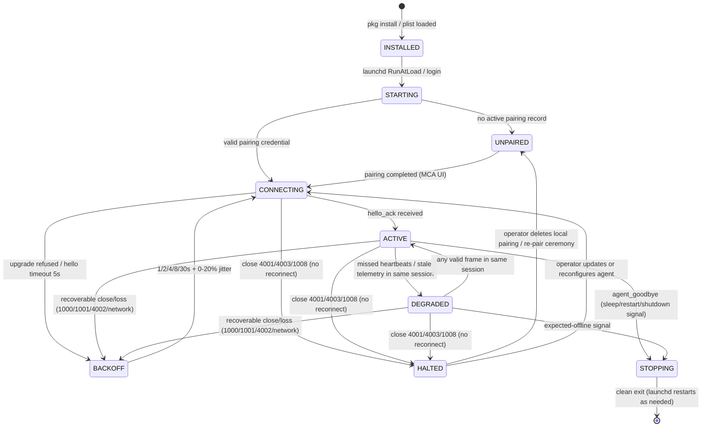

The state machine is MCA-local; the ESP32 observes only the session-level states of Chapter 4 (ACTIVE/STALE/OFFLINE). DEGRADED is a **same-session** degradation: the agent stops trusting its own telemetry freshness (missed heartbeats, stale local samples) but the session itself remains open, and any valid frame exchanged within the same session returns the agent to ACTIVE without a new handshake. A recoverable transport close from ACTIVE or DEGRADED (1000/1001/4002 or unannounced network loss) enters BACKOFF and reconnects — a 4002-forced reconnect opens a new session with sequence numbers reset, rather than silently replaying — while close 4001, 4003, or 1008 transitions directly to HALTED from either state, the terminal no-reconnect state aligned with Chapter 4: the agent MUST NOT enter BACKOFF from HALTED, and only operator intervention (deleting the local pairing, completing a new pairing ceremony, or updating/reconfiguring the agent) leaves it. The ACTIVE → BACKOFF edge is what makes the Chapter 8 wake flow possible: when the ESP32 closes the incumbent session with close 1000 at wake dispatch, an ACTIVE agent treats it as recoverable, backs off, and reconnects with a new session whose initial status burst reports `system_state=awake`. Rejected evidence (Chapter 2.2.2) is logged with its rejection reason and never by itself tears down the session. HALTED subsumes the old "stop reconnecting" rules: after close code 4001 the agent MUST NOT reconnect until a new pairing ceremony completes, because retrying a revoked credential cannot repair trust; closes 4003 and 1008 likewise stop reconnection until the agent is updated or reconfigured (Chapter 4.2.1).

### 9.2 MCA UI

#### 9.2.1 Define pairing status, command enablement, response endpoint configuration, application allowlist, and local log view

Per the UI ownership split of Chapter 2, the MCA UI configures only agent-local policy; it MUST NOT write any ESP32-owned configuration (macros, identity, controller credentials, OTA). Its scope is exactly five areas:

| Area | Content | Default | Rule |
|---|---|---|---|
| Pairing status | Endpoint `hostname`, pairing state (`unpaired`/`active`/`revoked`), `agent_instance_id`, session state | `unpaired` | Completes the Chapter 3 ceremony; shows close-code reason on disconnect |
| Command enablement | Per-action toggles for the agent-executed actions `launch_app` and `quit_app` (9.3.1) | both off (fail-closed) | Disabled actions are rejected ESP32-side pre-dispatch with 409 `command_disabled`; a stale dispatch reaching the MCA is answered `command_result(failed, command_disabled)` (9.3.1). The internal acknowledgement action `ack_command` is always permitted and never appears as an enableable command |
| Response endpoints | Endpoint address override and poll interval (fallback transport) | mDNS auto-resolution; 5 s poll | Configurable 2–30 s; change requires new session |
| Application allowlist | Bundle IDs permitted for launch/quit/report | empty | Match by bundle ID, never by display name; empty list denies all app actions |
| Local log view | Ring buffer of last 500 events (connections, rejections, action outcomes) | 500 entries | Read-only display; cleared on demand, never auto-uploaded |

The allowlist-by-bundle-ID rule is normative: display names are operator-decorative and collision-prone, whereas `com.renewedvision.propresenter` is stable. Command enablement defaults are fail-closed for mutating actions (launch/quit) so that installing the agent never silently expands the Mac's remote-attack surface.

### 9.3 Telemetry and control

#### 9.3.1 Enumerate closed agent actions: report status, report events, launch allowlisted app, quit allowlisted app, acknowledge command

The MCA speaks exactly one protocol: the single envelope and the closed set of eleven event types defined in Chapter 6 (`agent_hello`, `agent_goodbye`, `heartbeat`, `system_state_changed`, `user_session_changed`, `screen_lock_changed`, `application_started`, `application_exited`, `command_ack`, `command_result`, `capability_report`). There are no other frame types — no composite report frames, no capability advertisement inside `agent_hello`, and no timestamp field beyond the envelope's advisory `timestamp`. The MCA's `agent_hello` MUST therefore be an ordinary enveloped event whose payload carries only identity and version data:

```json
{
  "event_id": "evt_1",
  "agent_instance_id": "ag-7e21",
  "seq": 1,
  "timestamp": "2025-01-14T10:12:03Z",
  "type": "agent_hello",
  "command_id": null,
  "payload": {
    "protocol_version": 1,
    "agent_version": "1.0.0",
    "boot_id": "b_3F8A11",
    "hostname": "mac-propresenter"
  }
}
```

`agent_hello` carries no `state` or `ready` field: readiness is established exclusively by the mandatory initial status burst (Chapter 6.3) that the MCA MUST emit within 2 s of `hello_ack` — one `system_state_changed`, one `user_session_changed`, one `screen_lock_changed`, one `capability_report` whose `allowlisted_apps` carries every allowlisted application with its current state (`running` or `not_running`), and optionally one `application_started` per running allowlisted application. Thereafter the MCA emits the individual Chapter 6 events on change; it never batches them into a single report message. `boot_id` is regenerated on every macOS boot and is the pivot for restart verification: the ESP32 compares it against the pre-restart value before accepting a `restart_confirmed` verdict.

The ESP32→MCA direction is equally closed. Over the authenticated session (or `GET /agent/v1/commands/pending` in polling fallback) the ESP32 dispatches only two agent actions, `launch_app` and `quit_app`. The dispatch payload carries exactly three keys — `action`, `bundle_id`, and `command_id` — as in these two valid examples:

```json
{"action": "launch_app", "bundle_id": "com.renewedvision.propresenter", "command_id": "8F31A2C4"}
```

```json
{"action": "quit_app", "bundle_id": "com.renewedvision.propresenter", "command_id": "7AC41E9B"}
```

The MCA answers with `command_ack` within 2 s and `command_result` after the attempt, both correlated by `command_id` per Chapter 6. Enforcement of command enablement and the application allowlist is ESP32-first: because the ESP32 holds the latest `capability_report`, a controller request for a disabled action or a non-allowlisted `bundle_id` MUST be rejected pre-dispatch with HTTP 409 (`command_disabled` or `app_not_allowlisted`, Chapter 12.3.1) wherever the current report makes the outcome knowable. If a dispatch nonetheless reaches the MCA — for example, the operator changed enablement after the last `capability_report` — the MCA MUST NOT execute it and MUST instead return `command_result` with `outcome: "failed"` and `error_code` ∈ {`command_disabled`, `app_not_allowlisted`}.

The closed set is exhaustive: the MCA MUST NOT implement arbitrary shell execution, file access, or input injection, and any ESP32 dispatch naming an action outside this section MUST be rejected with `command_result(failed, app_not_allowlisted)` and logged on both sides. Every action outcome is correlated by `command_id`, and the acknowledgement is evidence, not a verdict — the ESP32 command ledger alone advances the command to a terminal state per Chapter 5. Acceptance implication: a launch of a non-allowlisted bundle ID, a disabled action, and a replayed `command_id` MUST each produce a deterministic, distinguishable outcome within 5 seconds of dispatch — pre-dispatch HTTP 409, or a correlated `command_result(failed)` with the matching closed `error_code`.

## 10. USB HID Macro Engine and Shortcut Triggers

The macro engine executes operator-defined, deterministic sequences of USB HID keyboard reports on the MacControl Endpoint. Macros are stored in ESP32 flash, created and edited only through the ESP32 Web UI (per the Chapter 2 ownership split), and every execution is entered in the Chapter 5 command ledger as command type `macro_execute`. The engine contains no conditional evaluation, no application awareness, and no inference: a macro is a fixed ordered list of steps that always produces the same report stream for the same input.

### 10.1 Macro model

#### 10.1.1 Define ordered steps for key press, key combo, modifier down/up, key release, text entry, and delay with macro timeout

A macro is an immutable-versioned object; edits create a new revision, and trigger bindings always resolve to the latest revision.

```json
{
  "macro_id": "mac_3F81",
  "revision": 4,
  "name": "Launch ProPresenter",
  "timeout_ms": 10000,
  "expected_event": {
    "type": "application_started",
    "match": { "bundle_id": "com.renewedvision.propresenter" }
  },
  "steps": [
    {"order": 1, "type": "key_combo", "modifiers": ["cmd"], "key": "space"},
    {"order": 2, "type": "delay", "delay_ms": 500},
    {"order": 3, "type": "text", "value": "ProPresenter"},
    {"order": 4, "type": "delay", "delay_ms": 500},
    {"order": 5, "type": "key_press", "key": "enter"}
  ]
}
```

| Field | Rule |
|---|---|
| `name` | 1–32 printable characters; unique per endpoint |
| `timeout_ms` | Default 10000; configurable 500–60000; bounds total wall-clock execution |
| `expected_event` | Optional Mode B verification declaration: an event `type` restricted to the five ambient evidence types — `application_started`, `application_exited`, `system_state_changed`, `user_session_changed`, `screen_lock_changed` — plus an exact-match `match` object over that event's payload keys (e.g., `bundle_id`). `command_ack`, `command_result`, `heartbeat`, `agent_hello`, `agent_goodbye`, and `capability_report` are explicitly forbidden as macro verification events; validation MUST reject them with HTTP 400 and error-envelope `code = "macro_invalid_step"`. Absent means the macro is unverifiable and always terminates `unconfirmed` |
| `steps` | 1–64 steps, executed strictly in ascending `order` |
| `key` | Named USB HID keyboard usage (letters, digits, function keys, navigation, `enter`, `space`, `esc`) |
| `modifiers` | Subset of `{ctrl, shift, alt, cmd}` |
| `value` (text) | 1–256 ASCII characters; each character is emitted as the required modifier+key pair |

The seven step types are a closed set: `key_press` (press and release one key), `key_combo` (assert modifiers, press key, release all), `modifier_down`/`modifier_up` (hold or release a modifier across subsequent steps, enabling chorded sequences), `key_release` (explicitly release a held non-modifier key), `text` (type a literal string at a default 10 ms inter-key interval), and `delay` (suspend the interpreter for `delay_ms`, range 10–5000). The interpreter MUST reject at validation time any step whose `type`, `key`, or modifier is outside these enums, answering the HTTP request with 400 and error-envelope `code = "macro_invalid_step"`; unknown step types MUST NOT be skipped silently at execution time.

#### 10.1.2 Exclude mouse, scroll, application actions, and conditional logic from MVP

The MVP engine MUST NOT implement mouse movement, mouse buttons, scroll, per-application targeting, variable substitution, branching, or any step whose behavior depends on Mac-side state. These are excluded for two deterministic reasons: the HID boot-protocol report descriptor advertised by the endpoint is keyboard-only, and any step predicated on observed state would make the report stream non-reproducible, breaking the "same input, same stream" invariant that makes ledger verdicts auditable. Application launch and quit are Mode B agent actions (Chapter 9), not macro steps; a macro such as "Launch ProPresenter" achieves its effect purely through keyboard input (Spotlight) and its Mode A terminal state remains `unconfirmed`.

### 10.2 Trigger bindings

#### 10.2.1 Define ESP32-owned trigger mappings from HTTP button, Web UI button, or optional GPIO input to macro_id

Triggers are ESP32-owned configuration, editable only in the ESP32 Web UI; the MCA has no write path to them. Each binding maps exactly one source to exactly one `macro_id`:

```json
{
  "trigger_id": "trg_02",
  "source": "gpio",
  "gpio_pin": 4,
  "edge": "falling",
  "debounce_ms": 50,
  "macro_id": "mac_3F81",
  "enabled": true
}
```

| Source | Invocation path | Notes |
|---|---|---|
| `http_button` | `POST /api/v1/macros/{id}/execute` (CONTROL scope) | Returns 202 + `command_id`, or 409 `macro_queue_full` pre-ledger when the queue is full; implicit trigger, no stored row required |
| `webui_button` | Dashboard RUN control | Requires an authenticated Web UI session; behaves identically to `http_button` |
| `gpio` | Physical input on a configured pin | `gpio_pin` 0–21, `edge` ∈ `{falling, rising}`, `debounce_ms` default 50 (range 10–500); requires an explicit stored binding |

GPIO bindings let a booth button or tally contact fire a macro without any network client, but they produce the same ledger record and queue entry as an HTTP invocation — there is no privileged local path. A trigger referencing a deleted macro MUST be disabled automatically and logged, never executed against a stale revision.

### 10.3 Execution semantics

#### 10.3.1 Define sequential interpretation, queue policy, deterministic timing bounds, abort behavior, and ledger integration

The interpreter is single-threaded; at most one macro executes at a time:

1. **Queue check.** Pending queue depth defaults to 4 (configurable 0–16). Queue depth MUST be checked before any ledger write: a full queue rejects HTTP invocations pre-ledger with HTTP 409 and error-envelope `code = "macro_queue_full"`, and no ledger record is created; a GPIO event against a full queue is dropped and logged with the would-be `macro_id`.
2. **Accept.** Only an invocation that passed the queue check is persisted: validate the macro and trigger, write a ledger record in `accepted` before any HID report, and return 202 with `command_id` (GPIO triggers record the same entry; the `command_id` is observable via `GET /api/v1/commands`).
3. **Enqueue and dispatch.** The accepted command enters the pending queue. On dequeue, transition to `dispatched`, set `dispatched_at`, and compute `deadline_at = dispatched_at + timeout_ms + 5 s` per Chapter 5. Queue wait consumes no verification budget, but a command still queued 30 s after acceptance MUST fail with `error_code = "dispatch_delayed"`.
4. **Interpret.** Execute steps in order. `delay` steps are scheduler-based with a worst-case timing deviation of 5 ms; text and key reports are emitted at the configured inter-key interval, bounded so total execution cannot exceed `timeout_ms` by more than one report interval.
5. **Abort.** On macro timeout, an explicit abort request, or USB disconnect, the interpreter MUST immediately emit an all-keys-up report (releasing every held modifier), release the queue slot, and terminate the command `failed` with `error_code` ∈ `{"macro_timeout", "macro_aborted", "usb_disconnected"}`. No partial-resume exists; a re-trigger starts a new command.
6. **Terminate.** In Mode A the command MUST end `unconfirmed` with `result = "hid_only"`. Macros are HID-only: there is no MCA `command_ack`/`command_result` correlation for macro execution, and the ESP32 MUST NOT require one. In Mode B the command ends `completed` with `result = "macro_confirmed"` only when the macro definition declares an explicit `expected_event` (10.1.1) and a matching Chapter 6 event arrives before `deadline_at`; a macro without an `expected_event` is unverifiable and MUST end `unconfirmed` with `result = "hid_only"` even in Mode B. If the deadline passes without the expected event, the command ends `timed_out` / `deadline_exceeded`. The MCA supplies evidence and never closes the command itself.

**Worked example — Launch ProPresenter.** With the macro of 10.1.1 bound to `trg_02` (GPIO 4), a falling edge produces: ledger record `7AC41E9B` `accepted` at $t_0$; `dispatched` at $t_0 + 12$ ms; step 1 emits `cmd+space` (Spotlight opens); 500 ms delay; step 3 types `ProPresenter` over ~120 ms; 500 ms delay; step 5 emits `enter`. Total execution ≈ 1.13 s, well inside the 10 s timeout. In Mode A, `7AC41E9B` terminates `unconfirmed`/`hid_only` — the operator sees the application open, but the endpoint claims only transmission. In Mode B, this macro declares `expected_event = application_started(bundle_id = com.renewedvision.propresenter)`; when the MCA's `application_started` event for that bundle ID arrives before the deadline, the ESP32 — not the agent — records `completed`/`macro_confirmed`, while the same macro without an `expected_event` declaration would remain `unconfirmed` even with the agent present. Acceptance implication: power-cycling the endpoint between steps 2 and 3 MUST leave `7AC41E9B` resolvable to `failed`/`esp32_restarted` after boot reconciliation, and the held-modifier release on abort MUST be observable as a final all-keys-up report on the USB bus.

## 11. Application Monitoring and Control

Application visibility and control in MacControl are exercised only through two explicit, user-curated lists: the monitored application registry owned by the MacControl Endpoint (ESP32), and the application allowlist owned by MacControlAgent (MCA). There is no discovery of arbitrary processes, no path-based launch, and no general execution channel; the closed action set of Chapter 9.3.1 contains exactly two application actions — `launch_app` and `quit_app` — and both resolve exclusively through allowlisted bundle identifiers.

### 11.1 Monitored application registry

#### 11.1.1 Define user-marked monitored applications and reconcile ESP32 expected list with MCA allowlist

The registry is ESP32-owned flash configuration, edited only in the ESP32 Web UI (Chapter 2 ownership split). It declares which applications the operator expects the endpoint to track and, optionally, to control.

```json
{
  "registry_revision": 7,
  "apps": [
    {
      "bundle_id": "com.renewedvision.propresenter",
      "display_name": "ProPresenter",
      "monitor": true,
      "control_enabled": true
    }
  ]
}
```

`bundle_id` is the canonical key: reverse-DNS, unique, matched exactly and case-sensitively; per the Chapter 9.2 rule, matching by display name is prohibited because names are decorative and collision-prone. `display_name` (1–64 printable characters) is presentation-only and MUST NOT appear in any dispatch or evidence frame. Capacity is bounded at 32 entries; `registry_revision` increments on every mutation so controllers can detect change. An entry with `monitor: false` is retained but produces no status object; an entry with `control_enabled: false` may be observed but MUST reject `launch_app`/`quit_app` dispatches with `error_code = "app_control_disabled"`.

Reconciliation runs on every MCA `capability_report` (Chapter 6.2) and on every registry edit. The ESP32 computes the set difference between registry `bundle_id`s with `monitor: true` and the `bundle_id`s carried in the report's `allowlisted_apps` entries, and MUST surface both mismatch directions as provenance warnings rather than silent gaps:

- **Registered but not allowlisted** (`warning.value = "registry_not_allowlisted"`): the application keeps a status object with `source: "unknown"`, `value: null`, `freshness: "unknown"`, because the MCA will never report it. Control dispatches fail with `app_not_allowlisted`.
- **Allowlisted but not registered** (`warning.value = "allowlist_not_registered"`): the MCA may report and control the application, but the ESP32 MUST NOT create a status object for it, keeping the controller-facing surface limited to operator-marked applications.

Both warnings are written to the Chapter 15 event log and attached to the status document as provenance tuples until the next reconciliation clears them, so a controller can always distinguish "application absent" from "monitoring misconfigured".

The per-application status object lives in the status cache `applications` map (Chapter 7), keyed by `bundle_id`:

```json
{
  "applications": {
    "com.renewedvision.propresenter": {
      "state": { "value": "running", "source": "agent_reported", "observed_at": "2025-01-14T09:41:10Z", "ttl_s": 15, "freshness": "fresh" },
      "pid":   { "value": 812,       "source": "agent_reported", "observed_at": "2025-01-14T09:41:10Z", "ttl_s": 15, "freshness": "fresh" },
      "warning": { "value": null, "source": "unknown", "observed_at": null, "ttl_s": null, "freshness": "unknown" }
    }
  }
}
```

Like every cache leaf, `warning` is a provenance tuple, never a bare scalar: `value` is null or one of the two closed reconciliation strings, `source` is `unknown` while the value is null and `agent_reported` once reconciliation against an accepted `capability_report` raises it, and `ttl_s` is null because warnings are cleared by the next reconciliation rather than by aging.

| State | Class | Entered by | Exited by |
|---|---|---|---|
| `not_running` | stable | `application_exited` evidence; a `capability_report` `allowlisted_apps` entry reporting `state: "not_running"` (including the mandatory initial burst, Chapter 6.3) | `application_started` evidence |
| `running` | stable | `application_started` evidence | `application_exited` evidence |
| `launching` | transitional | MCA evidence correlated to the in-flight launch (e.g., `command_ack(action=launch_app)`); MAY additionally be projected at dispatch when the stored value is `stale`/`unknown` | `application_started` before deadline → `running`; deadline expiry → `not_running` with command `timed_out` |
| `quitting` | transitional | MCA evidence correlated to the in-flight quit (e.g., `command_ack(action=quit_app)`); MAY additionally be projected at dispatch when the stored value is `stale`/`unknown` | `application_exited` before deadline → `not_running`; deadline expiry → `running` with command `timed_out` |

The stable states carry provenance `agent_reported` and obey the Chapter 7 freshness rules (TTL 15 s, frozen as `expected_offline` inside declared windows). The transitional states are entered from MCA events with provenance `agent_reported`, or — only when the stored agent-derived value is `stale` or `unknown` — as ESP32 dispatch projections with provenance `inferred`: they derive from ledger state, not agent observation, so a controller can distinguish "the agent saw it running" from "the endpoint is awaiting evidence". Dispatch MUST NOT force `launching` or `quitting` over a fresh `agent_reported` value; per the Chapter 7.2.1 precedence rule, an `inferred` projection MUST NOT overwrite a fresh `agent_reported` value. When the transition is resolved by MCA events (`application_started`/`application_exited` with exact `bundle_id` match), the resulting state is `agent_reported` like any other MCA-derived value. A transitional state MUST resolve no later than the command's `deadline_at`; when the command terminates without resolving evidence, the state reverts to the last agent-reported value in the same cache mutation. In Mode A no agent evidence exists, so monitored applications remain `unknown` and transitional states are never entered — Mode A launches happen through HID macros (Chapter 10) and terminate `unconfirmed`.

### 11.2 Application control

#### 11.2.1 Define launch and quit only through allowlisted names and prohibit arbitrary shell execution as a closed invariant

Controller requests use the Chapter 5 command API with `type ∈ {"app_launch", "app_quit"}` and a single parameter, `bundle_id`. Validation is ordered and deterministic, and every failure it can detect is **pre-ledger** — rejected with HTTP 409 before any ledger record is created (Chapter 12.3.1): (0) if no MCA is paired (Mode A), the request MUST be rejected with 409 `agent_not_paired`; if an agent is paired but its session is not ACTIVE, the request MUST be rejected with 409 `agent_offline`; neither rejection creates a ledger record; (1) `bundle_id` MUST exist in the registry with `control_enabled: true`, else the request fails with `app_not_registered` or `app_control_disabled`; (2) `bundle_id` MUST appear in the most recent `capability_report.allowlisted_apps` and the action in `enabled_commands`, else the request fails with `app_not_allowlisted` or `command_disabled` (Chapter 6.2 closed error enum). Only a request that passes all checks is persisted to the ledger in `accepted` and dispatched with the three-key payload defined in Chapter 9.3.1 — two valid examples:

```json
{"action": "launch_app", "bundle_id": "com.renewedvision.propresenter", "command_id": "8F31A2C4"}
```

```json
{"action": "quit_app", "bundle_id": "com.renewedvision.propresenter", "command_id": "7AC41E9B"}
```

The command then terminates per the Chapter 5.3 predicates — `completed` only on correlated `command_ack` plus matching `application_started`/`application_exited` evidence (exact `bundle_id` match) before the deadline; `command_result(ok)` may report the local execution outcome but MUST NOT by itself complete the predicate.

The closed invariant is structural, not policy text: the dispatch payload carries only an action enum and a `bundle_id` — no path, argument string, or script field exists in the schema, so no conforming request can express arbitrary execution. The MCA MUST resolve the bundle identifier to an application locally via LaunchServices and MUST reject any frame containing unexpected keys as a schema violation (Chapter 6.1). There is no shell, AppleScript, or file-path execution action anywhere in the MCA action set, and acceptance testing (Chapter 16.2) MUST demonstrate that launches of non-allowlisted identifiers, disabled actions, and malformed frames each produce distinguishable deterministic failures.

## 12. REST API Contract

This chapter fixes the complete HTTP surface of the MacControl Endpoint (ESP32): every path, method, role requirement, and Mode A availability a controller or MacControlAgent (MCA) may rely on. Two invariants organize the contract. First, all controller access is versioned under `/api/v1` and all agent traffic under `/agent/v1`; unversioned paths MUST be rejected with HTTP 404 (Chapter 4.1.1). Second, every command-producing controller endpoint — power commands, macro execution, and application launch/quit — creates a command ledger record **before** dispatch and returns HTTP 202 with a `command_id` (Chapter 5.1.2); non-command-producing mutations (macro CRUD, API key management, OTA upload/apply) return HTTP 200/201 synchronously and create no ledger record. No endpoint on this surface executes an action synchronously, and none accepts arbitrary shell or free-form execution requests (Chapter 13.3). The API is an ordinary deterministic HTTP interface: external AI clients, if any, consume it exactly as Q-SYS, Companion, browsers, and scripts do.

### 12.1 Endpoint inventory

#### 12.1.1 Controller endpoints

The table below is the master inventory of the controller surface. Roles are the RBAC scopes READ, CONTROL, and ADMIN (Chapter 13.1); "Mode A" states behavior when no MCA is paired.

| Method and path | Role | Mode A | Function |
|---|---|---|---|
| `GET /api/v1/status` | READ | full | Status cache document with provenance/freshness (Chapter 7) |
| `GET /api/v1/capabilities` | READ | full | Mode-aware capabilities document (12.3.1) |
| `POST /api/v1/commands` | CONTROL | full | Generic command submission (12.2.1) |
| `GET /api/v1/commands` | READ | full | Ledger listing with filtering and pagination (12.2.1) |
| `GET /api/v1/commands/{id}` | READ | full | Single ledger record, latest revision |
| `POST /api/v1/system/{wake\|sleep\|restart\|shutdown\|lock}` | CONTROL | full | Convenience routes; expand to `POST /api/v1/commands` |
| `GET /api/v1/macros` | READ | full | Macro list with revisions |
| `POST /api/v1/macros`, `PUT/DELETE /api/v1/macros/{id}` | ADMIN | full | Macro configuration (mirrors ESP32 Web UI) |
| `POST /api/v1/macros/{id}/execute` | CONTROL | full | `http_button` trigger (Chapter 10.2.1) |
| `POST /api/v1/apps/{bundle_id}/launch`, `.../quit` | CONTROL | 409 `agent_not_paired` | Agent action against MCA allowlist (Chapter 11) |
| `GET /api/v1/agent/status` | READ | 409 `agent_not_paired` | Latest MCA status report (Chapter 6.3) |
| `GET /api/v1/logs` | READ | full | Ring-buffer log, `?category=`, `?level=`, `?since_seq=`, `?limit=` (Chapter 15) |
| `GET /api/v1/ota/status`, `POST /api/v1/ota/upload`, `POST /api/v1/ota/apply` | READ / ADMIN | full | Signed dual-partition OTA (Chapter 15.3) |
| `GET /api/v1/openapi.json` | READ | full | Machine-readable copy of this contract (Chapter 17.1) |

Three consequences follow for implementers. First, the surface is closed: a request to any path not listed, including plausible extras such as `/api/v1/exec`, MUST return 404 `not_found`, which is the API-level enforcement of the closed action invariant. Second, the two Mode-A-denied endpoints fail *before* ledger write: because app launch/quit are dispatchable only through the MCA, accepting them in Mode A would manufacture commands doomed to `timed_out`, so they MUST be rejected with 409 `agent_not_paired` — or 409 `agent_offline` when an agent is paired but its session is not ACTIVE — and MUST NOT create records. Third, convenience routes are pure aliases: `POST /api/v1/system/restart` with an empty body MUST produce a ledger record identical in every field to `POST /api/v1/commands` with `{"type": "restart"}`, so controllers can be tested against either path interchangeably.

#### 12.1.2 Agent-facing endpoints

| Method and path | Credential | Function |
|---|---|---|
| `POST /agent/v1/pair` | none (pre-credential; one-time pairing code in body) | Completes the Chapter 3 pairing ceremony; the only pre-credential agent endpoint, rate-limited per Chapter 13 |
| `GET /agent/v1/ws` (Upgrade) | pairing bearer token | Primary MCA channel; `agent_hello`/`hello_ack`, then bidirectional frames (Chapter 4.2) |
| `POST /agent/v1/events` | pairing bearer token + `X-Session-Id` | Polling-fallback ingestion; body is the identical Chapter 6 event envelope |
| `GET /agent/v1/commands/pending` | pairing bearer token + `X-Session-Id` | Replaces server push; returns dispatched actions awaiting MCA acknowledgement |

`POST /agent/v1/pair` is the sole exception to the pairing-credential requirement: it is reachable only while an ESP32-initiated pairing window is open, accepts only the one-time pairing code displayed on the ESP32 Web UI, and is rate-limited to one validation attempt per second with the window closing after 5 failed attempts (Chapter 3.2.1).

The two transports are semantically identical (Chapter 4.3.1): the same envelope schema and sequence rules apply, and because there is no one-to-one WebSocket-close-to-HTTP mapping, fallback rejections follow the deterministic HTTP rules of Chapter 4.3.1 (401 `unauthorized` for missing/invalid credentials, 403 `forbidden` for revoked/disabled credentials, 409 `agent_not_paired`, 409 `agent_offline` for inactive sessions, 400 `validation_failed` for schema violations). Heartbeat semantics are transport-independent: the MCA MUST emit a `heartbeat` event every 5 s (default, configurable 2–30 s); any valid frame or POST resets the ESP32 liveness clock, 15 s of silence marks agent-derived status stale, and 30 s declares the session OFFLINE. `GET /agent/v1/commands/pending` defaults to a 5 s poll interval (2–30 s) and returns only actions the current `capability_report` permits, so a polling agent can never receive an action its operator disabled.

### 12.2 Command API

#### 12.2.1 Submission, record retrieval, filtering, pagination, and idempotency

`POST /api/v1/commands` accepts the closed command-type enum `wake`, `sleep`, `restart`, `shutdown`, `lock`, `macro_execute`, `app_launch`, `app_quit`. The submission schema is minimal because every command type has fixed semantics (Chapter 5.3.1):

```json
{
  "type": "app_launch",
  "parameters": { "bundle_id": "com.renewedvision.propresenter" },
  "idempotency_key": "qsys-show-preset-042"
}
```

`parameters` is type-scoped: empty for the five power/lock commands, `{"macro_id": "mac_3F81"}` for `macro_execute`, and `{"bundle_id": "<allowlisted bundle ID>"}` for `app_launch`/`app_quit`; unknown keys MUST be rejected with 400 `bad_request`. A valid request is persisted to the ledger in state `accepted` before any dispatch and answered with HTTP 202:

```json
{
  "command_id": "8F31A2C4",
  "state": "accepted",
  "deadline_at": "2025-01-14T09:34:03Z",
  "record_url": "/api/v1/commands/8F31A2C4"
}
```

The `deadline_at` in the 202 body is a projection (acceptance plus the per-type deadline); the authoritative value is set at dispatch in the ledger record, and both MUST agree within the 30 s dispatch-delay bound of Chapter 5.3.1. `GET /api/v1/commands/{id}` returns the latest record revision:

```json
{
  "command_id": "8F31A2C4",
  "revision": 4,
  "type": "restart",
  "parameters": {},
  "requested_by": "apikey:control-01",
  "requested_at": "2025-01-14T09:31:02Z",
  "mode_at_accept": "B",
  "state": "completed",
  "dispatched_at": "2025-01-14T09:31:03Z",
  "deadline_at": "2025-01-14T09:34:03Z",
  "expected_offline_window": { "open_after_s": 3, "close_after_s": 60 },
  "evidence": ["evt_1042", "evt_1051"],
  "result": "restart_confirmed",
  "error_code": null
}
```

`GET /api/v1/commands` lists records newest-first with exact-match filters `?state=`, `?type=`, and `?since=` (ISO 8601), and keyset pagination: `?limit=` (default 50, maximum 200) plus an opaque `?cursor=`; the response carries `commands[]` and `next_cursor` (null at the end). Keyset rather than offset pagination is mandatory because FIFO eviction (Chapter 5.1.1) makes offsets unstable. Idempotency follows Chapter 5.1.1 exactly: a replayed `Idempotency-Key` header or `idempotency_key` field with an identical body returns HTTP 200 and the existing record; the same key with a divergent body returns 409 `conflict`. A submission with no explicit idempotency key executes as a new command, with exactly one exception: a submission whose derived `(command_type, target, normalized_parameters)` hash matches a non-terminal in-flight record (`accepted`, `dispatched`, or `confirming`) accepted within the last 60 seconds is coalesced to that existing `command_id` — the ESP32 returns HTTP 202 with the existing `command_id` and current state and MUST NOT create a new record or dispatch a duplicate. Once the earlier command terminates or the 60-second window elapses, an identical no-key submission executes as a new command. Explicit-key protection spans ledger retention, never beyond it; coalescing never spans terminal records.

**Worked verified restart interaction (Mode B).** The controller issues `POST /api/v1/system/restart` with header `Idempotency-Key: nightly-recycle-2025-01-14`. The ESP32 persists the record above in `accepted` and returns 202. At `dispatched_at` + 5 s the MCA emits `agent_goodbye(reason=restart)` (`evt_1042`); the ESP32 closes the socket with 1001, the offline onset lands inside $[3\text{ s}, 60\text{ s}]$, and a `GET` at +20 s shows `state: "confirming"`. At +48 s the host returns; the MCA opens a new session with `agent_hello(boot_id = b_NEW ≠ b_OLD)` followed by the mandatory initial status burst reporting `system_state=awake` (`evt_1051`). The ESP32 — not the agent — evaluates the two-phase predicate of Chapter 8.2.1 and appends the terminal revision `completed` / `restart_confirmed`. A final `GET /api/v1/commands/8F31A2C4` returns the record exactly as shown above, with both evidence IDs listed. If the same `Idempotency-Key` is reposted, the controller receives 200 with this record and no second restart occurs.

### 12.3 Error and capability models

#### 12.3.1 Deterministic error envelope and mode-aware capabilities

Every non-2xx response on either surface uses the envelope of Chapter 4.1.1 — `{"error": {"code", "message", "request_id"}}` — with the closed HTTP/code mapping defined there. The command API adds the following codes under that envelope; `message` is human-readable and non-normative, `code` is the contract.

| HTTP | `code` | Trigger |
|---|---|---|
| 400 | `bad_request` | Unknown command type, parameter key, or schema violation on a controller request |
| 400 | `validation_failed` | Agent event envelope schema violation or unknown event type on `/agent/v1/` (Chapter 6.1.1) |
| 400 | `macro_invalid_step` | Any invalid macro definition: a step outside the closed Chapter 10.1.1 enums, or an invalid `expected_event` such as a forbidden verification event type |
| 409 | `conflict` | Idempotency-key replay with divergent body |
| 409 | `agent_not_paired` | Agent-dependent command or endpoint in Mode A; rejected pre-ledger, no record created |
| 409 | `agent_offline` | Agent paired but session not ACTIVE; rejected pre-ledger, no record created |
| 409 | `command_disabled` | Action absent from MCA `capability_report.enabled_commands` |
| 409 | `app_not_allowlisted` | Target `bundle_id` absent from `allowlisted_apps` |
| 409 | `app_not_registered` | Target `bundle_id` absent from the ESP32 monitored registry (Chapter 11.1) |
| 409 | `app_control_disabled` | Registry entry has `control_enabled: false` |
| 409 | `macro_queue_full` | Execution queue at capacity; rejected pre-ledger, no record created (Chapter 10.3.1) |
| 409 | `ota_in_progress` | OTA requested while another OTA operation is in progress, or `ota/apply` requested without `force` while commands are in flight (Chapter 15.3) |
| 409 | `store_corrupt` | Persistent macro store failed CRC validation (Chapter 15.1) |
| 503 | `ledger_unavailable` | Ledger write failed; nothing dispatched |
| 503 | `network_unavailable` | Requests arriving during association loss (Chapter 15.1) |

The 409 family is deliberately pre-ledger: each condition is knowable at request time, so the endpoint fails the request deterministically instead of accepting a command whose only possible verdict is failure. Controllers MUST treat 400/409 as permanent and MUST NOT retry them unchanged. WebSocket close codes 4001/4002/4003 are not HTTP status codes and are excluded from this mapping; there is no one-to-one mapping from close codes to HTTP statuses, and on the polling fallback agent-facing rejections use the deterministic HTTP rules of Chapter 4.3.1.

`GET /api/v1/capabilities` returns the mode-aware integration document external consumers (including Q-SYS modules and Chapter 17 tooling) use to enumerate what this specific endpoint can currently do:

```json
{
  "api_version": "v1",
  "mode": "B",
  "capability_level": "L3",
  "device": { "name": "ProPresenter Mac", "hostname": "maccontrol-01.local" },
  "commands": {
    "wake":     { "available": true, "verified": true, "deadline_s": 120 },
    "sleep":    { "available": true, "verified": true, "deadline_s": 90 },
    "restart":  { "available": true, "verified": true, "deadline_s": 180 },
    "shutdown": { "available": true, "verified": true, "deadline_s": 120 },
    "lock":     { "available": true, "verified": true, "deadline_s": 15 },
    "macro_execute": { "available": true, "verified": true, "macro_ids": ["mac_3F81"] },
    "app_launch": { "available": true, "verified": true, "apps": [ { "bundle_id": "com.renewedvision.propresenter", "display_name": "ProPresenter" } ] },
    "app_quit":   { "available": true, "verified": true, "apps": [ { "bundle_id": "com.renewedvision.propresenter", "display_name": "ProPresenter" } ] }
  },
  "agent": { "paired": true, "connected": true, "enabled_commands": ["launch_app", "quit_app"], "allowlisted_apps": ["com.renewedvision.propresenter"] }
}
```

The document is mode-aware in exactly two dimensions. The `commands` object MUST carry exactly one entry for each of the eight closed command types of Chapter 12.2.1, each with `available` and `verified` booleans, per the Chapter 17.1.1 schema. `available` reflects dispatchability *now*: in Mode A, `app_launch` and `app_quit` MUST report `available: false`, and `agent` MUST report `{"paired": false, "connected": false}` with empty lists. `verified` reports whether `completed` is reachable for that command type: in Mode A every command MUST report `verified: false`, because Chapter 5.2.2 confines Mode A to `unconfirmed`/`hid_only` terminal states. The document is generated live — from pairing state, session liveness, and the latest `capability_report` — never cached across a session transition, so a controller that polls after an MCA disconnect sees `verified` collapse to false within the 30 s offline threshold. Acceptance implication: a conformance client that drives the endpoint purely from `/api/v1/capabilities` plus `/api/v1/openapi.json` MUST be able to submit every `available: true` command and MUST never observe a terminal `completed` for a command the document reported as `verified: false`.

## 13. Security Model

Security in MacControl is structural, not optional: every privileged capability is gated by an explicit credential, an explicit role, and a closed action set. The model has three layers — controller authentication and role-based access control (RBAC) owned by the MacControl Endpoint (ESP32), agent trust anchored in the Chapter 3 pairing credential, and a closed action invariant that bounds what any authenticated party can cause the system to do. Consistent with the authority model of Chapter 2, controller credentials are ESP32-owned configuration, while command enablement and the application allowlist are MCA-owned policy; neither side can rewrite the other's trust state.

### 13.1 Controller security

#### 13.1.1 Define API keys, admin password, HTTPS where practical, rate limiting defaults, and READ/CONTROL/ADMIN scopes

Controllers authenticate to every `/api/v1/` endpoint with an API key presented in the `Authorization: Bearer` header. Keys are created, listed, and revoked only through the ESP32 Web UI by an ADMIN-scoped session. The ESP32 MUST store at most 8 active keys and MUST persist only a SHA-256 digest of each key; the raw key is displayed exactly once at creation, mirroring the pairing-token rule of Chapter 3.

```json
{
  "key_id": "key-04",
  "label": "Companion production controller",
  "role": "CONTROL",
  "key_sha256": "b91e…7a",
  "created_at": "2025-01-14T09:31:02Z",
  "last_used_at": "2025-01-14T10:12:03Z",
  "expires_at": null,
  "state": "active"
}
```

A raw key MUST be 32 random bytes, base64url-encoded with the prefix `mck_` so accidental commits and log captures are greppable. `expires_at` MAY be null (no expiry); when set, an expired key MUST be rejected with HTTP 401 `unauthorized`, never silently downgraded. The three roles form a strict total order READ < CONTROL < ADMIN, and every controller endpoint is assigned exactly one minimum role:

| Endpoint class | READ | CONTROL | ADMIN |
|---|---|---|---|
| `GET /api/v1/status`, `/capabilities`, `/openapi.json`, `/agent/status` | ✓ | ✓ | ✓ |
| `GET /api/v1/commands/{id}`, `GET /api/v1/macros`, `GET /api/v1/logs` | ✓ | ✓ | ✓ |
| `POST /api/v1/commands` and convenience power routes (`/api/v1/system/wake`, `/sleep`, `/restart`, `/shutdown`, `/lock`) | — | ✓ | ✓ |
| `POST /api/v1/macros/{id}/execute`, app launch/quit | — | ✓ | ✓ |
| Macro create/edit/delete, trigger bindings, device identity edits | — | — | ✓ |
| API key management, pairing window, controller security settings | — | — | ✓ |
| OTA upload/apply, factory reset, log clear | — | — | ✓ |

The matrix has two deliberate asymmetries. First, CONTROL can execute but cannot *define*: a production controller (or an external AI client, which is an ordinary HTTP consumer and receives no special role) can run existing macros and power commands but cannot introduce new keystroke sequences — the blast radius of a leaked CONTROL key is the operator's pre-approved action set, not the keyboard itself. Second, log *reading* is READ but log *clearing* is ADMIN, so evidence of misuse cannot be erased by the role that caused it. An external AI client SHOULD be issued CONTROL, never ADMIN, and SHOULD be issued its own labeled key so `last_used_at` and the event log attribute actions correctly.

The ESP32 Web UI is additionally protected by an ADMIN password (minimum 10 characters, stored as a salted hash, PBKDF2 or stronger). After 5 consecutive failed logins or 10 failed API authentications from one source IP, the endpoint MUST impose a 60-second lockout and log the event. Transport encryption is handled as an explicit, implementable rule: the endpoint serves plain HTTP by default and SHOULD additionally serve HTTPS (TLS 1.2+, port 443) when the operator installs a certificate through the Security page; when HTTPS is enabled, the endpoint MUST reject credential-bearing cleartext requests (any request carrying an `Authorization` header or ADMIN session cookie over plain HTTP) with HTTP 403 `forbidden` and a `https_required` message. When no certificate is installed, the Web UI MUST display a persistent warning that API keys traverse the LAN unencrypted, and operators SHOULD restrict the endpoint to a trusted management network. Rate limiting is per key with deterministic defaults (configurable in the Web UI): READ 60 requests/minute, CONTROL 30 requests/minute, ADMIN 10 requests/minute, enforced as a token bucket; excess requests return HTTP 429 `rate_limited` per the Chapter 4 error envelope and MUST NOT be queued.

### 13.2 Agent security

#### 13.2.1 Define paired credentials, command allowlist, application allowlist, credential rotation, and revocation

The MCA's sole credential is the Chapter 3 pairing token (`agent_token`, 32 bytes), presented on every WebSocket `agent_hello` and every polling request. There is exactly one pre-credential agent endpoint: `POST /agent/v1/pair`, which is reachable only while an ESP32-initiated pairing window is open, accepts only the one-time pairing code, and is rate-limited to one attempt per second with the window closing after 5 failed attempts (Chapter 3.2.1). Every other `/agent/v1/` request MUST be rejected per the deterministic credential rules: a missing, unknown, or expired token is HTTP 401 `unauthorized`, and a known but revoked or disabled credential is HTTP 403 `forbidden`; on the WebSocket transport both terminate the upgrade/session with close code 4001, but there is no one-to-one close-to-HTTP mapping (Chapter 4.3.1). Two allowlists then bound what a *validly authenticated* agent will do. The **command allowlist** (MCA UI "command enablement") gates the agent-executed actions — `launch_app` and `quit_app` — with fail-closed defaults, and these are the only values `capability_report.enabled_commands` may carry; the internal acknowledgement action `ack_command` is always permitted and is never an enabled command. An ESP32 dispatch of a disabled action is rejected pre-dispatch with 409 `command_disabled` wherever the current `capability_report` makes that knowable, and otherwise answered with `command_result(failed, command_disabled)` and never executed. The **application allowlist** enumerates bundle IDs eligible for launch/quit/report; matching is by bundle ID only, an empty allowlist denies all application actions, and any mismatch — including a bundle ID the ESP32's monitored registry expects but the MCA does not permit — resolves as `app_not_allowlisted` per the Chapter 11 reconciliation rules, with the divergence surfaced on both UIs.

Rotation and revocation are asymmetric by design. An ADMIN rotates or revokes the pairing credential by opening a new pairing ceremony or pressing revoke in the ESP32 Web UI; the MCA cannot self-rotate, because a compromised agent must not be able to mint fresh trust. Revocation takes effect within the same second: in-flight sessions close with code 4001, all `agent_reported` status-cache fields are marked stale, and the endpoint reverts to Mode A semantics — subsequent commands terminate `unconfirmed`, never `completed`, until a new ceremony completes. The exactly-one-active-pairing rule (Chapter 3) ensures rotation is implicitly revoking; there is no window in which two agent credentials are valid.

### 13.3 Closed action invariant

#### 13.3.1 Prohibit generic execution endpoints and enumerate the complete set of privileged actions

The defining security property of MacControl is that the complete set of privileged actions is enumerable and fixed at build time. The ESP32 MUST NOT expose, and the MCA MUST NOT implement, any generic execution capability; the following are prohibited outright:

- Arbitrary shell, AppleScript, or interpreter execution (no `POST /execute`-style endpoint on either component).
- Arbitrary file read, write, or transfer.
- HID injection outside the macro engine's declared step types; raw HID report streaming from the network.
- Mouse movement, clicks, or scroll (excluded from MVP per Chapter 10).
- Screen capture, keylogging, credential store access, or process control outside the allowlisted launch/quit actions.
- Listening sockets on the MCA; any inbound control path other than the authenticated session with the paired ESP32.
- Unsigned or unauthenticated OTA application (Chapter 15).

The complete privileged action set, and nothing else, is: (1) power commands `wake`, `sleep`, `restart`, `shutdown`, `lock`; (2) execution of stored macros composed solely of Chapter 10 step types; (3) `launch_app`/`quit_app` against allowlisted bundle IDs in Mode B; (4) ADMIN configuration writes (identity, macros, keys, security settings, pairing, OTA). Every item routes through the Chapter 5 command ledger or the ADMIN-authenticated Web UI, so each privileged act is authenticated, role-checked, rate-limited, logged with a correlation ID, and terminally adjudicated by the ESP32. Acceptance implication: an implementation MUST pass a negative test in which a valid ADMIN key requests each prohibited capability above and receives 404 `not_found` — the endpoints must not exist, not merely refuse.

## 14. User Interfaces

MacControl ships two operator-facing user interfaces with disjoint configuration authority: the ESP32 Web UI, served by the MacControl Endpoint itself, and the MacControlAgent (MCA) UI, a local macOS preferences surface. Per the ownership split of Chapter 2.3, each UI configures only the component it runs on; neither UI MAY expose a control that writes configuration owned by the other. Both UIs are consumers of the same authority model as any API client: the ESP32 Web UI is bound to the ADMIN role, and the MCA UI writes only agent-local policy. Neither UI contains any inference-driven behavior — every page renders stored configuration, command ledger records, or status cache fields exactly as the ESP32 serves them.

The responsibility matrix below is normative and supersedes any single-dashboard reading of the PRD:

| Configuration or display area | ESP32 Web UI | MCA UI |
|---|---|---|
| Dashboard and status display | Owns (renders status cache, Chapter 7) | — |
| Device identity, hostname, mDNS naming | Owns | — |
| Macro editor and shortcut trigger bindings | Owns | — |
| Monitored application registry (Chapter 11.1) | Owns (Applications page) | — |
| Pairing ceremony | Opens time-boxed pairing window | Completes ceremony, shows pairing state |
| Controller credentials and RBAC keys (READ/CONTROL/ADMIN) | Owns | — |
| Logs | Endpoint ring-buffer log (Chapter 15) | Local agent log view (read-only) |
| OTA update control | Owns (ADMIN) | — |
| Command enablement toggles | — | Owns |
| Response endpoints (transport address, poll interval) | — | Owns |
| Application allowlist (bundle IDs) | — | Owns |

The pairing row is the only shared area, and it is shared by protocol design rather than by duplicated control: the ESP32 opens the window, the MCA completes the ceremony, and exactly one active pairing results (Chapter 3). For implementers, the matrix implies a concrete test: for every row, an attempted write through the non-owning UI — or through the owning UI of the other component — MUST be impossible because no such control exists, not merely disabled.

### 14.1 ESP32 Web UI

#### 14.1.1 Define dashboard, device configuration, macro editor, shortcut trigger setup, applications registry, pairing control, security, logs, and OTA pages

The ESP32 Web UI MUST provide nine pages, served directly by the endpoint with no external dependency: Dashboard, Device, Macros, Triggers, Applications, Pairing, Security, Logs, and OTA. Dashboard renders `GET /api/v1/status` verbatim, including per-field provenance and freshness (Section 14.3). Device edits identity fields. Macros edits the Chapter 10 macro model with validation identical to the REST schema; Triggers binds HTTP/Web-UI/GPIO inputs to `macro_id`. Applications edits the Chapter 11.1 monitored application registry — the ESP32-owned list of `bundle_id` entries with `monitor` and `control_enabled` flags — and surfaces reconciliation warnings (`registry_not_allowlisted`, `allowlist_not_registered`) against the latest MCA `capability_report`; it MUST NOT edit the MCA-owned application allowlist, which lives only in the MCA UI. Pairing opens and closes the pairing window and shows pairing state. Security manages API keys, role scopes, and the admin password. Logs pages the ring buffer. OTA uploads signed firmware and reports rollback status. Every mutating page MUST surface the deterministic error envelope of Chapter 12 unchanged; client-side validation MAY pre-check but MUST NOT replace server validation.

```
+----------------------------------------------------------+
| MacControl  [ProPresenter Mac]          mode: B (paired) |
| Dashboard | Device | Macros | Triggers | Pairing | ...   |
+----------------------------------------------------------+
| CONNECTION              MAC (agent-reported)             |
|  usb      true   fresh    state   awake        fresh     |
|  network  true   fresh    locked  false        fresh     |
|  agent    true   fresh    user    production   fresh     |
| APPLICATIONS              LAST COMMAND                   |
|  ProPresenter running     restart -> completed (verified)|
+----------------------------------------------------------+
```

Each dashboard cell carries its freshness qualifier from the cache; the wireframe's parenthetical "(verified)" is governed by Section 14.3 and is prohibited for any unverified terminal state.

### 14.2 MCA UI

#### 14.2.1 Define pairing, command configuration, response endpoint setup, application allowlist, and connection status pages

The MCA UI MUST provide five views matching the Chapter 9.2 scope exactly: Pairing, Commands, Endpoints, Allowlist, and Connection/Log. It MUST NOT display or edit macros, triggers, identity, controller credentials, or OTA, and it MUST NOT present command outcomes as verdicts — the MCA observes evidence, never terminal state.

```
+----------------------------------------------------------+
| MacControlAgent                          macOS 15.2      |
| Pairing | Commands | Endpoints | Allowlist | Connection  |
+----------------------------------------------------------+
| Pairing status:  ACTIVE                                  |
| Endpoint:  maccontrol-01.local (mDNS)                    |
| Session:   ACTIVE   heartbeat 5s   last ack 2s ago       |
| [ Delete local pairing ]                                 |
+----------------------------------------------------------+
```

The MCA UI's only pairing-destructive control is **Delete local pairing**, which erases the agent's stored credential and returns the MCA to the `unpaired` state. It MUST NOT expose any control that revokes the ESP32-side pairing record or reopens the pairing window: revocation and window control are ESP32 Web UI functions (Chapter 3.2), so re-pairing after a local delete always requires an ADMIN to open a new ceremony on the endpoint.

Command enablement defaults remain fail-closed (mutating actions off); the Allowlist view matches bundle IDs, never display names; and the Connection view shows session state and close-code reasons verbatim from the Chapter 4 transport.

### 14.3 Status display rules

#### 14.3.1 Require UI to distinguish verified, unverified, stale, expected-offline, and unknown states without using completion language for unverified commands

Both UIs MUST render the five provenance/freshness states distinctly, using the muted academic palette (dark body text on neutral backgrounds) and the exact labels below; color MUST always be redundant with text so state is legible in monochrome:

| Display state | Cache/ledger input | Required label | Prohibited language | Color (academic palette) |
|---|---|---|---|---|
| Verified | terminal `completed` in Mode B with MCA evidence | "Verified" | — | `#4A6FA5` |
| Unverified | Mode A terminal, `unconfirmed` with `result = "hid_only"` | "Unverified — HID only" | "completed", "done", "successful" | `#7A8B99` |
| Stale | field freshness `stale` | "Last seen {age} ago" + stale badge | presenting value as current | `#8BA3C7` |
| Expected-offline | freshness `expected_offline` | "Expected offline (power window)" | "error", "lost" | `#6B8CBB` |
| Unknown | source `unknown` / `value: null` | "No data" | fabricated defaults (e.g., rendering null as `false`) | `#2E4A62` |

The language rule is the enforcement point of the product's core invariant: Mode A commands terminate `unconfirmed` (Chapter 5.2.2), so any UI string implying completion for an unverified command is a specification violation regardless of visual treatment. Stale values MUST be shown with age, not hidden, because a labeled stale fact is more actionable than an absent one (Chapter 7.2.2). Acceptance implication: a UI test harness drives the five input conditions into the status cache and asserts the five distinct renderings, and greps all shipped strings to confirm no completion vocabulary appears on the unverified path.

## 15. Reliability, Persistence, Logging, and OTA

This chapter defines the mechanisms that keep the MacControl Endpoint (ESP32-S3) deterministic under power loss, link failure, and firmware replacement. Each mechanism preserves a rule from earlier chapters: the ESP32 owns the command ledger and terminal verdicts (Chapter 5), liveness thresholds are fixed ratios (Chapter 4), and privileged update paths are ADMIN-gated (Chapter 13).

### 15.1 Reliability mechanisms

#### 15.1.1 Define watchdog, Wi-Fi reconnect, USB HID recovery, persistent configuration/macros, command timeouts, and heartbeat monitoring

The endpoint MUST implement the following mechanisms. All values are defaults and configurable in the ESP32 Web UI unless marked fixed.

| Mechanism | Default parameter | Failure detected | Deterministic response |
|---|---|---|---|
| Hardware watchdog (TWDT) | 10 s feed interval, 3 missed feeds | Firmware task hang or starvation | Forced reset; boot reconciliation runs (Ch. 5); log `watchdog_reset` |
| Wi-Fi reconnect | Backoff 1/2/4/8/30 s + 0–20% jitter, no attempt cap | Association loss, DHCP expiry | Requests arriving during association loss return HTTP 503 `network_unavailable`; no new commands are accepted while down; ledger untouched |
| USB HID recovery | Re-enumeration poll every 1 s, max 5 s per command dispatch | HID interface stalled or detached | Retry dispatch once; on second failure, terminate as `failed` with `error_code = "dispatch_error"` |
| Persistent configuration | Flash NVS, CRC32-checked, atomic write-then-commit | Corrupt config at boot | Fall back to last committed copy; if both invalid, load factory defaults and log `config_reset` |
| Persistent macros | Flash, same atomic-commit scheme, capacity 64 macros | Corrupt macro store | Refuse execution with 409 `store_corrupt`; never execute a partially parsed macro |
| Command timeouts | Per-type deadlines (Ch. 5.3.1), dispatch delay cap 30 s | Verification not satisfied by `deadline_at` | Terminal `timed_out` with `error_code = "deadline_exceeded"` |
| Heartbeat monitoring | Interval 5 s, stale 15 s, offline 30 s (fixed 3×/6× ratios) | MCA silence | Mark status cache stale, then close evidence channel; commands in `confirming` transition per Ch. 5.2, never to `completed` |

The table encodes one invariant implementers must not relax: no reliability mechanism ever upgrades a command's outcome. Watchdog resets, link recovery, and HID retry exist to preserve evidence and resume adjudication; terminal verdicts remain exclusively with the Chapter 5 lifecycle. Persistence is layered so that a single flash fault cannot silently change behavior: configuration and macro stores are double-slotted with CRC validation, and the command ledger uses the append-only revision scheme of Section 5.1.1, which survives an interrupted write by discarding the incomplete final record.

Wi-Fi outage semantics deserve emphasis. While disconnected, the endpoint MUST NOT expire in-flight commands early; `deadline_at` clocks keep running, so commands whose deadlines pass during the outage terminate as `timed_out` on their normal schedule. Boot reconciliation after a watchdog reset MUST complete within 2 seconds and MUST log a `boot_reconciliation` entry summarizing every verdict changed, giving controllers a deterministic explanation for any state that moved while the endpoint was down.

### 15.2 Logging

#### 15.2.1 Define ring-buffer event log schema, categories, correlation IDs, retention, and retrieval endpoint

The ESP32 MUST maintain a persistent ring-buffer event log in flash. Capacity is 512 entries (configurable 128–2048); when full, the oldest entries are overwritten in strict FIFO order. Entries MUST be written before the action they record is observable (e.g., a state transition is logged before the corresponding status response is served), so a crash never produces an untraceable verdict. Log clearing is ADMIN-only (Chapter 13) and is itself logged as the first entry of the new buffer.

```json
{
  "seq": 1047,
  "ts": "2025-01-14T09:31:05.214Z",
  "category": "command",
  "event": "state_transition",
  "level": "info",
  "command_id": "8F31A2C4",
  "request_id": "req_01HF3K9X2A",
  "session_id": "s_41",
  "actor": "apikey:control-01",
  "detail": { "from": "confirming", "to": "completed", "result": "restart_confirmed" }
}
```

The schema is closed and total: `seq` is a monotonically increasing 32-bit counter that survives reboots; `category` MUST be one of `command`, `session`, `auth`, `config`, `ota`, or `system`; `level` MUST be one of `info`, `warn`, `error`; `command_id`, `request_id`, and `session_id` are the correlation IDs defined in Chapters 4 and 5 and are null only where genuinely inapplicable (e.g., a watchdog reset). This correlation discipline is what lets a controller reconstruct a full causal chain — HTTP request → ledger transition → MCA evidence → terminal verdict — from a single `request_id`.

| Category | Representative events | Minimum level logged |
|---|---|---|
| `command` | acceptance, dispatch, every state transition, eviction | info |
| `session` | MCA connect/disconnect with close code, stale/offline transitions | info |
| `auth` | failed logins, lockouts, key use by ADMIN endpoints, revocation | warn |
| `config` | configuration/macro writes, `config_reset` fallback | info |
| `ota` | upload, validation result, apply, rollback | info |
| `system` | boot, `boot_reconciliation`, `watchdog_reset`, flash faults | warn |

Categories exist so operators can filter noise from signal: `auth` and `system` entries indicate trust or integrity events and SHOULD be reviewed even when commands succeed. Retention is time-unbounded but count-bounded; at the default 512 entries a production endpoint logging 50 events/day retains roughly 10 days. Entries MUST be retrievable via `GET /api/v1/logs` (minimum role READ, per Chapter 13) with query filters `category`, `level`, `since_seq`, and `limit` (default 100, maximum 512). Responses MUST be ordered by ascending `seq`, and the endpoint MUST include a `dropped` count whenever the requested range predates the oldest retained entry, so consumers can distinguish silence from truncation. Sensitive material MUST NOT be logged: API keys, the admin password, and pairing tokens appear only as identifiers (`key_id`, `device_id`), never as raw values.

### 15.3 OTA

#### 15.3.1 Define signed dual-partition updates, automatic rollback, ADMIN-only update control, and in-flight command handling

Firmware updates use a signed dual-partition scheme. The flash layout MUST contain two application slots (A/B) plus a factory recovery image. An update is uploaded to the inactive slot via `POST /api/v1/ota/upload` and applied via `POST /api/v1/ota/apply`; both endpoints require the ADMIN role (Chapter 13) and are rate-limited accordingly. Each image MUST carry an ECDSA P-256 signature over its SHA-256 digest, verified against the public key compiled into the firmware before any byte is written to flash. Signature verification failure rejects the upload with HTTP 400 `bad_request` and logs an `ota` entry at `error` level. The rollback path is therefore structural: the previously running image is never erased, so a failed update cannot brick the endpoint.

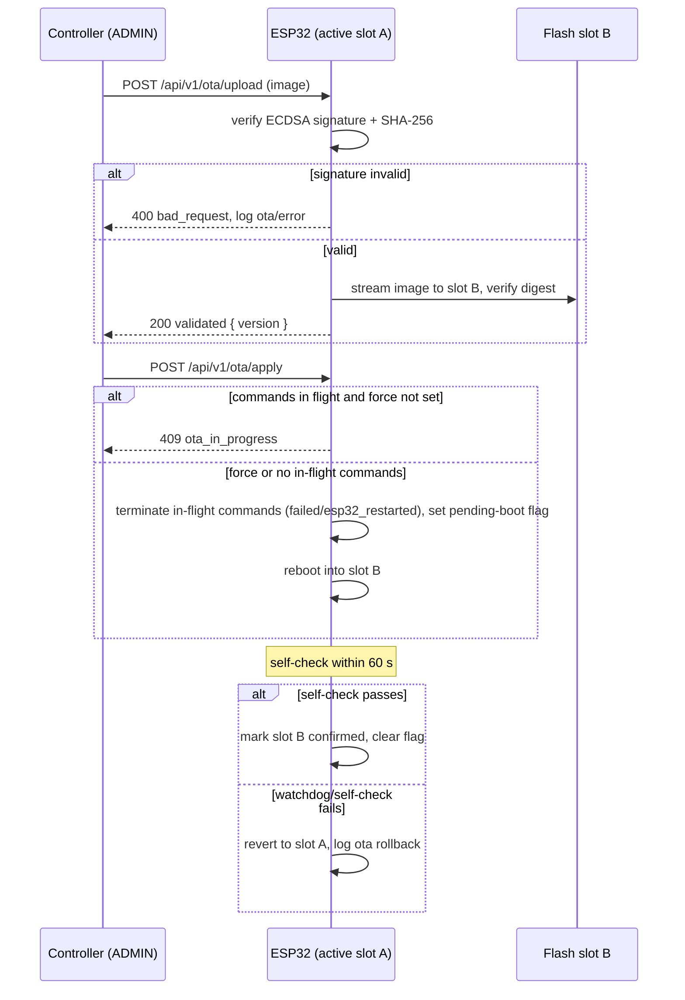

In-flight command handling is deliberately conservative. `apply` MUST be rejected with HTTP 409 `ota_in_progress` while any command is in `accepted`, `dispatched`, or `confirming`, unless the request sets `force: true`, in which case every non-terminal command MUST be terminated **before** reboot — as `failed` with `error_code = "esp32_restarted"` — matching the verdict boot reconciliation would assign anyway. A second OTA upload or apply request arriving while an OTA operation is already in progress is likewise rejected with HTTP 409 `ota_in_progress` (Chapter 4.1.1); both uses share one code because both tell the controller the same fact: an OTA operation cannot proceed now, and 409 remains non-retryable until the blocking condition clears. This keeps the ledger honest: a controller never sees a command silently abandoned by a firmware swap, and post-update reconciliation finds only terminal records.

After reboot, the new image runs a 60-second self-check: the watchdog is armed, Wi-Fi association is attempted, and the Web UI and `/api/v1/status` MUST become responsive. Success requires an explicit confirmation write (automatic on first successful status serve); if the confirmation is absent when the watchdog fires or the window expires, the bootloader MUST revert to the previous slot and log `ota` `rollback` at `error` level. Version regression is permitted but logged; downgrade images pass the same signature gate, and the endpoint MUST record the running version in every `ota` entry and in `GET /api/v1/status` so controllers can attribute behavioral differences to firmware revisions.

## 16. MVP Definition and Acceptance Tests

The minimum viable product is defined by two milestones that together prove the authority model end to end. Milestone 1 proves Mode A usefulness without any MacControlAgent (MCA): deterministic human-interface-device (HID) dispatch with honestly labeled, unverified terminal states. Milestone 2 proves Mode B: MCA evidence closes the verification loop, and only then may the ESP32 record `completed`. Every acceptance test is deterministic, independently executable, and observable from the controller-facing REST surface, the ledger record, or the USB bus; each traces to the chapters defining the mechanism under test. A test MUST run against a clean installation unless its preconditions state otherwise; a milestone is complete only when all its tests pass twice consecutively with no code change between runs.

Tests are numbered AT-01 through AT-12. "Ledger check" in an expected result means `GET /api/v1/commands/{command_id}` returns a record whose `state`, `result`, and `error_code` fields match exactly; partial matches are failures.

### 16.1 Milestone 1: agentless HID endpoint

#### 16.1.1 Prove mDNS reachability, system commands, macro creation/execution, persistence, and hid_only/unconfirmed semantics

Milestone 1 MUST be executed with no MCA installed and no pairing record on the endpoint, so that every terminal state is produced by Mode A rules alone.

| ID | Test | Preconditions | Steps | Expected result | Traces |
|----|------|---------------|-------|-----------------|--------|
| AT-01 | Discovery and reachability | Endpoint on test LAN; READ-scope API key configured per Chapter 13.1 | Browse mDNS for `_maccontrol._tcp.local`; resolve hostname; `GET /api/v1/status` and `GET /api/v1/capabilities`, each with header `Authorization: Bearer <READ key>`; repeat both requests without the header | Advertisement resolves within 5 s; authenticated status document returns 200 with provenance metadata and `connection.agent.value` `false` (source `esp32_direct`); authenticated capabilities report mode `A` with `paired: false`; unauthenticated requests return 401 `unauthorized` | Ch. 3.3, 7.1, 12.1, 13.1 |
| AT-02 | Mode A system command | AT-01 passed; CONTROL-scope API key configured | `POST /api/v1/commands` with `lock` and header `Authorization: Bearer <CONTROL key>`; repeat with the READ key; poll record to terminal | 202 with `command_id`; USB HID report observed on target; terminal state `unconfirmed` with `result = "hid_only"`, never `completed`; READ-key submission rejected with 403 `forbidden` | Ch. 4.1, 5.2.2, 12.2, 13.1 |
| AT-03 | Macro creation and execution | ADMIN key configured | Create a 3-step macro (combo, delay, text) via Web UI/API; bind to HTTP trigger; dispatch | Ledger record reaches `unconfirmed`/`hid_only`; step timing within Chapter 10 bounds; keystrokes observed on target in order | Ch. 10, 5.2.2 |
| AT-04 | Persistence across reboot | AT-03 passed | Power-cycle the endpoint | Identity, macros, trigger bindings, and API keys load from flash; ledger boot reconciliation resolves any in-flight record to `failed`/`esp32_restarted` | Ch. 5.1.1, 15.1 |
| AT-05 | Capabilities honesty in Mode A | AT-01 passed; READ and CONTROL keys configured | `GET /api/v1/capabilities` with the READ key; submit `app_launch` with the CONTROL key | Every command type is present in `commands` and reports `verified: false`; `app_launch` reports `available: false` and submission fails with the deterministic error envelope (409 `agent_not_paired`) | Ch. 12.3, 5.2.2, 17.1 |

The consequence of this table is architectural: Milestone 1 ships a complete product — deterministic dispatch, honest status — without a single line of macOS code. AT-02 and AT-03 are the core invariant tests: a build that ever records `completed` in Mode A fails regardless of observed behavior on the Mac, because Chapter 5.2.2 confines Mode A to unverified terminal states. AT-05 forbids capability advertisement drift, so controllers can render Mode A UIs directly from the capabilities document.

### 16.2 Milestone 2: agent-enhanced verification

#### 16.2.1 Prove pairing, verified status, verified restart/wake, expected-offline behavior, allowlist enforcement, RBAC, reconnect, fallback, provenance, idempotency, logging, and OTA

Milestone 2 adds the MCA and MUST demonstrate that evidence — and only evidence — advances commands to `completed`.

| ID | Test | Preconditions | Steps | Expected result | Traces |
|----|------|---------------|-------|-----------------|--------|
| AT-06 | Pairing ceremony | MCA installed, unpaired | Start pairing in ESP32 Web UI; complete in MCA UI within the time box | Exactly one stored pairing; MCA WebSocket connects with `agent_hello`/`hello_ack`; late second pairing attempt rejected | Ch. 3.2, 4.2.1 |
| AT-07 | Verified lock | AT-06 passed | Submit `lock` | MCA emits `screen_lock_changed(locked)` within the 15 s deadline; ESP32 records `completed`/`lock_confirmed`; verdict recorded by ESP32, not agent | Ch. 5.2, 5.3.1, 6.2, 2.1 |
| AT-08 | Verified restart and wake | AT-06 passed | Submit `restart`; wait | `agent_goodbye` or expected offline inside restart window; new-session `agent_hello` with changed `boot_id` plus initial burst reporting `system_state=awake` inside deadline; terminal `completed`/`restart_confirmed`; submit `sleep` then wake target; wake completes only on a post-dispatch new MCA session whose initial status burst reports `awake` | Ch. 8, 5.3 |
| AT-09 | Expected-offline provenance | AT-06 passed | Submit `sleep`; `GET /api/v1/status` during window | Agent-derived fields show `expected_offline`, not `stale`; after window expiry without hello they degrade to `stale` per TTL table | Ch. 7.2.2, 8.1 |
| AT-10 | Allowlist and RBAC enforcement | Allowlist contains one bundle ID | Launch allowlisted app; launch non-allowlisted app; submit CONTROL-scope request for ADMIN write | Allowlisted launch completes via correlated `command_ack(action=launch_app)` plus matching `application_started(bundle_id)`; non-allowlisted fails with deterministic error; RBAC matrix enforced with 403 for scope violations | Ch. 11.2, 13.1, 13.3 |
| AT-11 | Reconnect and polling fallback | AT-06 passed | Kill MCA WebSocket; block WebSocket port; restart MCA | Heartbeat loss marks agent stale at 15 s, offline at 30 s; reconnect follows 1/2/4/8/30 s backoff with 0–20% jitter; MCA falls back to `POST /agent/v1/events` + `GET /agent/v1/commands/pending` with identical semantics | Ch. 4.2.2, 4.3 |
| AT-12 | Idempotency, logging, and OTA | ADMIN key | Replay same `Idempotency-Key` submission; inspect logs; perform signed OTA | Replay returns original `command_id` with no duplicate dispatch; every transition carries correlation ID in ring-buffer log retrievable via API; OTA applies on dual partitions, rolls back on bad image, and is refused without ADMIN | Ch. 5.1.1, 12.2, 15.2, 15.3 |

Two cross-cutting rules govern this table. First, AT-08 and AT-09 encode the positive-evidence model of Chapter 8: an expected-offline window is itself evidence, so `restart` and `sleep` can complete without a goodbye frame, but only inside their declared windows; offline outside a window is a fault, not evidence. Second, AT-11 is the determinism gate for transport: backoff intervals MUST be measured from connection-failure timestamps in the log, and the fallback path MUST produce ledger outcomes indistinguishable from the WebSocket path — which is what makes external AI clients ordinary HTTP consumers with no special subsystem.

### 16.3 Explicit exclusions

#### 16.3.1 Exclude LLM/natural-language control, arbitrary shell execution, conditional macros, mouse control, and central manager from MVP

The following capabilities are excluded from the MVP by construction, not merely unimplemented. Acceptance requires negative evidence: where a row says an endpoint must not exist, a valid ADMIN-key request MUST return 404 `not_found` (Chapter 13.3), not 403 or a stub.

| Excluded capability | Reason | Enforcement point | Acceptance implication |
|---------------------|--------|-------------------|------------------------|
| LLM, natural-language parsing, planner, or inference-driven behavior | Violates the determinism invariant (Ch. 1.1.2) | No inference subsystem exists in any component; external AI clients are ordinary REST consumers (Ch. 12) | Source and configuration audit finds no inference dependency; all AT-01–AT-12 pass without any such component |
| Arbitrary shell, AppleScript, or path execution | Closed action invariant (Ch. 13.3) | Dispatch schema carries only action enum + `bundle_id`; MCA rejects frames with unexpected keys (Ch. 11.2) | Negative test: every generic-execution route returns 404; malformed dispatch frames rejected as schema violations |
| Conditional/branching macros | Deterministic timing and auditability (Ch. 10.1.2) | Macro model is an ordered step list with no condition or jump step type | Schema validation rejects any macro document containing conditional fields |
| Mouse and scroll HID control | Scope bound of the macro engine (Ch. 10.1.2) | HID report descriptor exposes keyboard only | USB descriptor inspection shows no mouse/scroll interface; mouse action types rejected |
| Central manager or cloud coordination | ESP32 is final source of truth (Ch. 2.1) | Discovery is mDNS-only; no outbound manager registration exists | Network capture during AT-01–AT-12 shows no traffic to any coordination service |

These exclusions are normative: a build that passes AT-01 through AT-12 but implements any excluded capability does not conform to the MVP. The table also bounds Chapter 17's development phases — excluded items may return as future work only by amending the authority model, never by silent extension of the action set.

## 17. Deterministic Integration and Development Phases

### 17.1 Deterministic machine-readable integration

MacControl's integration surface is deliberately small and fully deterministic. There is no LLM, natural-language parser, planner, or inference-driven behavior anywhere in the product (Chapter 1.1.2), and no subsystem is reserved for external AI clients: if an external AI tool ever consumes the API, it does so as an ordinary deterministic HTTP client with a standard RBAC credential (Chapter 13), identical in every respect to a script. The integration contracts defined here exist for the consumers the product actually targets — Q-SYS modules, Bitfocus Companion, operator browsers, and shell scripts — and the former PRD "Phase 7 (AI)" deliverables that remain useful (OpenAPI, machine-readable capabilities, discovery) are folded into this deterministic contract layer.

#### 17.1.1 /capabilities and /openapi.json as integration contracts

Two documents constitute the complete machine-readable contract a controller needs to integrate without human-written glue code:

| Contract | Path | Role | Mode A | Content and guarantee |
|---|---|---|---|---|
| Capabilities document | `GET /api/v1/capabilities` | READ | full | Live, mode-aware enumeration of dispatchable commands, `verified` reachability, deadlines, macros, and agent state (Chapter 12.3.1) |
| API schema | `GET /api/v1/openapi.json` | READ | full | Static OpenAPI 3.1 document covering every Chapter 12 path, schema, and error code; byte-identical to the implementation's routes |
| Discovery record | mDNS `_maccontrol._tcp` | none | full | Deterministic hostname/TXT advertisement so controllers locate the endpoint without a central manager (Chapter 3.3) |

The three contracts are complementary and none is optional. Discovery answers *where* the endpoint is, `/openapi.json` answers *how* to call it, and `/capabilities` answers *what this specific endpoint can do right now*. Because `/capabilities` is generated live from pairing state, session liveness, and the latest `capability_report`, a controller that polls it can degrade gracefully: when the MCA session crosses the 30 s offline threshold, every agent-dependent command's `verified` flag collapses to `false`, and a well-behaved Q-SYS or Companion module SHOULD surface that as "unverified mode" rather than failing commands outright. Implementers MUST treat `/openapi.json` as normative for request shape and MUST treat `/capabilities` as normative for dispatch decisions; a request that is schema-valid but contradicts the live capabilities document is rejected deterministically with the Chapter 12 409 family.

Because these contracts are the whole integration story, consumer obligations are minimal and fixed. Integration consumers SHOULD be issued READ or CONTROL credentials only (Chapter 13): Q-SYS and Companion modules need CONTROL to submit commands and READ to poll status, and no integration consumer requires ADMIN, which remains reserved for human operators performing macro, OTA, and security configuration. Consumers MUST pin the `/api/v1` version prefix, MUST treat HTTP 400/409 as permanent and never retry them unchanged (Chapter 12.3.1), and MUST poll `GET /api/v1/commands/{id}` for terminal verdicts rather than assuming synchronous execution, since every command-producing request returns 202 and resolves through the ledger (Chapter 5.1.2). A Companion or Q-SYS module that follows these rules and drives itself from the two documents requires no per-endpoint custom code beyond request templating.

The capabilities document MUST validate against the following JSON Schema, which fixes the field names used throughout Chapters 5, 11, and 12:

```json
{
  "$schema": "https://json-schema.org/draft/2020-12/schema",
  "title": "MacControlCapabilities",
  "type": "object",
  "required": ["api_version", "mode", "capability_level", "device", "commands", "agent"],
  "properties": {
    "api_version": { "const": "v1" },
    "mode": { "enum": ["A", "B"] },
    "capability_level": { "enum": ["L1", "L2", "L3"] },
    "device": {
      "type": "object",
      "required": ["name", "hostname"],
      "properties": {
        "name": { "type": "string", "maxLength": 32 },
        "hostname": { "type": "string", "maxLength": 63, "pattern": "^[a-z0-9]([a-z0-9-]{0,55}[a-z0-9])?\\.local$", "description": "Collision-resolved bare DNS label (1-57 chars, lowercase alnum/hyphen, start/end alnum, per Chapter 3.1) plus .local" }
      }
    },
    "commands": {
      "type": "object",
      "required": ["wake", "sleep", "restart", "shutdown", "lock", "macro_execute", "app_launch", "app_quit"],
      "propertyNames": { "enum": ["wake", "sleep", "restart", "shutdown", "lock", "macro_execute", "app_launch", "app_quit"] },
      "additionalProperties": {
        "type": "object",
        "required": ["available", "verified"],
        "properties": {
          "available": { "type": "boolean" },
          "verified": { "type": "boolean" },
          "deadline_s": { "type": "integer", "minimum": 1 },
          "macro_ids": { "type": "array", "items": { "type": "string" } },
          "apps": {
            "type": "array",
            "items": {
              "type": "object",
              "required": ["bundle_id", "display_name"],
              "properties": {
                "bundle_id": { "type": "string" },
                "display_name": { "type": "string", "maxLength": 64 }
              }
            }
          }
        }
      }
    },
    "agent": {
      "type": "object",
      "required": ["paired", "connected", "enabled_commands", "allowlisted_apps"],
      "properties": {
        "paired": { "type": "boolean" },
        "connected": { "type": "boolean" },
        "enabled_commands": { "type": "array", "items": { "type": "string" } },
        "allowlisted_apps": { "type": "array", "items": { "type": "string" }, "description": "Bundle IDs extracted from the latest MCA capability_report allowlisted_apps entries" }
      }
    }
  },
  "allOf": [
    {
      "if": { "properties": { "mode": { "const": "A" } }, "required": ["mode"] },
      "then": {
        "properties": {
          "capability_level": { "const": "L1" },
          "commands": {
            "additionalProperties": {
              "properties": { "verified": { "const": false } }
            }
          },
          "agent": {
            "properties": {
              "paired": { "const": false },
              "connected": { "const": false }
            }
          }
        }
      }
    },
    {
      "if": {
        "properties": {
          "agent": {
            "anyOf": [
              { "properties": { "paired": { "const": false } }, "required": ["paired"] },
              { "properties": { "connected": { "const": false } }, "required": ["connected"] }
            ]
          }
        },
        "required": ["agent"]
      },
      "then": {
        "properties": {
          "commands": {
            "additionalProperties": {
              "properties": { "verified": { "const": false } }
            }
          }
        }
      }
    }
  ]
}
```

Three invariants are acceptance-testable directly from this schema. First, the `commands` object is complete by construction: it MUST carry exactly one entry for every closed controller command type of Chapter 12.2.1 — `wake`, `sleep`, `restart`, `shutdown`, `lock`, `macro_execute`, `app_launch`, and `app_quit` — each with `available` and `verified` booleans, so a conformance client never has to infer the absence of a command from a missing key. Second, `verified: true` implies `mode: "B"` with `agent.paired: true` and `agent.connected: true`, because Chapter 5.2.2 confines Mode A to `unconfirmed`/`hid_only` terminal states and a disconnected agent supplies no evidence; the schema's `if`/`then` constraints make this machine-enforceable — in Mode A every command entry MUST carry `verified: false`, `capability_level` MUST be `L1`, and the agent object MUST report `paired: false, connected: false`, and in either mode an agent object reporting `paired: false` or `connected: false` forces every `verified` flag to `false` — so a conformance client can reject any violating document deterministically at validation time. Third, every entry in `commands` with `available: true` MUST be submittable per `/openapi.json` and MUST reach a terminal state within `deadline_s`; a conformance client driven purely by these two documents MUST never observe `completed` for a command reported `verified: false` (Chapter 12.3.1).

### 17.2 Development phases

#### 17.2.1 Phase deliverables, dependencies, risks, and exit criteria

The former PRD Phase 7 (AI) is removed; its reusable artifacts (OpenAPI, capabilities, discovery) are delivered in Phase 3 as deterministic integration contracts. Development proceeds in six phases, each gated by the Chapter 16 acceptance tests (AT-01 through AT-12); a phase is complete only when its exit criteria pass on the target hardware.

| Phase | Deliverables | Dependencies | Primary risks | Exit criteria (Chapter 16) |
|---|---|---|---|---|
| 1. HID control | ESP32-S3 USB HID keyboard, HTTP server, `wake`/`sleep`/`restart`/`shutdown`/`lock`, command ledger with 202 + `command_id` | Hardware, USB descriptor validation | HID enumeration variance across Macs; flash wear on ledger | AT-01–AT-02: dispatch, ledger persistence, Mode A `unconfirmed`/`hid_only` semantics |
| 2. Web UI, macros, triggers | ESP32 Web UI: identity, dashboard, macro editor, shortcut triggers, persistent storage | Phase 1 | Macro interpreter correctness; storage capacity | AT-03–AT-04: macro create/execute, state survives reboot |
| 3. Identity, security, integration contracts | mDNS discovery, device identity, RBAC (READ/CONTROL/ADMIN), `/capabilities`, `/openapi.json`, logging | Phases 1–2 | mDNS behavior on managed networks; schema drift between contract and firmware | AT-05: capabilities honesty; **Milestone 1 gate = AT-01 through AT-05** |
| 4. MacControlAgent | MCA process, pairing ceremony, WebSocket transport, heartbeat 5 s / stale 15 s / offline 30 s, capability_report | Phase 3 | macOS permission prompts; reconnect backoff (1/2/4/8/30 s, 0–20% jitter) correctness | AT-06, AT-11: pairing, heartbeat liveness, reconnect and polling fallback |
| 5. Verified lifecycle | Verification predicates, expected-offline windows, verified restart/wake/lock, expected-offline provenance, idempotency | Phase 4 | False-positive verification; window timing on slow boots | AT-07–AT-09: verified lock, verified power transitions, expected-offline provenance |
| 6. Production hardening | Q-SYS/Companion modules, Ethernet, signed dual-partition OTA, allowlist and RBAC hardening, provenance surfacing | Phase 5 | OTA rollback reliability; third-party module maintenance | AT-10, AT-12: allowlist/RBAC enforcement, idempotency, logging, OTA recovery; **Milestone 2 gate = AT-06 through AT-12** |

The mapping is cumulative rather than siloed: Phase 3 completes Milestone 1 (agentless but integratable), and Phase 6 completes Milestone 2 (agent-enhanced verification). Dependencies are strictly ordered — verified lifecycle work (Phase 5) cannot begin before MCA transport liveness (Phase 4) exists, because every verification predicate consumes MCA evidence — while Phase 6 hardening MAY overlap Phase 5 for work that does not touch the command lifecycle. Any regression in an earlier phase's acceptance tests blocks declaration of the current phase's completion.

Two risk-handling rules apply across all phases. First, no phase may ship a partial command type: a command listed in the Chapter 12 closed enum is either fully implemented through ledger, dispatch, and terminal verdict, or absent from `/capabilities` and `/openapi.json` entirely, so integration consumers never discover a half-built action. Second, the deterministic parameter defaults fixed by earlier chapters (heartbeat 5 s, stale 15 s, offline 30 s, reconnect backoff 1/2/4/8/30 s with 0–20% jitter) are acceptance-test inputs, not tunables to be settled during hardening; changing them after Phase 4 invalidates Phase 5 window timing and MUST trigger re-execution of AT-06 through AT-12.

# References

## user_pasted_clipboard_long_content_as_file_Absolutely._I’d_revise_the_PRD_so_MacCon1.txt
- **Type**: User-uploaded PRD draft
- **Description**: Source product requirements and architecture framing for MacControl
- **Path**: /mnt/agents/upload/user_pasted_clipboard_long_content_as_file_Absolutely._I’d_revise_the_PRD_so_MacCon1.txt

## plan.md
- **Type**: Execution plan
- **Description**: Staged plan for producing this specification
- **Path**: /mnt/agents/output/plan.md

## maccontrol_spec.agent.outline.md
- **Type**: Report outline
- **Description**: Executable outline used to generate the chapters
- **Path**: /mnt/agents/output/maccontrol_spec.agent.outline.md
