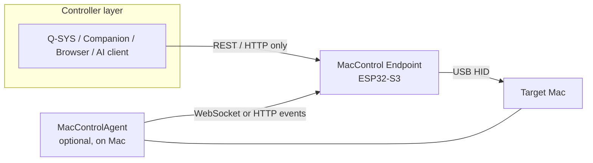

## 1. Scope, Conventions, and System Components

### 1.1 Purpose and normative language

#### 1.1.1 Define the document as build-ready engineering guidance using MUST/SHOULD/MAY and deterministic acceptance criteria

This document is the build-ready engineering specification for MacControl, a deterministic control system in which an ESP32-S3 endpoint controls a target Mac over USB Human Interface Device (HID) and an optional MacControlAgent (MCA) supplies verification evidence. An implementer can produce conforming firmware and software without further design decisions: every behavior is a requirement, schema, state rule, or failure behavior, and every feature carries at least one deterministic acceptance criterion testable by automated request/response checks rather than by judgment.

The key words **MUST**, **MUST NOT**, **SHOULD**, **SHOULD NOT**, and **MAY** are normative. **MUST** denotes a behavior required for conformance; violating it is a defect. **SHOULD** denotes a recommended behavior that may be omitted only with a documented reason. **MAY** denotes an optional behavior whose presence or absence does not affect conformance. Recommended defaults are always labeled as defaults and are configurable. Acceptance criteria are phrased as observable outcomes — an HTTP status code, a ledger record, a state transition, or a timeout — so that conformance testing is itself deterministic.

#### 1.1.2 State that MacControl contains no LLM, natural-language parser, planner, or inference-driven behavior anywhere in the product

MacControl contains **no large language model (LLM), no natural-language parser, no planner, and no inference-driven behavior** in any component. Every command path, macro step, verification predicate, and terminal verdict is produced by fixed, deterministic logic. External AI clients, if deployed, are ordinary HTTP API consumers with no privileged subsystem: they authenticate through the same role-based access control (RBAC) roles (READ, CONTROL, ADMIN) and receive the same responses. The machine-readable surfaces `GET /api/v1/capabilities` and `GET /api/v1/openapi.json` serve such clients, but they describe the system; they never cause it to reason.

### 1.2 Component inventory

#### 1.2.1 Identify the four components: controller, ESP32-S3 endpoint, target Mac, and optional MacControlAgent

| Component | Required | Role | Owns |
|---|---|---|---|
| Controller | Yes | Any REST/HTTP client (Q-SYS, Companion, browser, automation, AI client) | Nothing; issues requests only |
| MacControl Endpoint (ESP32-S3) | Yes | Authoritative control and status hub | Command ledger, status cache, identity, macros, terminal verdicts |
| Target Mac | Yes | Machine under control, reached via USB HID | Receives HID input; no protocol role |
| MacControlAgent (MCA) | No | On-Mac evidence provider | Pairing state, allowlist, event reports to ESP32 |

The inventory is closed: no central manager, broker, or cloud service exists in this specification. The ESP32 endpoint MUST remain fully functional in Mode A even when the MCA is never installed, because the ESP32 alone owns command initiation, the persistent command ledger, the controller-facing status cache, and all terminal command outcomes. The MCA closes the verification loop with evidence; it never independently marks a command complete and is never a dependency of basic HID control.

#### 1.2.2 Require all controllers to communicate only with the ESP32 REST/API surface and never directly with the MCA

Controllers MUST address only the ESP32 REST/API surface (`/api/v1/...`) and MUST NOT communicate directly with the MCA. The MCA accepts inbound traffic solely from its paired ESP32 endpoint and exposes no controller-facing API. This single-ingress rule keeps authentication, RBAC enforcement, rate limiting, and the command ledger in exactly one place, so the ESP32 is the sole testable system boundary.

### 1.3 Operating modes and capability levels

#### 1.3.1 Define Mode A as agentless HID control with hid_only/unconfirmed terminal states

Mode A is the zero-install mode: no software runs on the Mac. The ESP32 issues keyboard shortcuts, macros, and power commands over USB HID. Because no evidence channel exists, Mode A commands MUST terminate as `unconfirmed` (with `result = hid_only`) or `failed` on local dispatch errors, and MUST NEVER terminate as `completed`.

#### 1.3.2 Define Mode B as agent-enhanced operation where MCA evidence completes the verification loop

Mode B adds the MCA, which reports system state, user state, application state, and command acknowledgements. Mode B is the only mode that MAY mark a command `completed`, and only when MCA evidence satisfies the command's verification predicate within its deadline (Section 5.3).

#### 1.3.3 Define capability levels L1 HID, L2 agent visibility, and L3 verified automation with one testable criterion each

| Level | Name | Scope | Testable criterion |
|---|---|---|---|
| L1 | HID control | Mode A | Dispatching `POST /api/v1/system/lock` produces a ledger record terminating in `unconfirmed` with `result = hid_only` |
| L2 | Agent visibility | Mode B | `GET /api/v1/status` reports `agent_reported` Mac state no older than the 15 s stale threshold |
| L3 | Verified automation | Mode B | A `restart` command reaches terminal state `completed` only after agent hello with a changed `boot_id` within the restart deadline |

The levels are cumulative: L3 implies L1 and L2. An implementation claiming L3 MUST pass the L1 and L2 criteria with the agent disabled and enabled respectively, which proves the ESP32's independence from the MCA.
