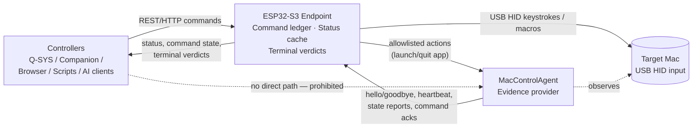

## 2. Authority Model and Responsibility Split

MacControl is a deterministic system, and determinism requires an unambiguous answer to the question: *who is allowed to assert what?* This chapter fixes that answer. The ESP32-S3 MacControl Endpoint is the single authority for command state and published status; the MacControlAgent (MCA) is an evidence supplier whose output can advance a command through its lifecycle but can never independently settle it. Controllers (Q-SYS, Companion, browsers, automation scripts, external AI clients) communicate only with the ESP32 REST/API surface and MUST NOT communicate directly with the MCA. No inference, planning, or natural-language interpretation occurs anywhere in this authority chain; every transition is produced by explicit, testable rules.

### 2.1 ESP32 as final source of truth

#### 2.1.1 Exclusive ESP32 responsibilities

Four functions are assigned exclusively to the ESP32 and MUST NOT be delegated to any other component, including the MCA:

| Function | Owner | Exclusive rule |
|---|---|---|
| Command initiation and dispatch | ESP32 | Every command-producing request (power commands, macro execution, application launch/quit) creates a ledger record and receives a `command_id` before any HID dispatch or agent action; non-command mutations (macro CRUD, key management, OTA) return 200/201 synchronously and create no ledger record. |
| Command ledger ownership | ESP32 | The ledger is the sole record of command state; it survives reboot and is reconciled at boot. |
| Status cache publication | ESP32 | `GET /api/v1/status` is served only from the ESP32 cache, with per-field provenance and freshness metadata. |
| Terminal verdicts | ESP32 | Only the ESP32 may set a command to `completed`, `failed`, `timed_out`, or `unconfirmed`. |

This concentration of authority is deliberate. Because controllers never talk to the MCA, a controller can reconstruct the full truth of the system from one document (the status cache) and one record set (the ledger). If authority were split — for example, if the MCA could mark a command complete — a controller would have to trust a component it cannot address and whose liveness it cannot independently observe. Centralizing verdicts on the ESP32 also makes the failure model simple: if the ESP32 is reachable, its answers are authoritative; if it is unreachable, nothing downstream may substitute its own claim of success.

#### 2.1.2 MCA output classified as evidence

MCA output is classified as *evidence*: typed, sequenced, authenticated messages that the ESP32 evaluates against per-command verification predicates. Evidence can advance a command from `dispatched` to `confirming` to `completed`, but evidence alone never produces a terminal state. The verdict is always computed by ESP32-side rules (see Chapter 5), which also incorporate timeouts and expected-offline windows. In Mode A (agentless), no evidence exists, so commands MUST terminate as `unconfirmed` with `result=hid_only`; Mode A MUST never report `completed`. Mode B (agent-enhanced) is the only mode in which `completed` is reachable, and only when MCA evidence satisfies the declared predicate for that command within its deadline.

### 2.2 MCA as loop-closing evidence provider

#### 2.2.1 Evidence supplied by the MCA

The MCA closes the verification loop that USB HID cannot close. It MUST supply the following evidence classes: `agent_hello`/`agent_goodbye` (session boundaries), `heartbeat` (every 5 seconds by default), system state reports (awake, sleeping, waking, shutting down, restarting, booting), user state reports (logged in/out, screen locked/unlocked), application state reports (started/exited for allowlisted applications), and command acknowledgements/results correlated by `command_id`. Each class exists to make a specific predicate testable: without `agent_goodbye` plus expected offline, sleep and shutdown cannot be verified; without a post-restart `agent_hello` bearing a changed `boot_id`, restart cannot be verified.

#### 2.2.2 Evidence admission rules

The ESP32 MUST reject MCA evidence that is unauthenticated (missing or invalid paired credential), out-of-sequence (session sequence number not monotonically increasing within the active session), stale (arriving only after its associated session has been declared OFFLINE at 30 seconds of silence or has been closed; a session merely marked STALE at 15 seconds still accepts evidence, because STALE is recoverable — any valid frame in the same session returns the session to ACTIVE per Chapter 4.2.1), or unpaired (device identity not matching the single active pairing). Rejected evidence is logged with the rejection reason and MUST NOT advance any command or update any status field. These admission rules make replay, spoofing, and cross-device confusion detectable and harmless rather than silently corrupting the ledger.

The data-flow diagram makes the authority structure visible: all controller traffic terminates at the ESP32, all physical effect flows through USB HID, and all verification flows back from the MCA as evidence. There is exactly one path by which the outside world learns outcomes, and exactly one component that decides them.

### 2.3 UI ownership split

Because authority is split between the endpoint and the agent, configuration authority is split the same way. Each UI configures only the component it runs on; neither UI may write configuration owned by the other.

#### 2.3.1 ESP32 Web UI responsibilities

The ESP32 Web UI MUST own shortcut trigger setup and macro definitions, device identity, controller credentials and RBAC keys, and dashboard/log/OTA functions, and MUST NOT expose any control that writes MCA-owned configuration.

#### 2.3.2 MCA UI responsibilities

The MCA UI MUST own command enablement, response endpoint configuration, and the application allowlist, and MUST NOT expose any control that writes ESP32-owned configuration.

| Configuration area | ESP32 Web UI | MCA UI |
|---|---|---|
| Shortcut trigger setup and macros | Owns | — |
| Device identity (name, hostname, location, description) | Owns | — |
| Controller credentials and RBAC keys (READ/CONTROL/ADMIN) | Owns | — |
| Dashboard publication, logs, OTA | Owns | — |
| Pairing initiation/completion | Opens pairing window | Completes pairing ceremony |
| Command enablement and response endpoints | — | Owns |
| Application allowlist | — | Owns |

This split follows the principle that the party enforcing a rule must own its configuration. The ESP32 enforces controller authentication and executes macros, so it owns credentials and macro definitions; the MCA enforces the application allowlist and decides which commands it will act on, so it owns allowlist and enablement state. Pairing is the single deliberate exception requiring cooperation: the ESP32 opens a time-boxed pairing window from its Web UI, and the MCA completes the ceremony in its own UI, after which exactly one active pairing is recognized (see Chapter 3). A consequence for implementers is that a factory-reset ESP32 never invalidates MCA-side allowlist data, and a reinstalled MCA never inherits controller credentials — each side's configuration is independently persisted, independently revocable, and meaningless to the other component except through the paired protocol.
