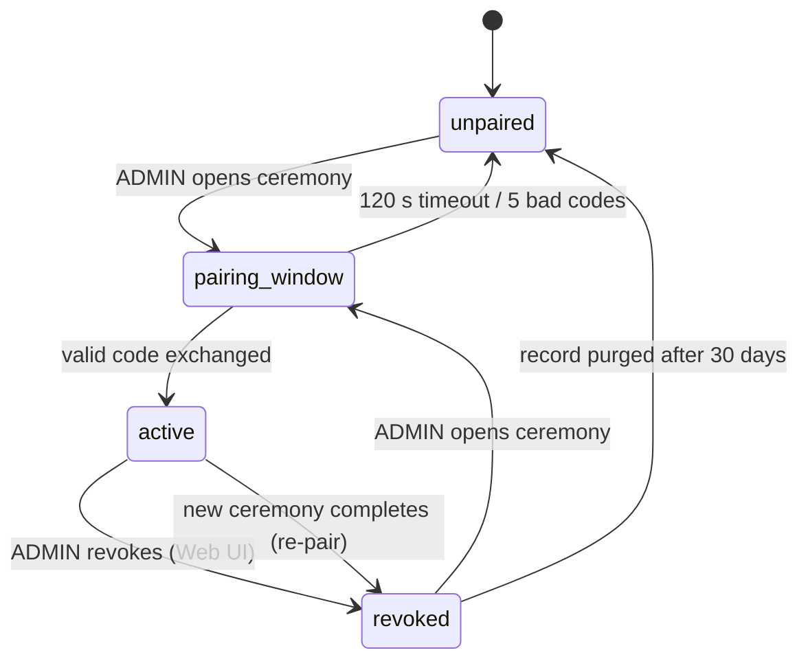

## 3. Device Identity, Pairing, and Discovery

### 3.1 Endpoint identity

#### 3.1.1 Define device name, hostname, location, description, generated device ID, and mDNS naming rules

Every MacControl Endpoint MUST carry a persistent identity record stored in ESP32 flash, editable through the ESP32 Web UI, and readable at `GET /api/v1/status` and in mDNS TXT records. The identity record is the anchor that controllers, the MCA, and the command ledger use to correlate traffic with a physical machine.

| Field | Type | Mutable | Rules |
|---|---|---|---|
| `device_name` | string, 1–32 chars | Yes (Web UI) | Operator label, e.g. `ProPresenter Mac`; display only, never used for routing |
| `hostname` | DNS label, 1–57 chars | Yes (Web UI) | Lowercase `[a-z0-9-]`, must start/end alphanumeric; default `mac-` + last 6 hex of factory MAC. The 57-char cap reserves room for the collision suffixes of Chapter 3.3 (`-2` through `-99`) within the 63-char DNS label limit |
| `location` | string, 0–64 chars | Yes (Web UI) | Free text, e.g. `Main Sanctuary` |
| `description` | string, 0–128 chars | Yes (Web UI) | Free text, e.g. `Main ProPresenter computer` |
| `device_id` | 12 hex chars | No | Generated once at first boot from the factory eFuse MAC; never regenerated, survives OTA and config reset |

The mDNS advertised instance name MUST be the collision-resolved hostname label (Chapter 3.3) plus `.local`, and the Web UI MUST reject a `hostname` edit that does not satisfy the DNS-label rule above. `device_id` is the only identity element other subsystems may trust for correlation: `device_name` and `hostname` are operator-editable and therefore decorative for security and ledger purposes. Implementers should note that identity edits apply without reboot, but the mDNS responder MUST re-announce within 2 seconds of a hostname change so controllers do not retain stale resolutions.

### 3.2 ESP32-MCA pairing

#### 3.2.1 Define a time-boxed pairing ceremony initiated from the ESP32 Web UI and completed in the MCA UI

Pairing is the sole trust anchor between an ESP32 endpoint and an MCA instance. The ceremony is explicitly two-sided and time-boxed:

1. An ADMIN-scoped operator opens the pairing window from the ESP32 Web UI. The ESP32 generates a one-time 8-character alphanumeric pairing code (excluding ambiguous glyphs `0/O/1/I`), displays it locally, and opens a pairing window with a default lifetime of 120 seconds (configurable 60–600 s).
2. The operator enters that code in the MCA UI on the target Mac. The MCA resolves the endpoint via mDNS, submits the code to `POST /agent/v1/pair` over the LAN, and receives a pairing credential in return.
3. The ESP32 validates the code, atomically stores the pairing record, and closes the window. Exactly one code validation attempt per second is accepted; after 5 failed attempts the window closes.

#### 3.2.2 Define stored credentials, revocation, re-pairing, and exactly-one-pairing-per-activation rules

The pairing record stored on the ESP32 MUST conform to:

```json
{
  "pairing_id": "pr-3fa9c2",
  "device_id": "a1b2c3d4e5f6",
  "agent_instance_id": "ag-7e21",
  "agent_token_sha256": "9f2c…e4",
  "created_at": "2025-01-14T09:31:02Z",
  "last_used_at": "2025-01-14T10:12:03Z",
  "state": "active"
}
```

The raw `agent_token` (32 bytes, base64url) is returned to the MCA exactly once during the ceremony; the ESP32 persists only its SHA-256 digest. The MCA MUST present the token on every WebSocket `agent_hello` and every polling request; the ESP32 MUST reject evidence bearing an unknown, revoked, or mismatched token. The following state machine governs the record's lifecycle:



The exactly-one rule is normative: an ESP32 holds at most one record in `active` state at any time, and completing a new ceremony implicitly revokes the incumbent credential before the new one is stored. Revocation takes effect immediately — in-flight MCA connections are closed with a dedicated close code and the status cache marks all `agent_reported` fields stale. Re-pairing after credential loss therefore requires physical or ADMIN access to the ESP32 Web UI, which is the intended recovery path. Acceptance implication: a revoked token presented within the same second as revocation MUST be rejected, and the ledger MUST log the revocation event with a correlation ID.

### 3.3 Discovery

#### 3.3.1 Define mDNS advertisement and deterministic controller discovery without any central manager dependency

Each endpoint MUST advertise service type `_maccontrol._tcp.local.` with TXT records `id=<device_id>`, `api=1`, `mode=A|B`, and `pair=unpaired|active|revoked`. Controllers discover endpoints by browsing this service type and resolving `<hostname>.local`; no central manager, cloud broker, or directory service is required or consulted. On joining a network, the ESP32 MUST issue an unsolicited announcement; on detecting a hostname conflict it MUST log the conflict, retain its configured `hostname` in the identity record, and advertise with the first available suffixed label formed by appending `-2`, then `-3`, and so on through `-99` (the 57-char base-label cap of Chapter 3.1 guarantees every suffixed label fits the 63-char DNS limit), while surfacing a persistent warning in the Web UI. If every suffix from `-2` through `-99` also collides, provisioning of the advertisement MUST fail with the deterministic error `hostname_collision_exhausted`, logged and surfaced in the Web UI; the endpoint retains its configured `hostname` and does not advertise a mDNS instance name until the conflict is resolved. Deterministic renaming beyond this rule remains the operator's responsibility, since silent renaming would break stored controller configurations. A future manager may aggregate these advertisements, but endpoints MUST remain fully functional in its absence; discovery, pairing, and command execution degrade only with the LAN itself, never with any off-device dependency.
