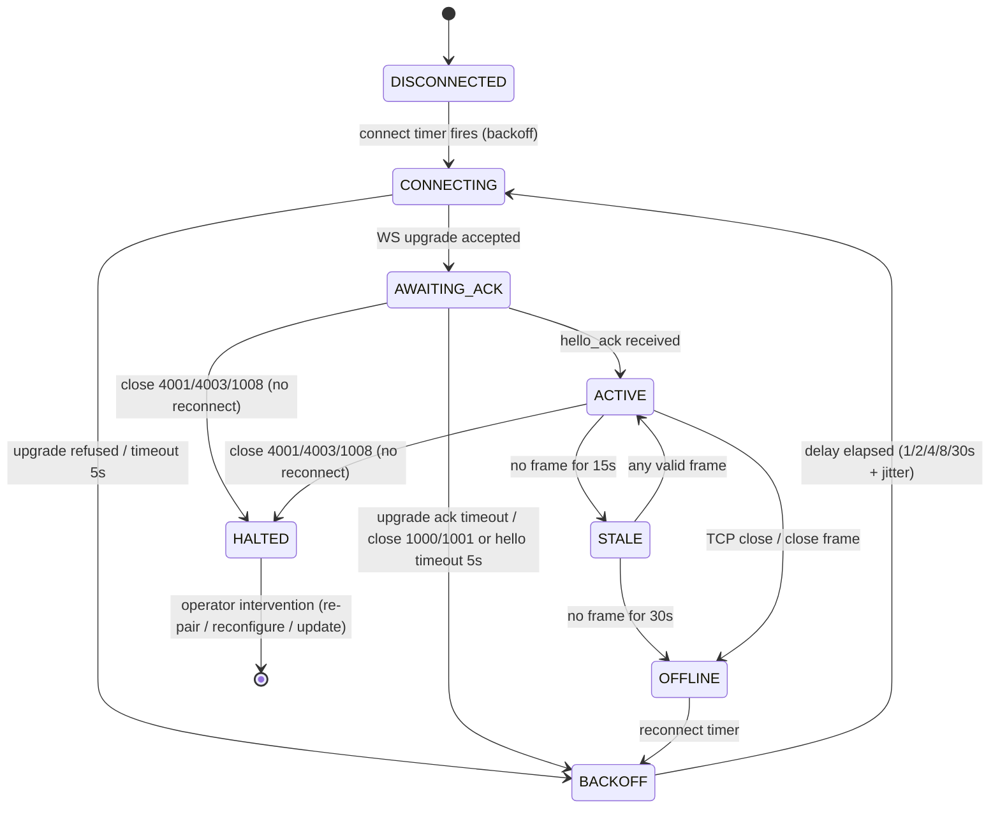

## 4. Connectivity and Agent Transport

This chapter defines the two transport surfaces of the MacControl Endpoint (ESP32): the controller-facing REST/HTTP API and the agent-facing channel used by MacControlAgent (MCA). Both surfaces are deterministic: every request produces a versioned path, a closed set of status codes, and a fixed timing behavior. The ESP32 remains the final source of truth for connection state; the MCA only initiates and maintains a session. Nothing in this chapter depends on natural-language or inference-driven behavior of any kind.

### 4.1 Controller transport

#### 4.1.1 REST/HTTP access with versioned paths and deterministic errors

Controllers (Q-SYS, Bitfocus Companion, browsers, scripts, or external AI clients acting as ordinary HTTP consumers) MUST communicate only with the ESP32 over HTTP. All controller paths MUST be prefixed with a major version segment, `/api/v1/`, and all agent-facing paths with `/agent/v1/`; unversioned requests MUST be rejected with HTTP 404. A version bump (for example `/api/v2/`) MUST leave `/api/v1/` behavior unchanged for at least one full firmware release cycle.

Every error response MUST use the deterministic error envelope below, and the mapping between HTTP status and `code` MUST be exact and total: the ESP32 MUST NOT emit a status code outside this table. The transport is Ethernet-capable: the same controller and agent surfaces, paths, status codes, and mDNS discovery apply unchanged when the endpoint is deployed with an Ethernet interface (Chapter 17, Phase 6) instead of or alongside Wi-Fi.

```json
{
  "error": {
    "code": "unauthorized",
    "message": "API key missing or invalid",
    "request_id": "req_01HF3K9X2A"
  }
}
```

| HTTP status | code | Trigger condition |
|---|---|---|
| 400 | `bad_request` | Malformed JSON, unknown field, schema violation on a controller (`/api/v1/`) request |
| 400 | `validation_failed` | Agent (`/agent/v1/`) event envelope schema violation or unknown event type; counted per Chapter 6.1.1 |
| 400 | `macro_invalid_step` | Any invalid macro definition: a step `type`, `key`, or modifier outside the closed enums, or an invalid `expected_event` such as a forbidden verification event type (Chapter 10.1.1) |
| 401 | `unauthorized` | Missing/invalid API key or pairing credential |
| 403 | `forbidden` | Valid credential, insufficient READ/CONTROL/ADMIN role |
| 403 | `forbidden` | Known but revoked/disabled credential (controller API key or agent pairing token) |
| 404 | `not_found` | Unknown path, command_id, macro_id, or version |
| 409 | `conflict` | Idempotency key replay with divergent body |
| 409 | `agent_not_paired` | Agent-dependent command or endpoint requested with no active pairing (Mode A) |
| 409 | `agent_offline` | Agent-dependent command requested while the paired agent's session is not ACTIVE |
| 409 | `command_disabled` | Action absent from the MCA `capability_report.enabled_commands` |
| 409 | `app_not_allowlisted` | Target `bundle_id` absent from the MCA `allowlisted_apps` |
| 409 | `app_not_registered` | Target `bundle_id` absent from the ESP32 monitored registry |
| 409 | `app_control_disabled` | Registry entry has `control_enabled: false` |
| 409 | `macro_queue_full` | Macro execution queue at capacity; rejected pre-ledger, no record created (Chapter 10.3.1) |
| 409 | `ota_in_progress` | OTA upload/apply requested while another OTA operation is in progress, or `ota/apply` requested without `force` while commands are in flight (Chapter 15.3) |
| 409 | `store_corrupt` | Persistent macro store failed CRC validation; execution refused (Chapter 15.1). Unrecoverable corruption of other stores surfaces as 500 `internal_error` |
| 429 | `rate_limited` | Per-role rate limit exceeded (Chapter 13) |
| 500 | `internal_error` | Any otherwise unclassified failure |
| 503 | `ledger_unavailable` | Ledger write failed; nothing dispatched (Chapter 5.1.2) |
| 503 | `network_unavailable` | Requests arriving during association loss (Chapter 15.1) |

This closed mapping lets controllers implement exact retry logic: 429, 500, and 503 are retryable with the backoff defined in Section 4.3.2, while 400, 401, 403, 404, and the 409 family are permanent and MUST NOT be retried unchanged. The mapping is total for the HTTP surfaces: every HTTP error the ESP32 emits uses exactly one row above. WebSocket close codes 4001, 4002, and 4003 (Section 4.2.1) are **not** HTTP status codes and are excluded from this mapping. There is no one-to-one mapping from WebSocket close codes to HTTP statuses; on the polling fallback transport, agent-facing rejections follow the deterministic HTTP rules of Section 4.3.1 and never reuse close-code numbers as `code` values or HTTP statuses. Only command-producing requests — power commands (`wake`, `sleep`, `restart`, `shutdown`, `lock`), macro execution, and application launch/quit — return HTTP 202 with a `command_id` whose lifecycle is defined in Chapter 5; transport acceptance never implies execution success. Non-command-producing mutations (macro CRUD, key management, OTA upload/apply) return HTTP 200 or 201 synchronously and create no ledger record. `request_id` is an ESP32-generated correlation identifier echoed into the event log (Chapter 15).

### 4.2 MCA-to-ESP32 WebSocket

#### 4.2.1 Handshake, session assignment, and sequence numbers

The MCA MUST initiate the connection; the ESP32 never dials the agent. The MCA opens a WebSocket to `ws://<hostname>.local/agent/v1/ws` and presents its pairing credential (Chapter 3) in the HTTP `Authorization: Bearer` header of the upgrade request. Immediately after upgrade, the MCA MUST send an `agent_hello` frame, enveloped like every MCA message (Chapter 6.1):

```json
{
  "event_id": "evt_1",
  "agent_instance_id": "ag-7e21",
  "seq": 1,
  "timestamp": "2025-01-14T09:31:10Z",
  "type": "agent_hello",
  "payload": {
    "protocol_version": 1,
    "agent_version": "1.0.0",
    "boot_id": "b_3F8A11",
    "hostname": "mac-propresenter"
  }
}
```

`agent_hello` carries no `state` or `ready` field: readiness is established by the mandatory initial status burst (Chapter 6.3) that follows `hello_ack`. The opening `agent_hello` is the only frame without a `session_id`, which is assigned by the `hello_ack` reply.
The ESP32 validates the credential and `agent_instance_id` against the stored pairing record's `agent_instance_id` (Chapter 3), then replies with `hello_ack` containing a server-assigned `session_id`, the negotiated `protocol_version`, and the heartbeat parameters of Section 4.2.2. From `hello_ack` onward the session is ACTIVE. Each MCA frame carries `seq`, a per-session monotonically increasing integer starting at 1; `seq` resets on every new session and MUST NOT be reused across sessions. The ESP32 MUST reject evidence that is unpaired or out of sequence (a gap greater than the configured `max_seq_gap`, default 10), per the evidence rules of Chapter 2. The MCA-supplied `timestamp` is advisory only and is never a rejection or ordering criterion: ordering is governed by `seq`, and all timing arithmetic uses the ESP32-recorded `received_at` (Chapter 6.1.1). Rejection is expressed by closing the socket with the close codes below.



The STALE and OFFLINE states are ESP32-side observations of the session, not MCA states; they drive status-cache freshness marking (Chapter 7) and never terminate commands by themselves. HALTED is the terminal no-reconnect state: closes 4001 (unpaired/revoked), 4003 (protocol mismatch), and 1008 (policy/auth failure) land there, and the MCA MUST NOT enter BACKOFF for them; only close 1000, close 1001, and unannounced network loss (including close 4002, which forces a new session) enter the BACKOFF loop.

| Close code | Name | Meaning | MCA MUST reconnect? |
|---|---|---|---|
| 1000 | Normal | Clean shutdown after `agent_goodbye` | Yes, after backoff |
| 1001 | Going away | Expected-offline window (sleep/restart/shutdown) | Yes, inside declared window |
| 1008 | Policy violation | Generic authentication/policy failure | No, until reconfigured |
| 4001 | Unpaired or revoked | Credential unknown or revoked pairing | No, until re-paired |
| 4002 | Sequence violation | `seq` regression or gap > `max_seq_gap` | Yes, new session, `seq` resets |
| 4003 | Protocol mismatch | Unsupported `protocol_version` | No, until agent updated |

For implementers, the reconnect column encodes the authority split: codes 1008, 4001, and 4003 represent configuration or trust faults that retrying cannot fix, so the MCA MUST surface them in its UI connection-status page and stop reconnecting; codes 1000, 1001, and 4002 are transient and enter the backoff loop. During an expected-offline window (1001), the ESP32 MUST classify the silence as `expected_offline` evidence rather than a fault.

Close handling is ordered and total. On any connection termination the ESP32 and the MCA MUST evaluate the close code first: close 4001, 4003, or 1008 transitions the session directly to HALTED (terminal, no reconnect); close 1000, close 1001, or no-code network loss transitions to OFFLINE and thence into BACKOFF as applicable. A 1001 close permits transport-level reconnect in general — the backoff loop is legal during an expected-offline window — but the command layer evaluates reconnects independently of transport permission: an MCA reconnect arriving before an in-flight sleep command's `close_after_s` is refutation evidence that MUST fail that command with `unexpected_wake` (Chapters 5.3.2, 8.1.1). For a clean sleep the MCA SHOULD NOT reconnect before `close_after_s` elapses.

#### 4.2.2 Heartbeat and liveness timing

| Parameter | Default | Configurable range | Semantics |
|---|---|---|---|
| `heartbeat_interval` | 5 s | 2–30 s | MCA sends `heartbeat` frame this often |
| `stale_threshold` | 15 s | fixed at 3 × interval | Agent-derived status fields marked stale |
| `offline_threshold` | 30 s | fixed at 6 × interval | Session declared OFFLINE; agent evidence closed |
| `hello_timeout` | 5 s | 2–10 s | Max wait for `hello_ack` after upgrade |

The 3× and 6× ratios MUST be preserved if `heartbeat_interval` is changed, so exactly three missed heartbeats imply STALE and six imply OFFLINE. Any valid frame—not only `heartbeat`—resets the liveness clock, which prevents idle-but-chatty sessions from flapping. OFFLINE does not mark commands failed; it only closes the evidence channel, leaving terminal verdicts to the lifecycle rules of Chapter 5.

### 4.3 Polling fallback

#### 4.3.1 Semantically identical HTTP transport

Where WebSocket is unavailable (proxy restrictions, constrained networks), the MCA MUST fall back to two endpoints that are semantically identical to the WebSocket channel: `POST /agent/v1/events` carries the exact same event envelope as a WebSocket frame (`agent_hello`, `heartbeat`, `command_ack`, and all Chapter 6 events), and `GET /agent/v1/commands/pending` replaces server-pushed command dispatch. The first `agent_hello` POST establishes the session and returns `session_id` in the response body, which the MCA MUST then supply as the `X-Session-Id` header on every subsequent request; sequence numbering and rejection rules are unchanged. Because HTTP has no close frames, there is no one-to-one WebSocket-close-to-HTTP mapping; instead, rejections on the polling transport use these deterministic rules: a missing or invalid credential is HTTP 401 `unauthorized`; a known but revoked or disabled credential is HTTP 403 `forbidden`; an unpaired `agent_instance_id` is HTTP 409 `agent_not_paired`; a request against an inactive or unknown session is HTTP 409 `agent_offline`; and an event-envelope schema violation or unknown event type is HTTP 400 `validation_failed`, counted toward the schema-violation threshold of Chapter 6.1.1. The default poll interval for `GET /agent/v1/commands/pending` is 5 s (configurable 2–30 s), matching `heartbeat_interval` so liveness semantics are identical across transports. The ESP32 MUST NOT treat transport choice as evidence: Mode B verification rules apply equally, and switching transports mid-session is prohibited—a transport change requires a new session.

#### 4.3.2 Deterministic reconnect backoff

| Consecutive failed attempts | Base delay | Applied jitter (0–20%) | Effective range |
|---|---|---|---|
| 1 | 1 s | 0–0.2 s | 1.0–1.2 s |
| 2 | 2 s | 0–0.4 s | 2.0–2.4 s |
| 3 | 4 s | 0–0.8 s | 4.0–4.8 s |
| 4 | 8 s | 0–1.6 s | 8.0–9.6 s |
| 5+ | 30 s (cap) | 0–6.0 s | 30.0–36.0 s |

The attempt counter increments on every failed connect, upgrade, or `hello_ack` wait, and on every failed poll cycle in fallback mode; it resets to zero only on a successful `hello_ack`. Jitter MUST be drawn uniformly from $[0,\ 0.2 \times \text{base}]$ using a non-cryptographic PRNG seeded at boot, which decorrelates fleets of agents rebooting together after a power event without introducing unbounded delay. There is no maximum attempt count: a paired agent retries forever at the 30 s cap, because long-lived silence is normal inside expected-offline windows and the ESP32, not the transport, decides when evidence is too old to matter.
