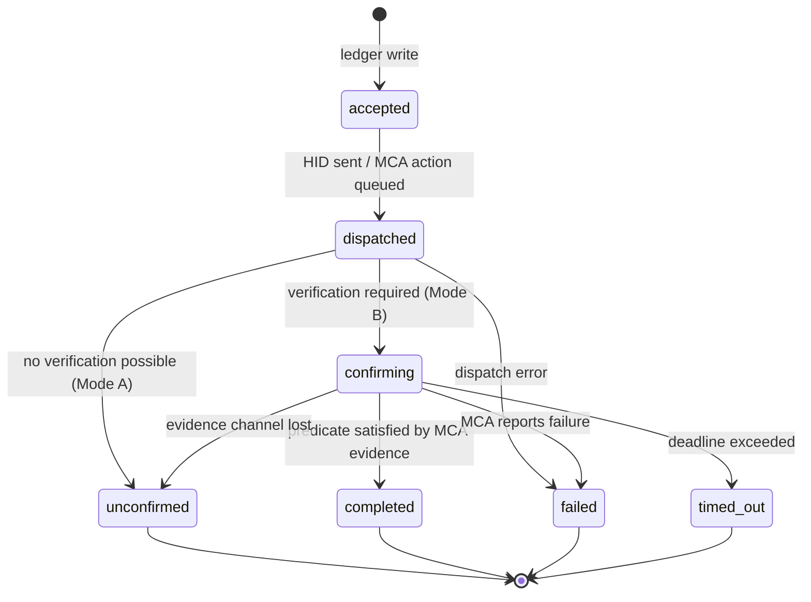

## 5. Command Ledger and Deterministic Command Lifecycle

This chapter defines how the MacControl Endpoint (ESP32-S3) records, advances, and terminates commands. The design follows directly from the authority model in Chapter 2: the ESP32 owns the command ledger, MacControlAgent (MCA) supplies evidence only, and the absence of evidence MUST produce a non-committal terminal state rather than an inferred success. Every state transition in this chapter is deterministic: given the same ledger record and the same evidence inputs, any conforming implementation MUST reach the same terminal verdict.

### 5.1 Command ledger

#### 5.1.1 Flash-backed append-only ledger with bounded capacity, FIFO eviction, idempotency keys, and boot reconciliation

The ESP32 MUST maintain a persistent command ledger in flash storage. The ledger is append-only: records are never mutated in place; instead, each state transition appends a new record revision sharing the same `command_id`, and the latest revision defines the observable state. This preserves an auditable transition history within the same bounded store. The ledger MUST be bounded at a default capacity of 256 commands (configurable 64–1024); when capacity is exhausted, the oldest command — including all of its revisions — MUST be evicted in strict FIFO order. Eviction MUST NOT remove a command in a non-terminal state unless the store is full of non-terminal commands, in which case the oldest non-terminal command MUST be terminated as `failed` with `error_code = "evicted_pending"` before eviction.

Idempotency is deduplicated on an explicit client-supplied key (`Idempotency-Key` header or `idempotency_key` field). If a new request arrives whose explicit idempotency key matches an existing non-evicted ledger record, the ESP32 MUST NOT create a new record or re-dispatch; it MUST return the existing `command_id` and current state with HTTP 200, and the same key with a divergent body MUST be rejected with 409 `conflict` (Chapter 12.2.1). A request with no explicit key executes as a new command, with exactly one exception: the ESP32 derives a hash of `(command_type, target, normalized_parameters)`, and if that hash matches a ledger record still in a non-terminal in-flight state (`accepted`, `dispatched`, or `confirming`) that was accepted within the last 60 seconds, the duplicate MUST be coalesced to the existing in-flight `command_id` — the ESP32 returns HTTP 202 carrying the existing `command_id` and its current state, creates no new record, and MUST NOT dispatch a duplicate. Coalescing never applies to terminal records and never beyond the 60-second in-flight window: once the earlier command terminates or the window elapses, an identical no-key request executes as a new command with a new ledger record. Only explicit-key deduplication spans full ledger retention.

```json
{
  "command_id": "8F31A2C4",
  "idempotency_key": "qsys-show-preset-042",
  "revision": 3,
  "type": "restart",
  "parameters": {},
  "requested_by": "apikey:control-01",
  "requested_at": "2025-01-14T09:31:02Z",
  "mode_at_accept": "B",
  "state": "confirming",
  "dispatched_at": "2025-01-14T09:31:03Z",
  "deadline_at": "2025-01-14T09:34:03Z",
  "expected_offline_window": { "open_after_s": 3, "close_after_s": 60 },
  "evidence": ["evt_1042", "evt_1047"],
  "result": null,
  "error_code": null
}
```

The schema fixes the vocabulary used across this specification: `command_id` is an ESP32-generated unique identifier formatted as a bare 8-character Crockford Base32 string — uppercase digits `0–9` and letters `A–Z` excluding `I`, `L`, `O`, and `U` (e.g., `8F31A2C4`, `7AC41E9B`); `state` and `result` follow Section 5.2; `expected_offline_window` follows Section 5.3.2; `evidence` lists MCA event identifiers (Chapter 6) that advanced the command. `result` and `error_code` are null in every non-terminal revision. Implementers should note that `mode_at_accept` is pinned at acceptance time: pairing or unpairing the MCA mid-command MUST NOT retroactively change which terminal states are reachable for that command.

On every boot, the ESP32 MUST reconcile the ledger before accepting new commands. Any command found in a non-terminal state MUST be re-evaluated against current evidence (MCA connection state, network probes): if its deadline has passed it transitions to `timed_out`; if its deadline is still open and the command is resumable (e.g., `wake`, which is pure observation after dispatch), it resumes in `confirming`; otherwise it transitions to `failed` with `error_code = "esp32_restarted"`. Boot reconciliation MUST complete within 2 seconds and MUST be recorded as a log entry (Chapter 15) so that a controller can explain any verdict that changed while the endpoint was down.

#### 5.1.2 Require every command-producing request to create a ledger record before dispatch and return 202 with command_id

Every command-producing controller request — system power commands, macro execution, and application launch/quit — MUST be persisted to the ledger in state `accepted` **before** any HID report is emitted or any MCA-bound action is queued. The only exceptions are requests resolved before acceptance: deterministic pre-ledger rejections (the 409 family of Chapter 12.3.1, including `macro_queue_full` and `agent_not_paired`) and the coalesced in-flight duplicate of Chapter 5.1.1, which returns HTTP 202 with the existing `command_id` and creates no new record. The response to an accepted controller request is HTTP 202 with a body containing at minimum `command_id`, `state: "accepted"`, and `deadline_at`. This ordering is the core durability guarantee: if the endpoint loses power after the flash write but before dispatch, boot reconciliation finds the record and terminates it deterministically instead of losing the command silently. If the ledger write fails (flash error, store full of unevictable records), the endpoint MUST return HTTP 503 whose error envelope carries `code: "ledger_unavailable"` and MUST NOT dispatch. Non-command-producing mutations — macro CRUD, API key management, and OTA upload/apply — return HTTP 200 or 201 synchronously and MUST NOT create ledger records. Read-only requests (status, capabilities, macro listing) MUST NOT create ledger records. Acceptance testing should verify the 202 contract by power-cycling the endpoint between acceptance and dispatch and confirming the command resolves to `failed`/`esp32_restarted` rather than disappearing.

### 5.2 Lifecycle states

#### 5.2.1 Define accepted, dispatched, confirming, completed, failed, timed_out, and unconfirmed with terminal-state rules



The four terminal states are `completed`, `failed`, `timed_out`, and `unconfirmed`; terminal records are immutable except for FIFO eviction. The transition table below is normative.

| From | Trigger | To | Guard / side effect |
|---|---|---|---|
| — | mutating request accepted | `accepted` | record persisted before dispatch |
| `accepted` | HID report sent or MCA action queued | `dispatched` | set `dispatched_at`, `deadline_at` |
| `accepted`/`dispatched` | USB/queue error | `failed` | `error_code = "dispatch_error"` |
| `dispatched` | Mode B, verification pending | `confirming` | evidence correlation opens |
| `dispatched` | Mode A, or no predicate available | `unconfirmed` | `result = "hid_only"` |
| `confirming` | MCA evidence satisfies predicate (5.3) | `completed` | result code per predicate table |
| `confirming` | MCA `command_result` reports failure | `failed` | `error_code` from MCA payload |
| `confirming` | `deadline_at` exceeded | `timed_out` | `error_code = "deadline_exceeded"` |
| `confirming` | MCA channel lost > 30 s with no window open | `unconfirmed` | `result = "evidence_lost"` |

The table encodes two rules implementers must not soften. First, `completed` has exactly one incoming edge, and that edge requires MCA evidence; no timer, probe, or HID success signal may substitute. Second, `unconfirmed` is terminal, not a retry state: a command that lost its evidence path ends there, and controllers that need certainty must issue a new command (idempotency keys make this safe). `timed_out` and `unconfirmed` differ in meaning — the deadline expired while the evidence channel was healthy, versus the channel itself failed — and UIs (Chapter 14) MUST render them distinctly.

#### 5.2.2 Define Mode A terminal behavior as unconfirmed with result=hid_only and prohibit completed without MCA evidence

In Mode A (agentless), every command MUST terminate as `unconfirmed` with `result = "hid_only"` once dispatch succeeds. This is the deterministic restatement of the PRD's distinction between "command sent" and "command confirmed": HID dispatch is proof of transmission, never of effect. The ESP32 MUST NOT mark any command `completed` without correlated MCA evidence, and this prohibition holds even if optional network probes (e.g., ping loss after a shutdown request) suggest success — such probes MAY annotate `result` (e.g., `"hid_only_net_unreachable"`) but MUST NOT change the terminal state. Symmetrically, in Mode B the MCA's `command_result` events are inputs to the ESP32's verdict logic; the MCA MUST NOT be treated as having authority to close a command, and the ESP32 MUST ignore completion claims that fail the evidence validation rules of Chapter 2.2.2 (unauthenticated, out-of-sequence, stale, or unpaired).

### 5.3 Verification predicates

#### 5.3.1 Define per-command predicates and default deadlines for wake, sleep, restart, shutdown, lock, macro execution, app launch, and app quit

Each command type has exactly one verification predicate — a boolean expression over MCA evidence events — and a default deadline. All deadlines are defaults and MUST be configurable per command type within the stated bounds.

| Command | Verification predicate (MCA evidence) | Default deadline (bounds) | `result` on completion |
|---|---|---|---|
| wake | Post-dispatch **new** MCA session `agent_hello` whose mandatory initial status burst reports `system_state=awake` (heartbeat alone insufficient) | 120 s (30–600) | `wake_confirmed` |
| sleep | `agent_goodbye(reason=sleep)` or offline onset inside the expected-offline window (5.3.2), **and** no reconnect through `close_after_s` | 90 s (15–300; MUST be > `close_after_s`) | `sleep_confirmed` |
| restart | Offline/goodbye inside window, then new-session `agent_hello` with changed `boot_id` and initial burst reporting `system_state=awake` | 180 s (60–900) | `restart_confirmed` |
| shutdown | `agent_goodbye(reason=shutdown)` or offline onset inside window, plus ICMP unreachability probes (Chapter 8.2.2) and no reconnect by deadline | 120 s (30–600) | `shutdown_confirmed` |
| lock | `screen_lock_changed(locked)` | 15 s (5–60) | `lock_confirmed` |
| macro execution | HID-only: the macro definition's explicit `expected_event` (e.g., `application_started` with matching `bundle_id`) arrives within the deadline; `expected_event.type` is restricted to the five ambient evidence types of Chapter 10.1.1 (`application_started`, `application_exited`, `system_state_changed`, `user_session_changed`, `screen_lock_changed`) — `command_ack`, `command_result`, `heartbeat`, `agent_hello`, `agent_goodbye`, and `capability_report` are forbidden as macro verification events; macro execution never uses MCA `command_ack`/`command_result` correlation, and if the macro declares no `expected_event`, the command is unverifiable and MUST terminate `unconfirmed` (Chapter 10.3.1) | macro timeout + 5 s | `macro_confirmed` |
| app launch | MCA-executed (Chapter 9.3.1): correlated `command_ack(action=launch_app)` **plus** `application_started(bundle_id)` matching the allowlisted target; `command_result(ok)` may report local execution outcome but MUST NOT by itself complete the predicate | 30 s (10–120) | `app_launch_confirmed` |
| app quit | MCA-executed (Chapter 9.3.1): correlated `command_ack(action=quit_app)` **plus** `application_exited(bundle_id)` with `reason` ∈ {`quit`, `requested_by_agent`} matching the allowlisted target; `command_result(ok)` may report local execution outcome but MUST NOT by itself complete the predicate | 30 s (10–120) | `app_quit_confirmed` |

Two consequences follow for implementers. First, evidence MUST be correlated by `command_id` where the event schema supports it (Chapter 6); uncorrelated events MAY satisfy a predicate only if they arrive within the command's open confirmation window and unambiguously match the command's target — a `wake` command accepts any qualifying new-session `agent_hello` plus awake burst inside its window, whereas an app launch requires an exact `bundle_id` match. Second, deadlines start at dispatch (`dispatched_at`), not at acceptance, so queue backpressure in the macro engine (Chapter 10) consumes no verification budget; a command that cannot dispatch before its acceptance plus 30 seconds MUST instead fail with `error_code = "dispatch_delayed"`.

#### 5.3.2 Define expected-offline windows as positive evidence for sleep, restart, and shutdown when they occur inside declared windows

For sleep, restart, and shutdown, the expected evidence is the *absence* of the agent — which is indistinguishable from failure without a declared window. Each such command therefore carries an `expected_offline_window` defined by two offsets from dispatch: `open_after_s` (default 3 s) and `close_after_s` (default 60 s). An MCA disconnect, a graceful `agent_goodbye`, or heartbeat expiry (offline after 30 s per Chapter 4) counts as **positive evidence** if and only if the offline condition begins at or after `open_after_s` and no later than `close_after_s`. No power command completes immediately on dispatch or on the first sign of silence: **sleep** completes only when the window has closed at `close_after_s` with no MCA reconnect (a `agent_goodbye(reason=sleep)` or in-window offline onset plus silence through `close_after_s`); sleep's refutation horizon is `close_after_s` — a reconnect before the window closes at `close_after_s` fails the command with `error_code = "unexpected_wake"`, while a reconnect after the command has completed at `close_after_s` is logged as `unexpected_wake` evidence (Chapter 15) and MUST NOT alter the terminal record. Sleep's timing carries a hard invariant: `close_after_s` MUST be strictly less than the sleep deadline (defaults 60 s < 90 s), and configuration MUST reject any sleep deadline less than or equal to `close_after_s`. Sleep completion and refutation are both evaluated at `close_after_s`; the deadline is only an outer bound for missing evidence — it terminates the command `timed_out` / `deadline_exceeded` when the evidence needed for evaluation (for example, any qualifying offline onset) never arrives, and it plays no role in a window whose evidence is complete. **Shutdown** completes only when the in-window offline evidence is corroborated by MUST-level ICMP unreachability probes (Chapter 8.2.2) and no MCA reconnect has occurred by the deadline; any reconnect fails it with `"unexpected_reconnect"`. For **restart**, the window satisfies only the first half of the predicate; `completed` additionally requires a new-session `agent_hello` bearing a `boot_id` different from the pre-command value and an initial status burst reporting `system_state=awake`, which deterministically excludes mere agent-process restarts. An offline event earlier than `open_after_s` is treated as a pre-existing channel fault and MUST terminate the command as `unconfirmed` with `result = "evidence_lost"`, because the endpoint cannot attribute the disconnection to its own dispatch. Once any command reaches a terminal state the record is never reopened: later contradictory events (for example, an MCA reconnect after a `completed` sleep or shutdown) are logged as `unexpected_wake`/`unexpected_reconnect` evidence and MUST NOT alter the terminal record.
