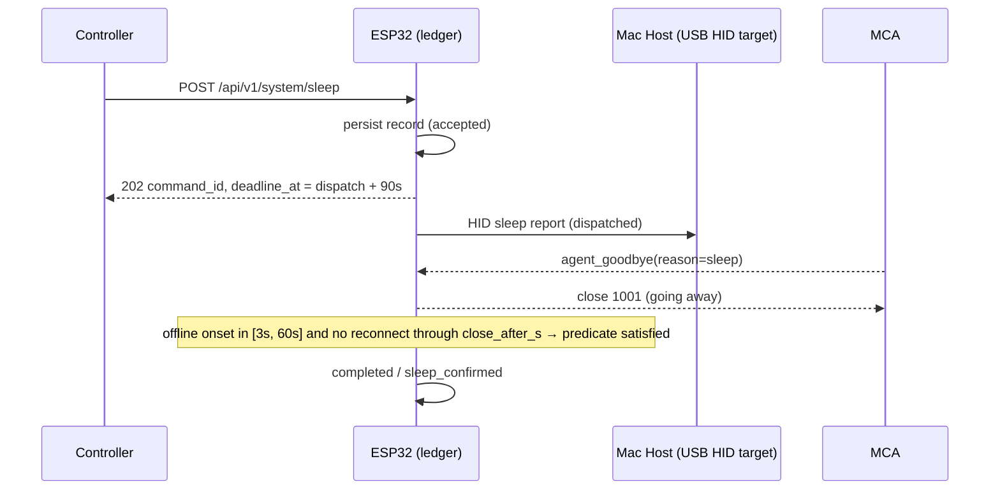
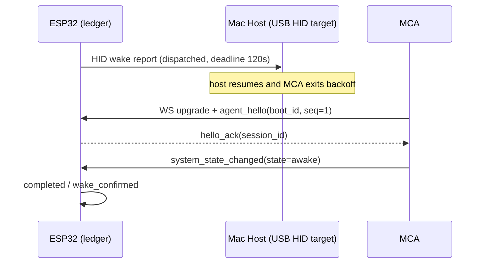
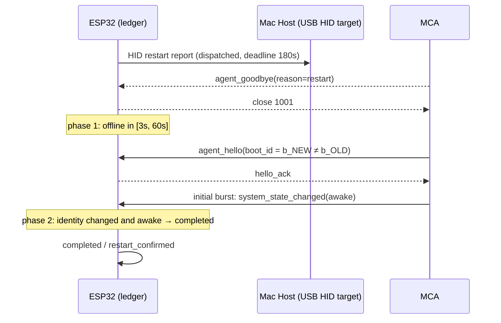
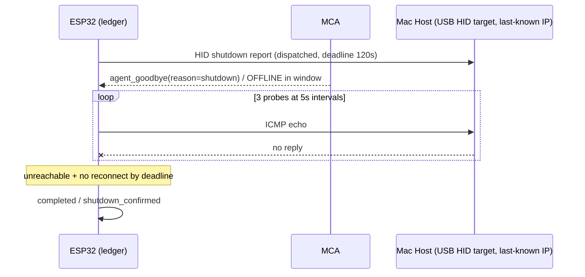

## 8. Power Transitions and Expected-Offline Windows

Power commands invert the usual evidence polarity: success looks like the MacControlAgent (MCA) disappearing. Without a declared window, disappearance is indistinguishable from a channel fault. This chapter therefore binds each power transition to a deterministic sequence of observations over the vocabulary fixed in Chapters 4–6: `agent_goodbye`, session OFFLINE (30 s silence or close frame), close code 1001, `agent_hello` carrying `boot_id`, and `system_state_changed`. The MacControl Endpoint (ESP32) alone evaluates these observations against the ledger record's `expected_offline_window` and deadline; the MCA never marks a power command complete. The per-command parameters below are normative defaults and MUST be configurable per Chapter 5.3.1.

| Command | `open_after_s` | `close_after_s` | Deadline | Positive offline evidence | Disqualifying event | Terminal on success |
|---|---|---|---|---|---|---|
| sleep | 3 s | 60 s | 90 s (MUST be > `close_after_s`) | `agent_goodbye(reason=sleep)` or OFFLINE in window, held with no reconnect through `close_after_s` | MCA reconnect before the window closes at `close_after_s` → `failed` / `unexpected_wake`; a reconnect after completion is logged as `unexpected_wake` and MUST NOT alter the terminal record | `completed` / `sleep_confirmed` |
| wake | — (no offline window) | — | 120 s | post-dispatch new-session `agent_hello` + initial burst reporting `system_state=awake` | none; absence runs to `timed_out` | `completed` / `wake_confirmed` |
| restart | 3 s | 60 s | 180 s | `agent_goodbye` or OFFLINE in window | reconnect with unchanged `boot_id` (window evidence voided; keep `confirming`) | `completed` / `restart_confirmed` |
| shutdown | 3 s | 60 s | 120 s | `agent_goodbye` or OFFLINE in window + probe unreachability | any MCA reconnect → `failed` / `unexpected_reconnect` | `completed` / `shutdown_confirmed` |

The table encodes three consequences for implementers. First, only sleep, restart, and shutdown carry an offline window; wake is a pure-presence command and is the resumable case in boot reconciliation (Chapter 5.1.1). Second, an offline event earlier than `open_after_s` is never attributed to the dispatch: it terminates the command as `unconfirmed` / `evidence_lost` per Chapter 5.3.2. Third, the disqualifying events differ deliberately — sleep and shutdown treat any reconnect as refutation, while restart *expects* a reconnect and instead refutes identity-unchanged reconnects.

### 8.1 Sleep and wake

#### 8.1.1 Define sleep as HID dispatch followed by graceful agent_goodbye or expected offline within the sleep window

A `sleep` command is verified when the MCA's session goes offline — gracefully via `agent_goodbye(reason=sleep)` with close code 1001, or ungracefully via heartbeat expiry (no frame for 30 s, Chapter 4.2.2) — with the offline onset inside $[\text{dispatched\_at} + 3\text{ s},\ \text{dispatched\_at} + 60\text{ s}]$. Both paths are equivalent evidence, because a sleeping host may drop TCP before the goodbye frame flushes; the ESP32 MUST NOT prefer one over the other. There is no immediate completion: the command remains `confirming` until the window closes at `close_after_s` with no MCA reconnect, at which point it completes `completed` / `sleep_confirmed`. Sleep's refutation horizon is `close_after_s`, not the 90 s deadline: any MCA reconnect before the window closes at `close_after_s` refutes the transition and MUST terminate the command `failed` / `unexpected_wake`; once the command has completed at `close_after_s`, a later reconnect is recorded in the log (Chapter 15) as `unexpected_wake` evidence but MUST NOT alter the terminal record. Two timing invariants bind this evaluation: `close_after_s` MUST be strictly less than the sleep deadline (defaults 60 s < 90 s), and configuration MUST reject any sleep deadline less than or equal to `close_after_s`; completion and refutation are both evaluated at `close_after_s`, so the deadline is only an outer bound for missing evidence — it terminates the command `timed_out` / `deadline_exceeded` when the evidence needed for the `close_after_s` evaluation never arrives.

#### 8.1.2 Define verified wake only when the MCA reconnects and reports awake inside the wake deadline

Wake is the mirror of sleep: the only acceptable evidence is *presence*. The command completes if and only if, within 120 s of dispatch, a **post-dispatch new MCA session** arrives (`agent_hello`, `seq` reset to 1, fresh `session_id`) whose mandatory initial status burst (Chapter 6.3) reports `system_state=awake`. A heartbeat alone is insufficient, because reconnect proves the agent process lives, not that the host woke on account of this command; requiring the new-session hello plus the explicit awake burst keeps the predicate deterministic. If the Mac was already awake, the predicate still works: the ESP32 closes the incumbent session with close code 1000 (normal) at dispatch, the MCA immediately reconnects with a new session and its initial burst reports `awake`, and the command completes. If the deadline passes with no qualifying evidence, the command ends `timed_out` / `deadline_exceeded` regardless of how plausible the wake appears. In Mode A there is no agent to return, so `wake` MUST terminate `unconfirmed` / `hid_only` immediately after dispatch.

### 8.2 Restart and shutdown

#### 8.2.1 Define restart confirmation as goodbye/offline followed by hello with changed boot_id and an initial awake burst

Restart verification is a two-phase predicate. Phase 1 is identical to sleep: a goodbye or OFFLINE onset inside the declared window. Phase 2 requires, before the 180 s deadline, a new-session `agent_hello` that (a) carries a `boot_id` strictly different from the value cached at acceptance and (b) is followed by the mandatory initial status burst (Chapter 6.3) reporting `system_state=awake` — `agent_hello` carries no readiness or state field, so readiness is established only by that burst. The `boot_id` comparison is what makes the verdict deterministic: an MCA process restart (crash, update, manual relaunch) reconnects with the **same** `boot_id`, which the ESP32 MUST treat as voiding the phase-1 evidence — the command stays in `confirming` and eventually ends `timed_out`, never `completed`. The ESP32 MUST cache `boot_id` in the status cache (Chapter 7 `mac.boot_id`) so the comparison survives an ESP32 reboot during the window.

#### 8.2.2 Define shutdown completion through expected agent offline plus network unreachability inside the shutdown window

Shutdown adds one corroborating check because its refutation window is otherwise unbounded. After a qualifying offline onset (goodbye with close 1001, or heartbeat expiry, inside the window), the ESP32 MUST issue three ICMP echo probes to the MCA's last-known source IP at 5 s intervals; all three failing establishes unreachability. The command completes only when unreachability holds **and** no MCA reconnect has occurred by the 120 s deadline; any reconnect MUST terminate it `failed` / `unexpected_reconnect`, and any probe reply MUST terminate it `failed` / `host_still_reachable`. Probe results are corroboration, not substitutes: in Mode A, where no goodbye can arrive, probes MAY only annotate `result` (e.g., `hid_only_net_unreachable`) and the command MUST still terminate `unconfirmed`, preserving the Chapter 5 rule that `completed` requires MCA evidence.
