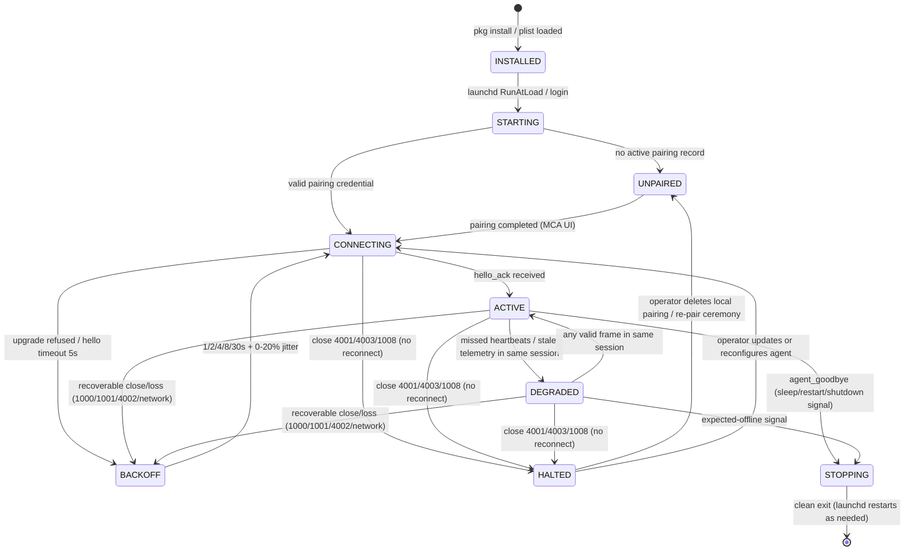

## 9. MacControlAgent Specification

MacControlAgent (MCA) is the optional macOS component that elevates an endpoint from Mode A (agentless) to Mode B (agent-enhanced). Its charter is narrow by design: it supplies authenticated, sequenced evidence to the paired MacControl Endpoint and executes a closed set of allowlisted actions. It is never a general remote shell, never a verdict authority, and never a dependency for basic HID control — Mode A operation without the agent MUST remain fully functional, with commands terminating as `unconfirmed` rather than `completed`.

### 9.1 Process model and privileges

#### 9.1.1 Define launchd-based background operation, automatic restart, minimal privileges, and no inbound control except paired ESP32 traffic

The MCA MUST be installed as a `launchd` agent (user-domain `LaunchAgent` plist with label `com.maccontrol.agent`), configured with `KeepAlive=true` and `RunAtLoad=true` so the supervisor restarts it after crash or logout/login. Restart throttling uses `ThrottleInterval=10` seconds; three consecutive abnormal exits within 60 seconds MUST place the process in a supervisor-backed cool-down of 60 seconds before the next attempt, and each abnormal exit MUST be written to the local log. The agent runs as the logged-in console user with no elevated entitlements: it MUST NOT request root, `sudo`, or Accessibility/Input Monitoring permissions beyond what its closed action set requires, and it MUST NOT open any listening socket on the network. The only network traffic permitted is the outbound, MCA-initiated channel to the paired endpoint (`ws://<hostname>.local/agent/v1/ws` or the polling fallback of Chapter 4); the MCA MUST ignore and log any inbound connection attempt. There is exactly one inbound trust path — commands delivered over the already-authenticated session with the paired ESP32 — so a port scan or rogue LAN host cannot reach the agent's action surface.



The state machine is MCA-local; the ESP32 observes only the session-level states of Chapter 4 (ACTIVE/STALE/OFFLINE). DEGRADED is a **same-session** degradation: the agent stops trusting its own telemetry freshness (missed heartbeats, stale local samples) but the session itself remains open, and any valid frame exchanged within the same session returns the agent to ACTIVE without a new handshake. A recoverable transport close from ACTIVE or DEGRADED (1000/1001/4002 or unannounced network loss) enters BACKOFF and reconnects — a 4002-forced reconnect opens a new session with sequence numbers reset, rather than silently replaying — while close 4001, 4003, or 1008 transitions directly to HALTED from either state, the terminal no-reconnect state aligned with Chapter 4: the agent MUST NOT enter BACKOFF from HALTED, and only operator intervention (deleting the local pairing, completing a new pairing ceremony, or updating/reconfiguring the agent) leaves it. The ACTIVE → BACKOFF edge is what makes the Chapter 8 wake flow possible: when the ESP32 closes the incumbent session with close 1000 at wake dispatch, an ACTIVE agent treats it as recoverable, backs off, and reconnects with a new session whose initial status burst reports `system_state=awake`. Rejected evidence (Chapter 2.2.2) is logged with its rejection reason and never by itself tears down the session. HALTED subsumes the old "stop reconnecting" rules: after close code 4001 the agent MUST NOT reconnect until a new pairing ceremony completes, because retrying a revoked credential cannot repair trust; closes 4003 and 1008 likewise stop reconnection until the agent is updated or reconfigured (Chapter 4.2.1).

### 9.2 MCA UI

#### 9.2.1 Define pairing status, command enablement, response endpoint configuration, application allowlist, and local log view

Per the UI ownership split of Chapter 2, the MCA UI configures only agent-local policy; it MUST NOT write any ESP32-owned configuration (macros, identity, controller credentials, OTA). Its scope is exactly five areas:

| Area | Content | Default | Rule |
|---|---|---|---|
| Pairing status | Endpoint `hostname`, pairing state (`unpaired`/`active`/`revoked`), `agent_instance_id`, session state | `unpaired` | Completes the Chapter 3 ceremony; shows close-code reason on disconnect |
| Command enablement | Per-action toggles for the agent-executed actions `launch_app` and `quit_app` (9.3.1) | both off (fail-closed) | Disabled actions are rejected ESP32-side pre-dispatch with 409 `command_disabled`; a stale dispatch reaching the MCA is answered `command_result(failed, command_disabled)` (9.3.1). The internal acknowledgement action `ack_command` is always permitted and never appears as an enableable command |
| Response endpoints | Endpoint address override and poll interval (fallback transport) | mDNS auto-resolution; 5 s poll | Configurable 2–30 s; change requires new session |
| Application allowlist | Bundle IDs permitted for launch/quit/report | empty | Match by bundle ID, never by display name; empty list denies all app actions |
| Local log view | Ring buffer of last 500 events (connections, rejections, action outcomes) | 500 entries | Read-only display; cleared on demand, never auto-uploaded |

The allowlist-by-bundle-ID rule is normative: display names are operator-decorative and collision-prone, whereas `com.renewedvision.propresenter` is stable. Command enablement defaults are fail-closed for mutating actions (launch/quit) so that installing the agent never silently expands the Mac's remote-attack surface.

### 9.3 Telemetry and control

#### 9.3.1 Enumerate closed agent actions: report status, report events, launch allowlisted app, quit allowlisted app, acknowledge command

The MCA speaks exactly one protocol: the single envelope and the closed set of eleven event types defined in Chapter 6 (`agent_hello`, `agent_goodbye`, `heartbeat`, `system_state_changed`, `user_session_changed`, `screen_lock_changed`, `application_started`, `application_exited`, `command_ack`, `command_result`, `capability_report`). There are no other frame types — no composite report frames, no capability advertisement inside `agent_hello`, and no timestamp field beyond the envelope's advisory `timestamp`. The MCA's `agent_hello` MUST therefore be an ordinary enveloped event whose payload carries only identity and version data:

```json
{
  "event_id": "evt_1",
  "agent_instance_id": "ag-7e21",
  "seq": 1,
  "timestamp": "2025-01-14T10:12:03Z",
  "type": "agent_hello",
  "command_id": null,
  "payload": {
    "protocol_version": 1,
    "agent_version": "1.0.0",
    "boot_id": "b_3F8A11",
    "hostname": "mac-propresenter"
  }
}
```

`agent_hello` carries no `state` or `ready` field: readiness is established exclusively by the mandatory initial status burst (Chapter 6.3) that the MCA MUST emit within 2 s of `hello_ack` — one `system_state_changed`, one `user_session_changed`, one `screen_lock_changed`, one `capability_report` whose `allowlisted_apps` carries every allowlisted application with its current state (`running` or `not_running`), and optionally one `application_started` per running allowlisted application. Thereafter the MCA emits the individual Chapter 6 events on change; it never batches them into a single report message. `boot_id` is regenerated on every macOS boot and is the pivot for restart verification: the ESP32 compares it against the pre-restart value before accepting a `restart_confirmed` verdict.

The ESP32→MCA direction is equally closed. Over the authenticated session (or `GET /agent/v1/commands/pending` in polling fallback) the ESP32 dispatches only two agent actions, `launch_app` and `quit_app`. The dispatch payload carries exactly three keys — `action`, `bundle_id`, and `command_id` — as in these two valid examples:

```json
{"action": "launch_app", "bundle_id": "com.renewedvision.propresenter", "command_id": "8F31A2C4"}
```

```json
{"action": "quit_app", "bundle_id": "com.renewedvision.propresenter", "command_id": "7AC41E9B"}
```

The MCA answers with `command_ack` within 2 s and `command_result` after the attempt, both correlated by `command_id` per Chapter 6. Enforcement of command enablement and the application allowlist is ESP32-first: because the ESP32 holds the latest `capability_report`, a controller request for a disabled action or a non-allowlisted `bundle_id` MUST be rejected pre-dispatch with HTTP 409 (`command_disabled` or `app_not_allowlisted`, Chapter 12.3.1) wherever the current report makes the outcome knowable. If a dispatch nonetheless reaches the MCA — for example, the operator changed enablement after the last `capability_report` — the MCA MUST NOT execute it and MUST instead return `command_result` with `outcome: "failed"` and `error_code` ∈ {`command_disabled`, `app_not_allowlisted`}.

The closed set is exhaustive: the MCA MUST NOT implement arbitrary shell execution, file access, or input injection, and any ESP32 dispatch naming an action outside this section MUST be rejected with `command_result(failed, app_not_allowlisted)` and logged on both sides. Every action outcome is correlated by `command_id`, and the acknowledgement is evidence, not a verdict — the ESP32 command ledger alone advances the command to a terminal state per Chapter 5. Acceptance implication: a launch of a non-allowlisted bundle ID, a disabled action, and a replayed `command_id` MUST each produce a deterministic, distinguishable outcome within 5 seconds of dispatch — pre-dispatch HTTP 409, or a correlated `command_result(failed)` with the matching closed `error_code`.
