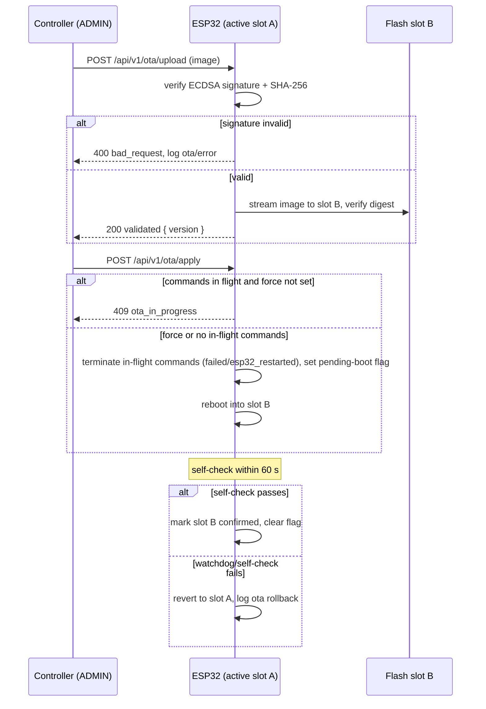

## 15. Reliability, Persistence, Logging, and OTA

This chapter defines the mechanisms that keep the MacControl Endpoint (ESP32-S3) deterministic under power loss, link failure, and firmware replacement. Each mechanism preserves a rule from earlier chapters: the ESP32 owns the command ledger and terminal verdicts (Chapter 5), liveness thresholds are fixed ratios (Chapter 4), and privileged update paths are ADMIN-gated (Chapter 13).

### 15.1 Reliability mechanisms

#### 15.1.1 Define watchdog, Wi-Fi reconnect, USB HID recovery, persistent configuration/macros, command timeouts, and heartbeat monitoring

The endpoint MUST implement the following mechanisms. All values are defaults and configurable in the ESP32 Web UI unless marked fixed.

| Mechanism | Default parameter | Failure detected | Deterministic response |
|---|---|---|---|
| Hardware watchdog (TWDT) | 10 s feed interval, 3 missed feeds | Firmware task hang or starvation | Forced reset; boot reconciliation runs (Ch. 5); log `watchdog_reset` |
| Wi-Fi reconnect | Backoff 1/2/4/8/30 s + 0–20% jitter, no attempt cap | Association loss, DHCP expiry | Requests arriving during association loss return HTTP 503 `network_unavailable`; no new commands are accepted while down; ledger untouched |
| USB HID recovery | Re-enumeration poll every 1 s, max 5 s per command dispatch | HID interface stalled or detached | Retry dispatch once; on second failure, terminate as `failed` with `error_code = "dispatch_error"` |
| Persistent configuration | Flash NVS, CRC32-checked, atomic write-then-commit | Corrupt config at boot | Fall back to last committed copy; if both invalid, load factory defaults and log `config_reset` |
| Persistent macros | Flash, same atomic-commit scheme, capacity 64 macros | Corrupt macro store | Refuse execution with 409 `store_corrupt`; never execute a partially parsed macro |
| Command timeouts | Per-type deadlines (Ch. 5.3.1), dispatch delay cap 30 s | Verification not satisfied by `deadline_at` | Terminal `timed_out` with `error_code = "deadline_exceeded"` |
| Heartbeat monitoring | Interval 5 s, stale 15 s, offline 30 s (fixed 3×/6× ratios) | MCA silence | Mark status cache stale, then close evidence channel; commands in `confirming` transition per Ch. 5.2, never to `completed` |

The table encodes one invariant implementers must not relax: no reliability mechanism ever upgrades a command's outcome. Watchdog resets, link recovery, and HID retry exist to preserve evidence and resume adjudication; terminal verdicts remain exclusively with the Chapter 5 lifecycle. Persistence is layered so that a single flash fault cannot silently change behavior: configuration and macro stores are double-slotted with CRC validation, and the command ledger uses the append-only revision scheme of Section 5.1.1, which survives an interrupted write by discarding the incomplete final record.

Wi-Fi outage semantics deserve emphasis. While disconnected, the endpoint MUST NOT expire in-flight commands early; `deadline_at` clocks keep running, so commands whose deadlines pass during the outage terminate as `timed_out` on their normal schedule. Boot reconciliation after a watchdog reset MUST complete within 2 seconds and MUST log a `boot_reconciliation` entry summarizing every verdict changed, giving controllers a deterministic explanation for any state that moved while the endpoint was down.

### 15.2 Logging

#### 15.2.1 Define ring-buffer event log schema, categories, correlation IDs, retention, and retrieval endpoint

The ESP32 MUST maintain a persistent ring-buffer event log in flash. Capacity is 512 entries (configurable 128–2048); when full, the oldest entries are overwritten in strict FIFO order. Entries MUST be written before the action they record is observable (e.g., a state transition is logged before the corresponding status response is served), so a crash never produces an untraceable verdict. Log clearing is ADMIN-only (Chapter 13) and is itself logged as the first entry of the new buffer.

```json
{
  "seq": 1047,
  "ts": "2025-01-14T09:31:05.214Z",
  "category": "command",
  "event": "state_transition",
  "level": "info",
  "command_id": "8F31A2C4",
  "request_id": "req_01HF3K9X2A",
  "session_id": "s_41",
  "actor": "apikey:control-01",
  "detail": { "from": "confirming", "to": "completed", "result": "restart_confirmed" }
}
```

The schema is closed and total: `seq` is a monotonically increasing 32-bit counter that survives reboots; `category` MUST be one of `command`, `session`, `auth`, `config`, `ota`, or `system`; `level` MUST be one of `info`, `warn`, `error`; `command_id`, `request_id`, and `session_id` are the correlation IDs defined in Chapters 4 and 5 and are null only where genuinely inapplicable (e.g., a watchdog reset). This correlation discipline is what lets a controller reconstruct a full causal chain — HTTP request → ledger transition → MCA evidence → terminal verdict — from a single `request_id`.

| Category | Representative events | Minimum level logged |
|---|---|---|
| `command` | acceptance, dispatch, every state transition, eviction | info |
| `session` | MCA connect/disconnect with close code, stale/offline transitions | info |
| `auth` | failed logins, lockouts, key use by ADMIN endpoints, revocation | warn |
| `config` | configuration/macro writes, `config_reset` fallback | info |
| `ota` | upload, validation result, apply, rollback | info |
| `system` | boot, `boot_reconciliation`, `watchdog_reset`, flash faults | warn |

Categories exist so operators can filter noise from signal: `auth` and `system` entries indicate trust or integrity events and SHOULD be reviewed even when commands succeed. Retention is time-unbounded but count-bounded; at the default 512 entries a production endpoint logging 50 events/day retains roughly 10 days. Entries MUST be retrievable via `GET /api/v1/logs` (minimum role READ, per Chapter 13) with query filters `category`, `level`, `since_seq`, and `limit` (default 100, maximum 512). Responses MUST be ordered by ascending `seq`, and the endpoint MUST include a `dropped` count whenever the requested range predates the oldest retained entry, so consumers can distinguish silence from truncation. Sensitive material MUST NOT be logged: API keys, the admin password, and pairing tokens appear only as identifiers (`key_id`, `device_id`), never as raw values.

### 15.3 OTA

#### 15.3.1 Define signed dual-partition updates, automatic rollback, ADMIN-only update control, and in-flight command handling

Firmware updates use a signed dual-partition scheme. The flash layout MUST contain two application slots (A/B) plus a factory recovery image. An update is uploaded to the inactive slot via `POST /api/v1/ota/upload` and applied via `POST /api/v1/ota/apply`; both endpoints require the ADMIN role (Chapter 13) and are rate-limited accordingly. Each image MUST carry an ECDSA P-256 signature over its SHA-256 digest, verified against the public key compiled into the firmware before any byte is written to flash. Signature verification failure rejects the upload with HTTP 400 `bad_request` and logs an `ota` entry at `error` level. The rollback path is therefore structural: the previously running image is never erased, so a failed update cannot brick the endpoint.



In-flight command handling is deliberately conservative. `apply` MUST be rejected with HTTP 409 `ota_in_progress` while any command is in `accepted`, `dispatched`, or `confirming`, unless the request sets `force: true`, in which case every non-terminal command MUST be terminated **before** reboot — as `failed` with `error_code = "esp32_restarted"` — matching the verdict boot reconciliation would assign anyway. A second OTA upload or apply request arriving while an OTA operation is already in progress is likewise rejected with HTTP 409 `ota_in_progress` (Chapter 4.1.1); both uses share one code because both tell the controller the same fact: an OTA operation cannot proceed now, and 409 remains non-retryable until the blocking condition clears. This keeps the ledger honest: a controller never sees a command silently abandoned by a firmware swap, and post-update reconciliation finds only terminal records.

After reboot, the new image runs a 60-second self-check: the watchdog is armed, Wi-Fi association is attempted, and the Web UI and `/api/v1/status` MUST become responsive. Success requires an explicit confirmation write (automatic on first successful status serve); if the confirmation is absent when the watchdog fires or the window expires, the bootloader MUST revert to the previous slot and log `ota` `rollback` at `error` level. Version regression is permitted but logged; downgrade images pass the same signature gate, and the endpoint MUST record the running version in every `ota` entry and in `GET /api/v1/status` so controllers can attribute behavioral differences to firmware revisions.
